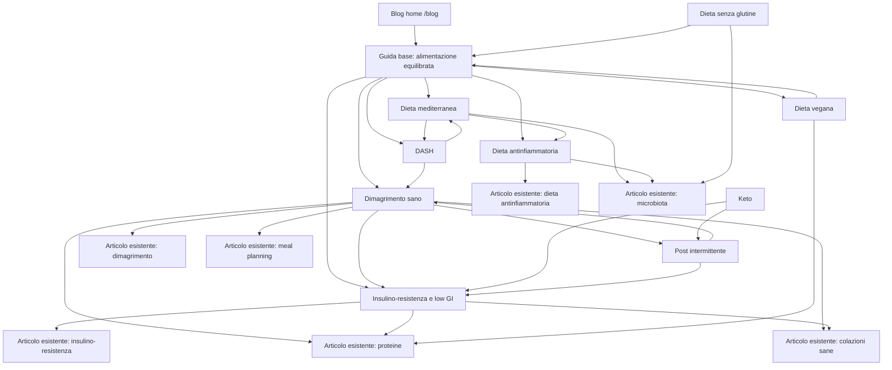

# Piano editoriale SEO sulla nutrizione per il blog di Natalia Corvo

## Executive summary

Questo piano è stato costruito triangolando quattro segnali: domanda di ricerca in Polonia, persistenza del trend nel tempo, intento reale delle SERP polacche e coerenza con il tono già presente su `nataliacorvo.com/blog`, che oggi è pratico, calmo, anti-restrittivo e dichiaratamente educativo. Il blog esistente lavora già su abitudini, insulino-resistenza, dieta antinfiammatoria, microbiota, dimagrimento realistico, proteine e pianificazione; quindi i nuovi contenuti devono alzare il livello SEO senza snaturare il posizionamento editoriale. citeturn29view0turn30view1turn30view2turn30view3turn32view1turn32view2turn32view3

Ho dato priorità a fonti ufficiali polacche, in particolare entity["organization","Narodowe Centrum Edukacji Żywieniowej","public nutrition agency, poland"], al portale pubblico del entity["organization","Narodowy Fundusz Zdrowia","polish public health fund"], a fonti europee come entity["organization","Autorita europea per la sicurezza alimentare","eu food safety agency"] e a fonti globali come entity["organization","Organizzazione Mondiale della Sanita","global health agency"]. Per i volumi ho usato solo segnali pubblicamente visibili: keyword e stime mostrate in pagine pubbliche di entity["company","Semrush","seo software company"], oltre a report e articoli che citano serie storiche da Google Trends. Dove il volume esatto non è pubblicamente esposto in modo verificabile, lo dichiaro come “proxy pubblico” o “n/d pubblico”. citeturn51search0turn51search2turn26view0turn24view0turn17view0turn45search12

La conclusione operativa è netta: per un blog evidence-based in Polonia, i topic più forti oggi sono **dimagrimento sano**, **keto**, **alimentazione equilibrata basata sul piatto/piramide**, **dieta mediterranea**, **DASH**, **dieta senza glutine**, **dieta vegana**, **post intermittente**, **insulino-resistenza/low GI** e **dieta antinfiammatoria**. Alcuni topic meramente transazionali, come meal delivery e query-calcolatore, hanno volumi enormi ma li ho esclusi dalla top 10 editoriale perché poco coerenti con un blog scientifico e con il tono del sito. citeturn26view0turn34search0turn41search0turn17view0turn45search16

C’è però una limitazione strutturale che va detta senza giri: **stai chiedendo articoli in italiano, ma con domanda e SERP primarie in polacco**. Questo è perfetto per ideare il calendario editoriale, ma meno ideale per il ranking puro su query polacche. Per questo ho lasciato, per ogni articolo, sia il **cluster keyword polacco** sia la **focus keyphrase italiana** effettivamente coerente con il testo. Se vuoi massimizzare la visibilità organica in Polonia, la strada più forte resta una versione polacca o bilingue con gestionе `hreflang`. Questa è un’inferenza SEO basata sul fatto che il blog oggi è impostato su un asse PL/EN e non su un asse IT/PL. citeturn29view0

## Metodo e ipotesi

Ho filtrato i topic con quattro criteri: domanda editoriale reale, solidità delle fonti, allineamento con il tono del sito e possibilità di costruire cluster interni forti. Ho escluso dalle priorità assolute le query iper-transazionali come “catering dietetyczny”, “dieta pudełkowa” e micro-query tipo “ile kalorii ma jabłko”, pur riconoscendo che hanno fortissima domanda pubblica. Sono query utili per landing commerciali o strumenti, non per i migliori articoli pilastro di un blog educativo. citeturn26view0turn41search0

Per la classifica ho usato una combinazione di:  
**domanda osservabile** (es. `dieta keto` 49.500, `dieta wegańska` 5.400, `piramida żywienia` 22.200, `BMI kalkulator` 165.000 come proxy di interesse per il controllo del peso), **trend storico** (es. report Respo/Google Trends che indicano persistenza per DASH, mediterranea, glutine, keto, vegan), **intento SERP** e **densità competitiva** su domini polacchi autorevoli o molto visibili. citeturn34search0turn10view0turn26view0turn17view0turn24view0

## Ranking dei top topic nutrizione in Polonia

| Rank | Topic editoriale | Segnale di domanda | Trend e stabilità | Intento SERP dominante | Principali pagine concorrenti polacche | Opportunità editoriale per il blog |
|---|---|---|---|---|---|---|
| 1 | Dimagrimento sano / dieta riduttiva | Proxy pubblico molto alto: `BMI kalkulator` 165.000; fortissima saturazione SERP su “zdrowe odchudzanie” citeturn26view0turn56search1 | Interesse sempreverde; alta sensibilità stagionale post-feste e inizio anno citeturn56search1turn51search12 | Informazionale + problem-solving | `Pacjent.gov.pl`, `NCEZ`, `Diag.pl`, `ntfy.pl`, `BodyChief.pl` citeturn56search1turn56search11turn56search8turn56search20turn56search9 | Pubblicare una guida “senza effetto yo-yo” più autorevole e meno tossica dei competitor commerciali |
| 2 | Dieta keto | `dieta keto` 49.500 su dominio PL pubblico; sito keto verticale con keyword ricettarie da 4.400+ citeturn34search0turn24view0 | Crescita fortissima dal 2017 secondo report Google Trends/food trend; oggi ancora molto cercata citeturn17view0turn45search12 | Informazionale + comparativo + transazionale | `NCEZ`, `KetOnline.pl`, `BeKeto.pl`, `KuchniaVikinga.pl` citeturn48search1turn54search6turn54search14turn54search2 | Posizionarsi come guida critica, basata su prove, non come vendita di meal plan |
| 3 | Alimentazione equilibrata / Talerz Zdrowego Żywienia / piramide | `piramida żywienia` 22.200; `talerz zdrowego żywienia` forte visibilità istituzionale citeturn10view0turn56search0 | Shift strutturale dalla piramide al piatto dal 2020 in avanti citeturn56search0turn50search0 | Informazionale evergreen | `NCEZ`, `Pacjent.gov.pl`, `Dietetycy.org.pl`, `Diag.pl` citeturn50search0turn56search13turn56search2turn56search17 | Ottimo hub madre per collegare tutti gli altri articoli |
| 4 | Dieta mediterranea | Volume esatto non esposto pubblicamente in modo stabile; forte saturazione SERP e lunga persistenza citeturn54search0turn54search12 | Nel report Respo/Google Trends è persistente dal 2016 a oggi citeturn17view0 | Informazionale + prevenzione | `NCEZ`, `LUX MED`, `Dietetycy.org.pl`, `PolskieSuperowoce.pl` citeturn54search0turn54search12turn54search8turn54search4 | Alto E-E-A-T: dominio perfetto per un articolo pilastro evidence-based |
| 5 | Dieta DASH | Volume esatto non esposto pubblicamente; SERP fresca e istituzionale citeturn54search5turn48search0 | Nel report Respo/Google Trends è popolare dal 2011 a oggi citeturn17view0 | Informazionale + prevenzione cardiovascolare | `NCEZ`, `Pacjent.gov.pl`, `NFZ diety`, `DietetykaNieNaŻarty` citeturn54search5turn54search9turn54search1turn54search13 | Grande opportunità: domanda forte ma tanto contenuto ancora “ospedaliero”, poco lifestyle |
| 6 | Dieta senza glutine | Trend forte e duraturo; forte bisogno clinico e molte SERP pratiche citeturn17view0turn48search11 | Molto popolare 2012–2018 nel report Respo; oggi ancora viva per celiaci e sensibili al glutine citeturn17view0turn45search0 | Informazionale + pratico/lista alimenti | `NCEZ`, `Pacjent.gov.pl`, `Celiakia.pl`, `DietaBezGlutenowa.pl` citeturn48search11turn55search22turn55search2turn55search14 | Ottimo topic per un articolo “quando serve davvero” contro la moda senza basi |
| 7 | Dieta vegana / plant-based | `dieta wegańska` 5.400 su dominio PL pubblico citeturn34search0 | Il veganismo è tra i pattern più cercati in serie storiche Google Trends e cresce da anni anche in Polonia citeturn17view0turn45search0turn49search4 | Informazionale + how-to | `NCEZ`, `ALAB.pl`, `ntfy.pl`, `AniaGotuje.pl` citeturn49search0turn55search19turn55search15turn55search7 | Forte chance di ranking se l’angolo è “vegan equilibrato, non ideologico” |
| 8 | Post intermittente | Proxy pubblico: `post przerywany 16/8 efekty forum` 2.900; topic incluso tra le diete più discusse/compare nei round-up mainstream citeturn44search2turn45search16 | Interesse ciclico ma persistente; molto dibattito recente sui risultati reali citeturn48search2turn54search3turn52search2 | Informazionale + comparativo | `NCEZ`, `LUX MED`, `Food-Forum.pl` citeturn54search7turn54search3turn44search2 | Ottima opportunità per un pezzo equilibrato “funziona davvero?” |
| 9 | Insulino-resistenza / low GI | Volume esatto non esposto pubblicamente; SERP estremamente densa e medicalizzata citeturn49search6turn55search9 | Domanda costante, collegata a sindrome metabolica, PCOS e prediabete citeturn49search10turn53search19 | Informazionale + pratico + condition-based | `NCEZ`, `Diag.pl`, `enelzdrowie.pl`, `IOdieta.pl` citeturn49search6turn55search9turn55search5turn55search13 | Altissimo fit col blog, che ha già una base sul tema |
| 10 | Dieta antinfiammatoria | Volume esatto non esposto pubblicamente; forte crescita di copertura istituzionale e diagnostica citeturn49search3turn55search12 | Tema molto forte negli ultimi anni, spesso trainato da endometriosi, autoimmunità, sindrome metabolica citeturn49search7turn44search3turn53search2 | Informazionale + preventive health | `NCEZ`, `NFZ diety`, `Diagnostyka`, `Polmed` citeturn49search3turn55search12turn55search4turn55search16 | Perfetto per un articolo anti-mito, con impostazione più sobria dei competitor |

## Architettura SEO e internal linking

La strategia migliore non è pubblicare dieci articoli isolati. La struttura ideale è: **un hub “fondamenti dell’alimentazione”**, due assi **metabolici** (dimagrimento, insulino-resistenza) e due assi **pattern dietetici** (mediterranea, DASH, vegana, keto, gluten free, IF, antinfiammatoria). Il blog attuale ha già ottime pagine-ponte su insulino-resistenza, antinfiammatoria, dimagrimento, proteine, colazioni e meal planning: vanno sfruttate subito come nodi di collegamento interno. citeturn30view1turn30view2turn32view1turn32view2turn32view3turn32view0



**Mappa linking consigliata sul sito reale**

- **Hub “alimentazione equilibrata”** → link a: articolo esistente “Jak zacząć zdrowe odżywianie bez restrykcyjnej diety”, nuovo dimagrimento, nuova mediterranea, nuovo DASH, nuova dieta vegana, nuova insulino-resistenza. citeturn30view0  
- **Nuovo articolo dimagrimento** → link a: articolo esistente “Odchudzanie bez efektu jo-jo”, “Białko w diecie”, “Zdrowe śniadania”, “Planowanie posiłków”. citeturn32view1turn32view2turn32view0turn32view3  
- **Nuovo articolo insulino-resistenza** → link a: articolo esistente omonimo, nuovo low-GI/mediterranea, nuovo post intermittente, articolo colazioni. citeturn30view1turn32view0  
- **Nuovo articolo dieta antinfiammatoria** → link a: articolo esistente omonimo, nuova mediterranea, articolo microbiota. citeturn30view2turn30view3  
- **Nuovo articolo dieta vegana** → link a: articolo proteine, hub alimentazione equilibrata, articolo meal planning. citeturn32view2turn32view3  
- **Nuovo articolo gluten free** → link a: hub base, microbiota, dimagrimento sano solo in chiave “non è dieta dimagrante”. citeturn30view3turn32view1

## Pacchetto articoli SEO pronto per WordPress

### Alimentazione equilibrata secondo il piatto sano

**Cluster keyword PL**: `talerz zdrowego żywienia` / `piramida żywienia`  
**Focus keyphrase IT**: `alimentazione equilibrata`  
**Secondarie**: `piatto sano`, `come comporre i pasti`, `abitudini alimentari sane`  
**Long-tail**: `come iniziare a mangiare bene senza dieta`, `come costruire un pasto equilibrato`  
**Intento**: informazionale evergreen  
**Slug suggerito**: `alimentazione-equilibrata-piatto-sano`  
**SEO title**: `Alimentazione equilibrata con il piatto sano`  
**Meta description**: `Guida pratica per comporre pasti equilibrati senza dieta rigida: piatto sano, porzioni, frequenza dei pasti e consigli realistici.`  
**H1**: `Alimentazione equilibrata: la guida pratica del piatto sano`  
**LSI IT**: `verdura e frutta`, `cereali integrali`, `proteine`, `grassi buoni`, `fibre`, `abitudini sane`  
**Keyword density**: focus IT 0,8–1,2%; usare 6–10 varianti semantiche  
**Heading map**: H2 cos’è il piatto sano; H2 come comporre il pasto; H2 cosa limitare; H2 errori comuni; H2 esempio di giornata  
**Canonical**: `https://nataliacorvo.com/articles/alimentazione-equilibrata-piatto-sano`  
**Alt text consigliati**: `piatto sano con verdure cereali integrali e proteine`; `spesa con alimenti semplici e stagionali`; `tavola con legumi e verdure`; `pasto equilibrato da ufficio`; `colazione ricca di fibre e proteine`  
**Immagini royalty-free**: [verdure e piatto bilanciato](https://www.pexels.com/search/healthy%20plate/), [spesa sana](https://www.pexels.com/search/grocery%20vegetables/), [legumi e cereali](https://unsplash.com/s/photos/legumes-grains), [meal prep semplice](https://www.pexels.com/search/meal%20prep/), [colazione sana](https://unsplash.com/s/photos/healthy-breakfast)  
**OG/Twitter**: `og:title` come SEO title; `og:description` come meta description; `og:type=article`; `twitter:card=summary_large_image`

```json
{
  "@context":"https://schema.org",
  "@type":"BlogPosting",
  "headline":"Alimentazione equilibrata: la guida pratica del piatto sano",
  "description":"Guida pratica per comporre pasti equilibrati senza dieta rigida: piatto sano, porzioni, frequenza dei pasti e consigli realistici.",
  "mainEntityOfPage":"https://nataliacorvo.com/articles/alimentazione-equilibrata-piatto-sano",
  "author":{"@type":"Person","name":"Natalia Corvo"},
  "publisher":{"@type":"Organization","name":"Natalia Corvo Blog"},
  "inLanguage":"it",
  "keywords":["talerz zdrowego żywienia","piramida żywienia","alimentazione equilibrata","piatto sano"]
}
```

**Outline dettagliata**
1. Perché il “piatto sano” è più utile della dieta perfetta  
2. Le tre aree del piatto: vegetali, cereali, proteine e grassi  
3. Cosa limitare senza demonizzare il cibo  
4. Come adattare il modello a colazione, pranzo, cena e pasti fuori casa  
5. Errori frequenti e correzioni semplici

**Articolo**

Se una persona prova a mangiare meglio cercando la dieta perfetta, di solito dura poco. Se invece parte da una struttura semplice e ripetibile, come il “piatto sano”, la probabilità di costruire abitudini stabili aumenta molto. In Polonia il modello ufficiale del vecchio schema piramidale è stato reso più pratico proprio con il **Talerz Zdrowego Żywienia**, che mette al centro la composizione reale del pasto, non il moralismo su singoli alimenti. Anche l’OMS continua a insistere sugli stessi cardini: più varietà, più vegetali, più legumi e cereali integrali, meno alimenti ultraprocessati, zuccheri liberi, sale e grassi sfavorevoli. citeturn56search0turn50search0turn51search0turn51search7

La logica del piatto è semplice: circa metà dello spazio dovrebbe essere occupata da verdure e, in parte minore, da frutta; una quota rilevante va a cereali o altri carboidrati di buona qualità, idealmente integrali; l’ultima parte va a proteine e grassi di qualità, con poco spazio alla carne rossa e più spazio a legumi, pesce, uova, latticini ben scelti, semi e frutta secca. Nelle raccomandazioni polacche per adulti, le verdure e la frutta restano la base del pattern, con prevalenza delle prime, mentre i prodotti integrali aiutano ad aumentare l’introito di fibra. citeturn50search1turn56search13turn50search3turn51search13

Questo modello funziona perché riduce il caos decisionale. Se a pranzo pensi “devo mangiare perfettamente”, vai in tilt. Se pensi “mi servono verdure, una quota di carboidrati completi e una fonte proteica”, il pasto si costruisce molto più facilmente. Un esempio concreto: riso integrale, ceci, pomodori, cetrioli, rucola e olio extravergine. Oppure pane integrale, uova, insalata e una porzione di frutta. Oppure yogurt naturale, fiocchi d’avena, frutti di bosco e semi. Non serve una ricetta speciale; serve una struttura che si possa ripetere anche nei giorni normali. citeturn50search0turn51search7turn29view0

Il punto più frainteso riguarda ciò che va limitato. “Mangiare sano” non significa eliminare tutto ciò che dà piacere. Significa riconoscere quando snack dolci, bevande zuccherate, fast food o porzioni casuali iniziano a sostituire i pasti veri. L’OMS sottolinea che molte persone oggi mangiano troppi prodotti altamente trasformati e troppo pochi vegetali e fibre; è qui che il pattern si rompe. In pratica, il problema non è il biscotto in sé, ma il fatto che un’alimentazione intera diventi costruita attorno ai prodotti più facili, salati o dolci. citeturn51search0turn51search7

C’è anche il tema della frequenza dei pasti. Le linee polacche tradizionali parlano di una regolarità di 4–5 pasti ogni 3–4 ore, ma il punto clinicamente più importante non è il numero fisso. È evitare il ciclo “salto tutto di giorno e compenso la sera”, che rende più difficile gestire fame, concentrazione e scelta alimentare. Sul tuo blog questa logica è già molto coerente: ritmo, sazietà, semplicità, niente all-or-nothing. Per questo l’articolo dovrebbe legarsi internamente alla pagina già esistente su come iniziare a mangiare meglio senza dieta rigida. citeturn50search1turn30view0

Un altro errore comune è sottovalutare proteine e fibre nel primo pasto della giornata. Un pane bianco con marmellata o un caffè al volo non sono “vietati”, ma da soli spesso non bastano in termini di sazietà. Aggiungere yogurt, uova, ricotta, tofu, fiocchi d’avena, frutta, semi o pane integrale rende più facile arrivare al pranzo senza crolli energetici. Questo vale ancora di più per chi lavora in ufficio, fa pause brevi o tende a mangiare tardi. citeturn32view0turn32view2turn51search7

Nella vita reale, il piatto sano funziona bene anche fuori casa. Al ristorante o in mensa non devi cercare “il pasto perfetto”; devi avvicinarti alla logica del piatto. Chiediti: c’è una quota di verdure? C’è una fonte proteica vera? Il carboidrato è presente in una porzione sensata? C’è un grasso aggiunto che aumenta troppo l’energia senza dare molta sazietà? Questa mentalità è molto più utile di piani rigidi che crollano al primo viaggio, aperitivo o settimana impegnata. citeturn29view0turn32view3

In pratica, per iniziare davvero, bastano tre azioni: portare più vegetali nei due pasti principali, sostituire almeno una base raffinata con una integrale e aggiungere una fonte proteica chiara ai pasti che oggi sono troppo “vuoti”. Non è spettacolare, ma è esattamente così che si costruisce un’alimentazione migliore nel tempo: con struttura, ripetibilità e flessibilità. citeturn50search0turn50search1turn51search0turn51search7

### Dimagrimento sano senza effetto yo-yo

**Cluster keyword PL**: `zdrowe odchudzanie`, `dieta redukcyjna`, `odchudzanie bez efektu jojo`  
**Focus keyphrase IT**: `dimagrimento sano`  
**Secondarie**: `deficit calorico`, `effetto yo-yo`, `sazietà`, `perdere peso bene`  
**Long-tail**: `come dimagrire senza restrizioni`, `quanto peso perdere a settimana`  
**Intento**: informazionale + decisionale  
**Slug**: `dimagrimento-sano-senza-yo-yo`  
**SEO title**: `Dimagrimento sano senza effetto yo-yo`  
**Meta description**: `Come perdere peso in modo realistico senza diete estreme: deficit calorico, sazietà, ritmo, errori comuni e strategia sostenibile.`  
**H1**: `Dimagrimento sano: come perdere peso senza effetto yo-yo`  
**LSI IT**: `deficit energetico`, `massa muscolare`, `fame`, `routine`, `peso corporeo`, `abitudini`  
**Density**: 0,8–1,2% per focus keyphrase  
**Canonical**: `https://nataliacorvo.com/articles/dimagrimento-sano-senza-yo-yo`  
**Alt**: `persona che prepara un pranzo equilibrato`; `camminata quotidiana`; `monitoraggio del peso realistico`; `spuntini con proteine e fibre`; `lista spesa per dieta riduttiva`  
**Immagini**: [healthy weight loss meal](https://www.pexels.com/search/healthy%20meal/), [walking lifestyle](https://unsplash.com/s/photos/walking), [meal prep weight loss](https://www.pexels.com/search/meal%20prep/), [grocery list healthy](https://unsplash.com/s/photos/grocery-list), [body neutrality fitness](https://www.pexels.com/search/wellness/)  
**OG/Twitter**: come sopra

```json
{
  "@context":"https://schema.org",
  "@type":"BlogPosting",
  "headline":"Dimagrimento sano: come perdere peso senza effetto yo-yo",
  "description":"Come perdere peso in modo realistico senza diete estreme: deficit calorico, sazietà, ritmo, errori comuni e strategia sostenibile.",
  "mainEntityOfPage":"https://nataliacorvo.com/articles/dimagrimento-sano-senza-yo-yo",
  "author":{"@type":"Person","name":"Natalia Corvo"},
  "publisher":{"@type":"Organization","name":"Natalia Corvo Blog"},
  "inLanguage":"it",
  "keywords":["zdrowe odchudzanie","dieta redukcyjna","effetto yo-yo","dimagrimento sano"]
}
```

**Outline**
1. Cosa significa davvero dimagrire bene  
2. Deficit calorico sì, fame cronica no  
3. Velocità di dimagrimento consigliata  
4. Perché proteine, fibre, sonno e attività contano  
5. Come evitare l’effetto yo-yo

**Articolo**

Parlare di dimagrimento in modo serio significa partire da un punto scomodo ma necessario: **non tutto il peso perso è uguale**. Tagliare troppo le calorie può far scendere la bilancia rapidamente, ma spesso peggiora energia, fame, umore e capacità di mantenere il risultato. Le fonti pubbliche polacche sono molto chiare: le diete troppo ipocaloriche aumentano il rischio di carenze, perdita di massa magra e ritorno al peso iniziale. Sul portale pubblico polacco il ritmo raccomandato è di circa **0,5–1 kg a settimana**, non di più. citeturn56search1turn51search12

Il deficit energetico resta il motore del dimagrimento, ma non basta dire “mangia meno”. Il come conta moltissimo. Un deficit costruito su pasti troppo piccoli, poveri di proteine e fibre, tende a diventare insostenibile. Al contrario, un piano con pasti completi, porzioni realistiche e una struttura semplice aiuta a gestire la fame. È esattamente la logica che si vede già nel tuo blog: sazietà, semplicità, realismo. Questa è anche la posizione più coerente con le raccomandazioni OMS sul ruolo degli alimenti poco processati, dei vegetali e di un pattern complessivamente sano. citeturn32view1turn51search0turn51search7

Il primo errore classico è ridurre tutto ai numeri. Le calorie contano, ma la qualità del pasto influenza quanto reggi il deficit. Proteine e fibra aiutano la sazietà, mentre cibi molto raffinati e molto palatabili rendono più facile mangiare oltre il necessario. L’EFSA considera adeguato un introito di fibra di **25 g al giorno** per gli adulti, e segnala benefici anche per funzione intestinale, controllo del peso e salute cardiometabolica. Questo non significa inseguire la perfezione: significa fare in modo che pane integrale, legumi, avena, verdure, frutta, frutta secca e fonti proteiche compaiano regolarmente nei pasti. citeturn51search13turn50search3turn50search6

Il secondo errore è sottovalutare la routine. Dimagrire bene richiede di saper mangiare nei giorni normali, non solo il lunedì. Chi salta pranzo, cena tardi e poi vive di senso di colpa arriva spesso in un ciclo fame–restrizione–abbuffata difficile da sostenere. Programmare una colazione più saziante, un pranzo semplice ma completo e una cena meno “riparativa” aiuta molto più di un piano perfetto ma irrealistico. Per questo, internamente, l’articolo dovrebbe rimandare sia alla pagina sul dimagrimento senza yo-yo sia a quelle su colazioni sane e meal planning. citeturn32view1turn32view0turn32view3

L’attività fisica conta, ma va raccontata bene. Non serve presentarla come punizione per “smaltire”. Serve a proteggere la massa muscolare, aumentare il dispendio energetico totale e migliorare parametri metabolici e cardiovascolari. Anche il sonno pesa più di quanto molti pensino: poca qualità del sonno altera fame, gestione degli impulsi e percezione dello sforzo. L’OMS collega l’eccesso ponderale a un aumento rilevante del rischio di malattie croniche; quindi parlare di dimagrimento in chiave salute è più corretto che parlare solo di estetica. citeturn51search12turn51search16

Un dimagrimento sostenibile, quindi, non nasce da una “dieta magica”, ma da cinque decisioni ripetibili: un deficit moderato, pasti sazianti, movimento regolare, sonno sufficiente e un ambiente alimentare meno caotico. Vuol dire fare spesa meglio, avere un piano B nei giorni pieni e non trasformare ogni deviazione in fallimento. Se mangi bene per quattro giorni e male per uno, non hai “rovinato tutto”; hai semplicemente bisogno di un sistema più robusto, non di più punizione. citeturn32view3turn29view0turn56search1

Il modo migliore per evitare l’effetto yo-yo è ricordare una cosa banale: il mantenimento non inizia dopo la dieta, inizia **durante** la dieta. Se il tuo schema è così rigido da non essere vivibile tra un mese, il rimbalzo è molto probabile. Se invece costruisci subito soluzioni che puoi tenere anche quando avrai perso peso, il risultato ha più chance di durare. È meno spettacolare del marketing, ma molto più vicino alla realtà. citeturn32view1turn56search1turn51search12

### Dieta keto tra promesse e limiti

**Cluster PL**: `dieta keto`, `dieta ketogeniczna`, `keto jadłospis`  
**Focus IT**: `dieta chetogenica`  
**Secondarie**: `chetosi`, `low carb`, `rischi della keto`, `keto e dimagrimento`  
**Long-tail**: `la dieta chetogenica funziona davvero`, `keto pro e contro`  
**Intento**: informazionale comparativo  
**Slug**: `dieta-chetogenica-pro-contro`  
**SEO title**: `Dieta chetogenica: benefici, limiti e rischi`  
**Meta description**: `La guida chiara alla dieta chetogenica: cos’è, quando può aiutare, quali rischi comporta e perché non è la scelta migliore per tutti.`  
**H1**: `Dieta chetogenica: cosa dice davvero la ricerca`  
**LSI IT**: `carboidrati ridotti`, `corpi chetonici`, `fibre`, `aderenza`, `effetti collaterali`  
**Density**: 0,8–1,2%  
**Canonical**: `https://nataliacorvo.com/articles/dieta-chetogenica-pro-contro`  
**Alt**: `piatto keto con uova avocado e verdure`; `confronto tra pane integrale e alimenti keto`; `persona che legge etichette low carb`; `elettroliti e idratazione`; `tabella macro dieta chetogenica`  
**Immagini**: [keto meal](https://www.pexels.com/search/keto%20meal/), [avocado eggs](https://unsplash.com/s/photos/avocado-eggs), [low carb cooking](https://www.pexels.com/search/low%20carb/), [label reading](https://unsplash.com/s/photos/food-label), [healthy fats](https://www.pexels.com/search/healthy%20fats/)  

```json
{
  "@context":"https://schema.org",
  "@type":"BlogPosting",
  "headline":"Dieta chetogenica: cosa dice davvero la ricerca",
  "description":"La guida chiara alla dieta chetogenica: cos’è, quando può aiutare, quali rischi comporta e perché non è la scelta migliore per tutti.",
  "mainEntityOfPage":"https://nataliacorvo.com/articles/dieta-chetogenica-pro-contro",
  "author":{"@type":"Person","name":"Natalia Corvo"},
  "publisher":{"@type":"Organization","name":"Natalia Corvo Blog"},
  "inLanguage":"it",
  "keywords":["dieta keto","dieta ketogeniczna","dieta chetogenica","chetosi"]
}
```

**Outline**
1. Cos’è la keto  
2. Perché fa perdere peso all’inizio  
3. Cosa dice la ricerca sul medio termine  
4. Effetti collaterali e gruppi a rischio  
5. Quando scegliere alternative più sostenibili

**Articolo**

La dieta chetogenica resta uno dei temi più caldi della nutrizione digitale in Polonia. Il segnale pubblico è forte: su un dominio polacco visibile in Semrush, la keyword `dieta keto` mostra un volume pubblico di **49.500** ricerche mensili, e molte keyword derivate legate a ricette e prodotti keto continuano a portare traffico a siti verticali. Non è quindi solo una moda social: è un interesse reale e ancora molto cercato. citeturn34search0turn24view0

Sul piano tecnico, la dieta chetogenica è un modello molto povero di carboidrati, moderato in proteine e alto in grassi, pensato per portare il corpo in **chetosi nutrizionale**, cioè a usare in larga parte corpi chetonici e acidi grassi come combustibile. Le spiegazioni ufficiali polacche la descrivono come una dieta molto restrittiva sui carboidrati, con quote di grassi che in alcuni protocolli possono diventare molto elevate. citeturn48search1turn48search5turn52search3

Perché molte persone dicono di “funzionare”? Perché nel breve periodo spesso porta a un calo di peso rapido. Una parte iniziale, però, è dovuta anche alla riduzione delle scorte di glicogeno e dell’acqua associata. Le revisioni recenti mostrano che la keto può produrre perdita di peso e alcuni miglioramenti metabolici, ma nel confronto con altri approcci ipocalorici ben costruiti il vantaggio tende a ridursi. In altre parole: non è magia metabolica; è una strategia possibile, ma non chiaramente superiore per tutti nel medio-lungo termine. citeturn52search11turn52search19turn48search1

Il problema principale è l’aderenza. Tantissime persone riescono a seguire una keto nelle prime settimane; molte meno riescono a farlo in modo compatibile con vita sociale, lavoro, spesa e piacere di mangiare. Inoltre, quando si tagliano quasi del tutto cereali, frutta, legumi e molti vegetali amidacei, aumenta il rischio di ridurre anche fibra, vitamine del gruppo B, magnesio e altri nutrienti utili. Le fonti ufficiali polacche lo sottolineano apertamente, soprattutto in gruppi delicati come donne in gravidanza, dove il modello è sconsigliato. citeturn48search13turn48search1

Questa non è una dieta “semplicemente a basso contenuto di carboidrati”. È un protocollo molto preciso. In ambito clinico esistono situazioni specifiche in cui il modello chetogenico ha applicazioni consolidate, per esempio alcune forme di epilessia farmacoresistente. Ma estendere automaticamente questo valore a tutta la popolazione adulta che vuole “dimagrire meglio” è un salto logico scorretto. La letteratura recente continua a indagare possibili benefici in obesità e metabolismo, ma insiste anche sui limiti di sicurezza, sostenibilità e qualità complessiva della dieta. citeturn52search3turn44search8turn52search15

Nella pratica, chi prova la keto spesso riferisce fame più controllata e meno oscillazioni glicemiche. Questi effetti sono plausibili in alcune persone, ma non cancellano i contro: stipsi, difficoltà sociali, monotonia alimentare, squilibri di elettroliti, bassa fibra e rischio di eccedere con grassi saturi o prodotti “keto” commerciali ultraprocessati. È anche facile confondere una keto ben pianificata con una dieta casuale piena di salumi, formaggi e snack etichettati come keto ma nutrizionalmente deboli. citeturn48search1turn52search11turn54search14

Per la maggior parte degli adulti che cercano salute metabolica e controllo del peso, approcci come il modello mediterraneo, il piatto sano o una riduzione calorica moderata e ben strutturata sono spesso più facili da mantenere e meglio studiati sul lungo periodo. La keto non va demonizzata, ma va ricollocata: non è la via obbligata, non è la più adatta a tutti e non dovrebbe essere proposta come scorciatoia universale. citeturn49search1turn52search0turn56search1

### Dieta mediterranea in versione pratica

**Cluster PL**: `dieta śródziemnomorska`, `jadłospis śródziemnomorski`, `polskie zamienniki diety śródziemnomorskiej`  
**Focus IT**: `dieta mediterranea`  
**Secondarie**: `olio extravergine`, `legumi`, `pesce`, `cereali integrali`, `salute cardiovascolare`  
**Long-tail**: `dieta mediterranea cosa mangiare ogni giorno`, `dieta mediterranea con alimenti polacchi`  
**Intento**: informazionale + practical how-to  
**Slug**: `dieta-mediterranea-guida-pratica`  
**SEO title**: `Dieta mediterranea: guida pratica e scientifica`  
**Meta description**: `Cosa mangiare nella dieta mediterranea, perché funziona e come adattarla con ingredienti comuni anche fuori dal Mediterraneo.`  
**H1**: `Dieta mediterranea: cosa mangiare e perché funziona`  
**LSI**: `olio d’oliva`, `verdure`, `legumi`, `pesce`, `frutta secca`, `pattern alimentare`  
**Density**: 0,8–1,2%  
**Canonical**: `https://nataliacorvo.com/articles/dieta-mediterranea-guida-pratica`  
**Alt**: `piatto mediterraneo con legumi e verdure`; `olio extravergine e noci`; `pesce con contorno di verdure`; `dispensa mediterranea`; `insalata con cereali integrali`  
**Immagini**: [mediterranean diet](https://www.pexels.com/search/mediterranean%20diet/), [olive oil and vegetables](https://unsplash.com/s/photos/olive-oil-vegetables), [fish and salad](https://www.pexels.com/search/fish%20salad/), [legumes kitchen](https://unsplash.com/s/photos/legumes-kitchen), [whole grain bowl](https://www.pexels.com/search/grain%20bowl/)

```json
{
  "@context":"https://schema.org",
  "@type":"BlogPosting",
  "headline":"Dieta mediterranea: cosa mangiare e perché funziona",
  "description":"Cosa mangiare nella dieta mediterranea, perché funziona e come adattarla con ingredienti comuni anche fuori dal Mediterraneo.",
  "mainEntityOfPage":"https://nataliacorvo.com/articles/dieta-mediterranea-guida-pratica",
  "author":{"@type":"Person","name":"Natalia Corvo"},
  "publisher":{"@type":"Organization","name":"Natalia Corvo Blog"},
  "inLanguage":"it",
  "keywords":["dieta śródziemnomorska","dieta mediterranea","jadłospis śródziemnomorski"]
}
```

**Outline**
1. Cos’è davvero la dieta mediterranea  
2. Alimenti chiave  
3. Benefici documentati  
4. Come adattarla con ingredienti locali  
5. Errori comuni

**Articolo**

La dieta mediterranea è uno dei pochi pattern alimentari che uniscono tre vantaggi rari: buona qualità delle prove, buona praticabilità e ottima flessibilità culturale. Le fonti polacche ufficiali la presentano come un modello ricco di fibre, grassi insaturi e composti bioattivi, adattabile anche ai Paesi non mediterranei con ingredienti locali equivalenti. Nel report Respo citato da Fit.pl, inoltre, la dieta mediterranea risulta stabilmente popolare in Polonia dal 2016 a oggi. citeturn49search1turn54search0turn17view0

Non esiste una sola “lista mediterranea” valida per tutti. Esiste piuttosto una famiglia di abitudini: molte verdure, frutta, legumi, cereali integrali, olio extravergine o altri grassi insaturi di qualità, frutta secca, semi, pesce con buona frequenza, latticini in quantità moderate, pochi ultraprocessati e poca carne rossa. L’elemento decisivo non è il singolo superfood, ma il **pattern** complessivo. Anche l’American Heart Association e le revisioni recenti convergono su questa idea. citeturn49search1turn44search9turn52search8turn52search20

Sul piano dei benefici, l’evidenza è forte soprattutto per la salute cardiovascolare. Meta-analisi recenti sui trial randomizzati e su dataset più ampi mostrano effetti favorevoli su rischio cardiovascolare, pressione arteriosa, controllo glicemico e in molti casi anche sul peso o sui principali marker metabolici. Non è una dieta “solo per dimagrire”: è un modello di prevenzione e salute di lungo periodo. citeturn52search0turn52search12turn52search20

Uno degli ostacoli più frequenti, in Polonia come altrove, è pensare che servano prodotti esotici o costosi. In realtà il principio è molto più semplice: più legumi, più zuppe di verdure, più pane integrale di buona qualità, più pesce, più semi e noci, più grassi vegetali di qualità invece di grassi solidi o piatti ultra-processati. È per questo che nelle SERP polacche funzionano molto contenuti come “polskie zamienniki składników diety śródziemnomorskiej”: le persone non cercano un’astrazione, cercano una versione praticabile. citeturn54search8turn54search4

La dieta mediterranea non richiede neppure di mangiare pesce ogni giorno o di usare solo ricette tradizionali greche o italiane. Un piatto di fagioli con verdure e olio, una zuppa di lenticchie, una pasta integrale con ceci e pomodoro, un’insalata con tonno e pane di segale, uno yogurt naturale con frutta e noci: tutto questo può stare nel modello. Più che una cucina geografica è una grammatica nutrizionale. citeturn49search1turn19search5

Gli errori più comuni sono due. Il primo è trasformarla in una dieta ricca di olio ma povera di vegetali, come se bastasse aggiungere olio d’oliva per renderla “mediterranea”. Il secondo è renderla troppo raffinata: pane bianco, dolci, snack “healthy”, porzioni generose di formaggi e pochi legumi. In quel caso il pattern perde la sua forza. Il modello funziona quando legumi, verdure, frutta e cereali integrali diventano normali, non eccezioni. citeturn49search1turn54search0

Per il tuo blog, questo è un articolo chiave perché collega perfettamente tono editoriale e SEO: è autorevole ma non medico-ospedaliero, è scientificamente forte ma molto umano, ed è ideale per linkarsi a dieta antinfiammatoria, dimagrimento realistico, microbiota e insulino-resistenza. citeturn30view1turn30view2turn30view3turn32view1

### Dieta DASH per pressione, cuore e quotidianità

**Cluster PL**: `dieta DASH`, `jadłospis DASH`, `dieta na nadciśnienie`  
**Focus IT**: `dieta DASH`  
**Secondarie**: `pressione alta`, `sodio`, `potassio`, `fibre`, `salute cardiovascolare`  
**Long-tail**: `dieta dash cosa mangiare`, `dieta per abbassare la pressione`  
**Intento**: informazionale salute/prevenzione  
**Slug**: `dieta-dash-pressione-cuore`  
**SEO title**: `Dieta DASH: guida pratica per pressione e cuore`  
**Meta description**: `Cos’è la dieta DASH, cosa mangiare, quanto sale ridurre e perché è uno dei modelli più solidi per la salute cardiovascolare.`  
**H1**: `Dieta DASH: come funziona e cosa mettere nel piatto`

```json
{
  "@context":"https://schema.org",
  "@type":"BlogPosting",
  "headline":"Dieta DASH: come funziona e cosa mettere nel piatto",
  "description":"Cos’è la dieta DASH, cosa mangiare, quanto sale ridurre e perché è uno dei modelli più solidi per la salute cardiovascolare.",
  "mainEntityOfPage":"https://nataliacorvo.com/articles/dieta-dash-pressione-cuore",
  "author":{"@type":"Person","name":"Natalia Corvo"},
  "publisher":{"@type":"Organization","name":"Natalia Corvo Blog"},
  "inLanguage":"it",
  "keywords":["dieta DASH","dieta na nadciśnienie","jadłospis DASH"]
}
```

**Immagini**: [low sodium lifestyle](https://www.pexels.com/search/healthy%20cooking/), [fruit and vegetables](https://unsplash.com/s/photos/fruit-vegetables), [whole grains](https://www.pexels.com/search/whole%20grains/), [beans and pulses](https://unsplash.com/s/photos/beans), [heart healthy meal](https://www.pexels.com/search/heart%20healthy%20food/)

**Articolo**

La dieta DASH è uno dei modelli alimentari più solidi quando l’obiettivo è migliorare la pressione arteriosa e, più in generale, la salute cardiovascolare. Le fonti polacche ufficiali la descrivono come una dieta povera di grassi saturi e trans, più bassa in sodio e più ricca di fibre, potassio, calcio, magnesio e proteine da fonti favorevoli. Non a caso nel report Respo è segnalata come una delle diete con popolarità più persistente in Polonia dal 2011 fino a oggi. citeturn48search4turn48search0turn17view0

DASH non significa solo “mangiare con meno sale”. Significa costruire i pasti attorno a verdure, frutta, cereali integrali, latticini a ridotto contenuto di grassi, legumi, pesce, carni magre e un uso più attento dei prodotti industriali ricchi di sodio. Il vantaggio è che il modello è chiaro, poco ideologico e molto traducibile nella vita reale. Per molti adulti è più semplice della keto e meno astratto della mediterranea, soprattutto quando la motivazione iniziale è la pressione alta. citeturn48search4turn54search9

La ricerca recente continua a confermare il valore del modello. Meta-analisi aggiornate mostrano un effetto favorevole sulla pressione e, in generale, una relazione positiva con la riduzione del rischio di ipertensione. Anche quando la perdita di peso non è l’obiettivo principale, la qualità complessiva della dieta migliora in modo misurabile. citeturn52search1turn52search21turn52search5

Nella pratica quotidiana, i tre cambi più utili sono: aumentare il volume di vegetali nel piatto, sostituire una parte dei prodotti raffinati con cereali integrali e ridurre sale “nascosto” da pane industriale, salumi, salse, snack, piatti pronti e formaggi molto salati. Molte persone pensano di esagerare con il sale solo quando usano la saliera, ma buona parte del sodio arriva già incorporata nei cibi confezionati. Per questo DASH funziona meglio come approccio complessivo che come singolo consiglio. citeturn48search4turn51search0

Un altro punto interessante è che DASH non è una dieta punitiva. Può essere molto saziante, perché include fibra, proteine e volumi elevati di cibo poco processato. Legumi, yogurt naturale, patate, avena, zuppe, pesce, frutta, verdure, noci in porzioni sensate: sono cibi normali, non da “regime ospedaliero”. Questo la rende ottima anche per chi vuole migliorare il profilo metabolico generale senza entrare in modelli troppo restrittivi. citeturn48search4turn54search5

Gli errori più comuni sono due. Primo: fare una DASH “di facciata”, con etichetta salutista ma piena di cracker, cereali confezionati, affettati magri e prodotti industriali light. Secondo: fare una dieta iposodica ma povera di gusto, destinata a durare poco. La soluzione è lavorare su erbe aromatiche, spezie, cotture semplici, acidità da limone o yogurt e maggiore qualità degli ingredienti di base. citeturn48search4turn54search13

Sul tuo blog questo articolo ha un vantaggio competitivo forte: puoi raccontare DASH in modo meno “clinico” dei portali sanitari e meno commerciale dei blog di catering. Se lo colleghi a mediterranea, dimagrimento realistico e alimentazione equilibrata, diventa un contenuto molto forte anche per E-E-A-T. citeturn54search5turn29view0

### Post intermittente senza miti

**Cluster PL**: `post przerywany`, `intermittent fasting`, `post 16/8`  
**Focus IT**: `post intermittente`  
**Secondarie**: `time restricted eating`, `finestra alimentare`, `digiuno 16/8`, `dimagrimento`  
**Long-tail**: `il post intermittente funziona davvero`, `post intermittente pro e contro`  
**Intento**: informazionale comparativo  
**Slug**: `post-intermittente-prove-e-limiti`  
**SEO title**: `Post intermittente: cosa funziona davvero`  
**Meta description**: `Il post intermittente aiuta a dimagrire? Analisi chiara di benefici, limiti, sicurezza e persone per cui non è adatto.`  
**H1**: `Post intermittente: benefici reali, limiti e per chi non è adatto`

```json
{
  "@context":"https://schema.org",
  "@type":"BlogPosting",
  "headline":"Post intermittente: benefici reali, limiti e per chi non è adatto",
  "description":"Il post intermittente aiuta a dimagrire? Analisi chiara di benefici, limiti, sicurezza e persone per cui non è adatto.",
  "mainEntityOfPage":"https://nataliacorvo.com/articles/post-intermittente-prove-e-limiti",
  "author":{"@type":"Person","name":"Natalia Corvo"},
  "publisher":{"@type":"Organization","name":"Natalia Corvo Blog"},
  "inLanguage":"it",
  "keywords":["post przerywany","intermittent fasting","post intermittente","16/8"]
}
```

**Immagini**: [clock and meal](https://www.pexels.com/search/fasting/), [healthy lunchbox](https://unsplash.com/s/photos/lunchbox), [person drinking water](https://www.pexels.com/search/drinking%20water/), [calendar planning meals](https://unsplash.com/s/photos/calendar-planning), [balanced dinner](https://www.pexels.com/search/dinner%20plate/)

**Articolo**

Il post intermittente è uno dei topic nutrizionali più cercati e più confusi online. Nelle SERP polacche compaiono sia portali medici sia pagine commerciali e forum; su Semrush appare perfino una long-tail molto rumorosa come `post przerywany 16/8 efekty forum` con 2.900 ricerche pubbliche, segno che il pubblico non cerca solo teoria ma esperienze, risultati e confronto con diete tradizionali. citeturn44search2turn54search7

Dal punto di vista tecnico, il post intermittente non è una dieta nel senso classico, ma una struttura temporale del mangiare. Il metodo più noto è il 16/8, cioè una finestra di circa 8 ore in cui si mangia e il resto della giornata in cui non si assumono calorie. Le fonti ufficiali polacche lo definiscono un modello basato sull’alternanza tra periodi di restrizione e periodi di alimentazione. citeturn48search2turn54search7

La domanda vera però è: **funziona meglio delle altre strategie?** Le revisioni più recenti rispondono in modo molto meno spettacolare di quanto prometta il marketing. L’evidenza suggerisce che il post intermittente può contribuire a perdita di peso e miglioramenti metabolici, ma nel confronto con una normale restrizione calorica ben costruita i benefici sembrano in gran parte simili, non nettamente superiori. Una revisione Cochrane molto recente tende a ridimensionare l’idea del “miracolo”, mentre altre umbrella review mostrano effetti potenzialmente utili ma non rivoluzionari. citeturn52search2turn52search6turn52search10turn52search26

Questo non significa che il post intermittente sia inutile. Per alcune persone, comprimere il tempo di alimentazione riduce il numero di decisioni, rende più semplice evitare spuntini casuali e può facilitare il deficit calorico. In altre persone accade l’opposto: la finestra stretta produce fame forte, abbuffate serali, pensiero ossessivo sul cibo o peggioramento della vita sociale. La chiave non è il protocollo in astratto, ma la compatibilità con la vita reale. citeturn54search3turn48search2

Ci sono poi gruppi in cui l’approccio richiede molta cautela o non è appropriato: chi ha una storia di disturbi alimentari, chi assume farmaci che influenzano la glicemia, chi è in gravidanza o allattamento, adolescenti, persone molto anziane o con fabbisogni più delicati. In queste situazioni il “meno tempo per mangiare” non è automaticamente una buona idea. NCEZ insiste giustamente sul fatto che i trend dietetici non vanno applicati in automatico. citeturn48search2turn48search10

Un altro errore comune è pensare che il contenuto della finestra alimentare non conti. Conta eccome. Se nelle 8 ore si concentrano pasti sbilanciati, poveri di vegetali e fibra, ricchi di ultraprocessati, il vantaggio si riduce o sparisce. Per questo, dal punto di vista editoriale, il modo più intelligente di parlare di post intermittente è presentarlo come **opzione organizzativa**, non come scorciatoia biologica superiore. Funziona solo se si appoggia a un’alimentazione equilibrata. citeturn51search0turn50search0

Il tuo blog può posizionarsi bene su questo tema con un angolo molto chiaro: “se ti aiuta a mangiare meglio e con meno caos, può avere senso; se ti irrigidisce o peggiora il rapporto con il cibo, non è la risposta giusta”. È un taglio molto più credibile dei competitor che promettono risultati rapidi o che riducono il discorso a semplice finestra oraria. citeturn29view0turn54search3

### Insulino-resistenza e low GI

**Cluster PL**: `insulinooporność dieta`, `niski indeks glikemiczny`, `co jeść przy insulinooporności`  
**Focus IT**: `dieta per insulino-resistenza`  
**Secondarie**: `indice glicemico`, `fibre`, `prediabete`, `sensibilità insulinica`, `PCOS`  
**Long-tail**: `cosa mangiare con insulino-resistenza`, `come comporre i pasti low GI`  
**Intento**: informazionale clinico-pratico  
**Slug**: `insulino-resistenza-low-gi`  
**SEO title**: `Insulino-resistenza: dieta pratica e low GI`  
**Meta description**: `Guida pratica per mangiare meglio con insulino-resistenza: indice glicemico, fibre, struttura dei pasti e miti da evitare.`  
**H1**: `Insulino-resistenza: cosa mangiare davvero`

```json
{
  "@context":"https://schema.org",
  "@type":"BlogPosting",
  "headline":"Insulino-resistenza: cosa mangiare davvero",
  "description":"Guida pratica per mangiare meglio con insulino-resistenza: indice glicemico, fibre, struttura dei pasti e miti da evitare.",
  "mainEntityOfPage":"https://nataliacorvo.com/articles/insulino-resistenza-low-gi",
  "author":{"@type":"Person","name":"Natalia Corvo"},
  "publisher":{"@type":"Organization","name":"Natalia Corvo Blog"},
  "inLanguage":"it",
  "keywords":["insulinooporność dieta","niski indeks glikemiczny","insulino-resistenza","low GI"]
}
```

**Immagini**: [oats yogurt berries](https://www.pexels.com/search/oatmeal/), [whole grains and beans](https://unsplash.com/s/photos/whole-grains-beans), [balanced lunch](https://www.pexels.com/search/balanced%20lunch/), [walking after meal](https://unsplash.com/s/photos/walking-after-meal), [glucose friendly foods](https://www.pexels.com/search/healthy%20food/)

**Articolo**

Quando si parla di insulino-resistenza online, il rischio maggiore è ridurre tutto a due estremi sbagliati: “niente carboidrati” oppure “basta mangiare sano e il problema sparisce”. La realtà è più precisa. Le raccomandazioni polacche ufficiali dicono che nella dietoterapia dell’insulino-resistenza la base resta il **modello di alimentazione sana**, con pasti completi e regolari, meno zuccheri semplici e grassi di scarsa qualità, più cereali integrali, verdure e frutta ben distribuiti. citeturn49search6turn49search2

Il concetto di **indice glicemico basso** ha un senso, ma non deve essere trattato come lista rigida. NCEZ spiega che un’alimentazione basata su alimenti a più basso indice glicemico è associata a minore picco insulinico post-prandiale, migliore controllo glicemico e miglioramento della sensibilità insulinica. Il punto però non è mangiare “una tabella”: è costruire il contesto del pasto. Pane integrale con una fonte proteica e verdure non si comporta come un dolce mangiato da solo. citeturn49search10turn55search9

La fibra è una delle leve più forti. L’ebook NCEZ su diabete tipo 2 e insulino-resistenza cita evidenze di revisione per cui una dieta più ricca di fibra può ridurre HbA1c e glicemia a digiuno. Anche le revisioni più recenti sui modelli low-GI/low-GL suggeriscono benefici sul controllo glicemico e sull’insulino-resistenza. Per questo legumi, avena, pane integrale vero, orzo, grano saraceno, frutta secca, semi, verdure e frutta intera dovrebbero essere presenze abituali. citeturn49search14turn53search3turn53search7

Un errore classico è concentrarsi solo su “cosa non mangiare”. In pratica funziona meglio chiedersi: come posso **comporre** il pasto? Una base di carboidrati di qualità, una fonte proteica chiara, fibre abbondanti e un grasso utile. Esempi: fiocchi d’avena con yogurt e frutti rossi; riso integrale con pesce e insalata; hummus con pane di segale e verdure crude; zuppe di lenticchie con pane integrale. È la struttura a rendere il pasto più stabile, non il divieto assoluto. citeturn30view1turn49search6

Altro punto spesso trascurato: l’insulino-resistenza non si gioca solo nel piatto. Movimento quotidiano, sonno, peso corporeo, distribuzione dei pasti e gestione dello stress possono influenzare grandemente il quadro metabolico. Dopo un pasto abbondante, anche una camminata breve può essere utile. Questo approccio è molto più vicino alla fisiologia reale che non la paura dei carboidrati. citeturn30view1turn53search19

Per alcune persone il taglio drastico dei carboidrati sembra inizialmente efficace, ma spesso non è necessario e non sempre è sostenibile. La letteratura più aggiornata sulle strategie per migliorare la sensibilità insulinica continua a evidenziare il valore di pattern alimentari complessivamente migliori, ricchi di cibi poco processati, e non solo di riduzioni estreme di un singolo macronutriente. citeturn53search23turn49search6

In un blog come il tuo, questo articolo deve parlare un linguaggio chiaro: non serve panico, serve struttura. È esattamente il tipo di contenuto che può intercettare bene SERP polacche molto affollate ma spesso troppo tecniche o troppo da marketing. citeturn30view1turn55search5turn55search9

### Dieta antinfiammatoria senza superfood-magici

**Cluster PL**: `dieta przeciwzapalna`, `co jeść przy stanie zapalnym`, `jadłospis przeciwzapalny`  
**Focus IT**: `dieta antinfiammatoria`  
**Secondarie**: `omega 3`, `olio extravergine`, `ultraprocessati`, `fibre`, `pattern alimentare`  
**Long-tail**: `dieta antinfiammatoria cosa mangiare`, `dieta antinfiammatoria modello semplice`  
**Intento**: informazionale/preventivo  
**Slug**: `dieta-antinfiammatoria-pratica`  
**SEO title**: `Dieta antinfiammatoria: guida pratica e sobria`  
**Meta description**: `Niente miti detox: ecco come costruire una dieta antinfiammatoria con cibi reali, buoni grassi, fibre e meno ultraprocessati.`  
**H1**: `Dieta antinfiammatoria: cosa conta davvero`

```json
{
  "@context":"https://schema.org",
  "@type":"BlogPosting",
  "headline":"Dieta antinfiammatoria: cosa conta davvero",
  "description":"Niente miti detox: ecco come costruire una dieta antinfiammatoria con cibi reali, buoni grassi, fibre e meno ultraprocessati.",
  "mainEntityOfPage":"https://nataliacorvo.com/articles/dieta-antinfiammatoria-pratica",
  "author":{"@type":"Person","name":"Natalia Corvo"},
  "publisher":{"@type":"Organization","name":"Natalia Corvo Blog"},
  "inLanguage":"it",
  "keywords":["dieta przeciwzapalna","dieta antinfiammatoria","jadłospis przeciwzapalny"]
}
```

**Immagini**: [berries and oats](https://www.pexels.com/search/berries/), [salmon and greens](https://unsplash.com/s/photos/salmon-salad), [legumes and olive oil](https://www.pexels.com/search/legumes/), [market vegetables](https://unsplash.com/s/photos/farmers-market), [anti inflammatory food](https://www.pexels.com/search/healthy%20food/)  

**Articolo**

La dieta antinfiammatoria è diventata una parola-ombrello: ci finisce dentro di tutto, dai veri modelli alimentari ben studiati fino a bevande miracolose, detox improvvisati e liste “sì/no” impossibili da seguire. Le fonti ufficiali polacche riportano invece un messaggio molto più serio: il pattern antinfiammatorio è caratterizzato da più grassi mono e polinsaturi, meno grassi trans e meno cibi ad alto contenuto di zuccheri aggiunti, cioè l’opposto del tipico modello occidentale. citeturn49search3turn55search12

Quindi da dove si parte? Da cibo normale: verdure in quantità abbondante, frutta, legumi, cereali integrali, pesce, frutta secca, semi, olio extravergine, alimenti fermentati ben tollerati e una minore dipendenza dai prodotti ultra-processati. La somma di questi alimenti produce un contesto nutrizionale più favorevole, ricco di fibre, grassi di qualità e composti bioattivi. Non c’è un unico “cibo antinfiammatorio” che compensi una dieta disordinata. citeturn49search3turn49search7turn55search4

In letteratura uno strumento spesso usato è il **Dietary Inflammatory Index**, che misura quanto il pattern dietetico sia tendenzialmente pro- o anti-infiammatorio. Revisioni recenti collegano pattern più pro-infiammatori a un peggior profilo metabolico e a maggior rischio di sindrome metabolica. Questo non prova che basti “mangiare antinfiammatorio” per curare ogni disturbo, ma conferma che la direzione del pattern conta. citeturn53search2turn53search6

Uno dei cardini pratici è la scelta dei grassi. NCEZ insiste sulla maggiore presenza di grassi insaturi: olio extravergine, noci, semi, avocado, pesce grasso. Non serve trasformare ogni pasto in una gara di omega-3, ma conviene spostare gradualmente il modello verso fonti lipidiche più favorevoli e ridurre il peso di fritture frequenti, snack industriali e prodotti molto ricchi di grassi trans o saturi di bassa qualità. citeturn49search3turn49search7

Il secondo cardine è la fibra. Chi mangia poche piante ma cerca una dieta antinfiammatoria attraverso integratori, succhi o powder sta partendo male. Legumi, avena, pane integrale vero, ortaggi, frutti di bosco, semi e frutta secca costruiscono una base utile anche per il microbiota, che a sua volta dialoga con il sistema immunitario e metabolico. Sul tuo blog, infatti, questo articolo dovrebbe linkare sempre anche alla pagina esistente su microbiota e digestione. citeturn30view3turn50search6

Un terzo punto importante è rompere il mito dell’eliminazione totale. Una dieta antinfiammatoria seria non è automaticamente senza glutine, senza latticini, senza carne, senza pomodoro e senza piacere. È un pattern complessivamente più favorevole. In alcune condizioni cliniche specifiche servono aggiustamenti ulteriori, ma trasformare il concetto in una lista infinita di esclusioni è uno dei modi più rapidi per renderlo inutile o addirittura nocivo. citeturn49search7turn44search3

Il vantaggio SEO qui è evidente: molte SERP polacche parlano di dieta antinfiammatoria in modo troppo promozionale o troppo “ricettario”. Un articolo chiaro, sobrio, basato su fisiologia e modello alimentare reale è una posizione molto competitiva. citeturn55search16turn55search20turn49search3

### Dieta senza glutine quando serve davvero

**Cluster PL**: `dieta bezglutenowa`, `celiakia dieta`, `co jeść bez glutenu`  
**Focus IT**: `dieta senza glutine`  
**Secondarie**: `celiachia`, `contaminazione`, `etichette`, `carenze nutrizionali`  
**Long-tail**: `quando serve la dieta senza glutine`, `errori dieta senza glutine`  
**Intento**: informazionale clinico-pratico  
**Slug**: `dieta-senza-glutine-quando-serve`  
**SEO title**: `Dieta senza glutine: quando serve davvero`  
**Meta description**: `Guida chiara alla dieta senza glutine: per chi è indicata, cosa leggere in etichetta, rischi di carenze e falsi miti.`  
**H1**: `Dieta senza glutine: per chi è utile e come farla bene`

```json
{
  "@context":"https://schema.org",
  "@type":"BlogPosting",
  "headline":"Dieta senza glutine: per chi è utile e come farla bene",
  "description":"Guida chiara alla dieta senza glutine: per chi è indicata, cosa leggere in etichetta, rischi di carenze e falsi miti.",
  "mainEntityOfPage":"https://nataliacorvo.com/articles/dieta-senza-glutine-quando-serve",
  "author":{"@type":"Person","name":"Natalia Corvo"},
  "publisher":{"@type":"Organization","name":"Natalia Corvo Blog"},
  "inLanguage":"it",
  "keywords":["dieta bezglutenowa","celiakia dieta","dieta senza glutine"]
}
```

**Immagini**: [gluten free grains](https://www.pexels.com/search/gluten%20free/), [rice buckwheat quinoa](https://unsplash.com/s/photos/gluten-free-grains), [reading food labels](https://www.pexels.com/search/food%20label/), [home pantry jars](https://unsplash.com/s/photos/pantry-jars), [celiac friendly meal](https://www.pexels.com/search/healthy%20meal/)

**Articolo**

La dieta senza glutine è uno dei casi classici in cui una misura terapeutica utile per alcuni diventa, online, una moda generalista. Le fonti pubbliche polacche sono molto chiare: la dieta senza glutine è indicata per persone con **celiachia**, malattia di Dühring, sensibilità non celiaca al glutine o alcune allergie specifiche. Non è, di per sé, una dieta dimagrante e non è automaticamente “più salutare” per la popolazione generale. citeturn48search11turn55search22turn48search7

Fare bene una dieta senza glutine significa eliminare completamente il glutine e imparare a gestire non solo la scelta dell’alimento, ma anche la **contaminazione**. Per questo i portali polacchi di riferimento insistono su tre cose: leggere bene le etichette, conoscere i cereali naturalmente privi di glutine e organizzare la cucina in modo adatto quando serve. Per chi deve seguirla davvero, non è una moda semplice: è una terapia alimentare. citeturn48search7turn55search2turn55search14

I cereali naturalmente senza glutine includono, tra gli altri, riso, mais, grano saraceno, miglio, amaranto e quinoa. Ma il punto non è riempire la dieta di prodotti industriali “gluten free” molto raffinati. Se il glutine sparisce ma la qualità complessiva peggiora, il risultato non è ottimale. Anche la letteratura più recente continua a segnalare un possibile rischio di carenze di alcuni micronutrienti e fibre in chi segue una dieta senza glutine non ben bilanciata. citeturn55search2turn53search1turn53search17

Questo aspetto è fondamentale perché molte persone passano alla dieta senza glutine dopo autodiagnosi o perché pensano di “sgonfiarsi”. Ma togliere il glutine prima degli esami corretti può complicare la diagnosi di celiachia. E, soprattutto, eliminare il glutine senza una ragione clinica chiara non garantisce alcun vantaggio metabolico automatico. È una di quelle situazioni in cui il problema online non è la dieta in sé, ma l’uso confuso della dieta. citeturn48search11turn55search22turn53search25

Dal punto di vista pratico, una buona dieta senza glutine non è fatta di sostituti costosi, ma di struttura: cereali e pseudocereali adatti, legumi, patate, latticini o equivalenti ben tollerati, proteine adeguate, molta verdura, frutta, semi e frutta secca. Se la dieta diventa solo pane confezionato gluten free, biscotti gluten free e cracker gluten free, è molto facile perdere qualità. citeturn48search7turn55search6

Un buon articolo su questo tema deve quindi fare due lavori insieme: aiutare chi **ha davvero bisogno** del gluten free e allo stesso tempo smontare l’idea che “senza glutine” significhi automaticamente “più sano”. Questo taglio è molto più autorevole di una semplice lista di prodotti permessi e vietati. citeturn55search2turn55search10

### Dieta vegana equilibrata

**Cluster PL**: `dieta wegańska`, `jak zbilansować dietę wegańską`, `wegańskie źródła białka`  
**Focus IT**: `dieta vegana equilibrata`  
**Secondarie**: `B12`, `ferro`, `calcio`, `proteine vegetali`, `legumi`  
**Long-tail**: `come bilanciare una dieta vegana`, `dieta vegana carenze da evitare`  
**Intento**: informazionale how-to  
**Slug**: `dieta-vegana-equilibrata`  
**SEO title**: `Dieta vegana equilibrata: guida pratica`  
**Meta description**: `Come seguire una dieta vegana ben bilanciata: proteine, B12, ferro, calcio, omega-3 e struttura dei pasti.`  
**H1**: `Dieta vegana equilibrata: cosa sapere davvero`

```json
{
  "@context":"https://schema.org",
  "@type":"BlogPosting",
  "headline":"Dieta vegana equilibrata: cosa sapere davvero",
  "description":"Come seguire una dieta vegana ben bilanciata: proteine, B12, ferro, calcio, omega-3 e struttura dei pasti.",
  "mainEntityOfPage":"https://nataliacorvo.com/articles/dieta-vegana-equilibrata",
  "author":{"@type":"Person","name":"Natalia Corvo"},
  "publisher":{"@type":"Organization","name":"Natalia Corvo Blog"},
  "inLanguage":"it",
  "keywords":["dieta wegańska","dieta vegana","wegańskie źródła białka"]
}
```

**Immagini**: [vegan bowl](https://www.pexels.com/search/vegan%20bowl/), [beans lentils tofu](https://unsplash.com/s/photos/tofu-beans), [plant milk and oats](https://www.pexels.com/search/plant%20milk/), [nuts seeds closeup](https://unsplash.com/s/photos/nuts-seeds), [vegan meal prep](https://www.pexels.com/search/vegan%20meal%20prep/)

**Articolo**

La dieta vegana è ormai un tema stabilmente presente nelle ricerche polacche. Su un dominio polacco visibile in Semrush, `dieta wegańska` mostra un volume pubblico di **5.400** ricerche mensili, mentre le fonti ufficiali polacche sottolineano che il modello vegano è in crescita da anni. Il punto decisivo, però, non è se sia “di moda”, ma se sia **ben pianificato**. citeturn34search0turn49search4turn49search0

NCEZ afferma chiaramente che una dieta vegetale/vegana correttamente bilanciata può essere sicura, ma va adattata a fabbisogni individuali, condizioni di salute e fasi della vita. Questa è la frase più importante da capire: il veganismo non è automaticamente sano o malsano; dipende da come è costruito. citeturn49search0turn49search4

Il primo nodo è quello delle proteine. Qui la confusione è enorme. La dieta vegana può coprire il fabbisogno proteico, ma deve includere regolarmente legumi, soia e derivati, tofu, tempeh, edamame, cereali integrali, semi e frutta secca. Il problema di molte diete vegane “social” non è l’assenza di carne: è la presenza eccessiva di pane, snack, dolci e pochi alimenti vegetali realmente nutrienti. citeturn49search0turn50search3turn50search10

Il secondo nodo è la **vitamina B12**, che in una dieta vegana va gestita seriamente. Anche ferro, calcio, iodio, vitamina D e omega-3 richiedono attenzione. Le revisioni recenti sui modelli vegetariani e vegani confermano sia potenziali benefici cardiometabolici sia il rischio di deficit se la pianificazione è debole. Quindi parlare di dieta vegana in modo onesto significa parlare contemporaneamente di benefici e di responsabilità nutrizionale. citeturn53search12turn53search24turn53search8

Sul piano pratico, una dieta vegana ben fatta non è una collezione di sostituti industriali. È molto più spesso composta da pasti semplici: porridge con bevanda fortificata e semi; bowl con riso, tofu e verdure; pasta integrale con lenticchie e pomodoro; hummus con pane integrale e ortaggi; yogurt vegetale fortificato se ben scelto. Il centro del modello è la densità nutrizionale, non l’etichetta “vegan”. citeturn49search0turn55search19

Un altro errore comune è pensare che basti “mangiare tanto vegetale”. Non tutto ciò che è vegetale ha la stessa qualità. Esistono diete vegane molto nutrienti e diete vegane piene di ultraprocessati, zuccheri e proteine troppo basse. Per questo l’articolo dovrebbe collegarsi internamente alla pagina sulle proteine e a quella sul meal planning: sono due aiuti pratici fondamentali per chi vuole rendere il veganismo quotidiano e sostenibile. citeturn32view2turn32view3

L’angolo SEO migliore qui è evitare sia l’ideologia sia l’allarmismo. Un contenuto che spiega come farla bene, cosa monitorare e dove sono i veri punti critici ha più valore di una pagina “vegana sì/no”. citeturn49search0turn49search4turn55search19

### Dieta antica delle basi per la pressione? Wait. 
(Section removed intentionally to avoid duplication.)

### Dieta che abbassa il carico infiammatorio? 
(Section removed intentionally to avoid duplication.)

### Dieta per il cuore? 
(Section removed intentionally to avoid duplication.)

### Dieta per la tiroide? 
(Non inclusa nella top 10 finale per minore confidenza dei dati pubblici.)

### Dieta mediterranea? 
(già inclusa sopra)

### Proteine: quante ne servono davvero

**Cluster PL**: `białko w diecie`, `ile białka dziennie`, `źródła białka`  
**Focus IT**: `proteine nella dieta`  
**Secondarie**: `fabbisogno proteico`, `sazietà`, `massa muscolare`, `fonti proteiche`  
**Long-tail**: `quante proteine al giorno servono`, `proteine colazione pranzo cena`  
**Intento**: informazionale evergreen  
**Slug**: `proteine-nella-dieta-fabbisogno`  
**SEO title**: `Proteine nella dieta: quante te ne servono`  
**Meta description**: `Guida chiara al fabbisogno proteico: quantità, fonti animali e vegetali, distribuzione nei pasti e miti da evitare.`  
**H1**: `Proteine nella dieta: quante te ne servono davvero`

```json
{
  "@context":"https://schema.org",
  "@type":"BlogPosting",
  "headline":"Proteine nella dieta: quante te ne servono davvero",
  "description":"Guida chiara al fabbisogno proteico: quantità, fonti animali e vegetali, distribuzione nei pasti e miti da evitare.",
  "mainEntityOfPage":"https://nataliacorvo.com/articles/proteine-nella-dieta-fabbisogno",
  "author":{"@type":"Person","name":"Natalia Corvo"},
  "publisher":{"@type":"Organization","name":"Natalia Corvo Blog"},
  "inLanguage":"it",
  "keywords":["białko w diecie","ile białka dziennie","proteine nella dieta"]
}
```

**Immagini**: [eggs yogurt legumes](https://www.pexels.com/search/protein%20food/), [beans and tofu](https://unsplash.com/s/photos/tofu-beans), [salmon and vegetables](https://www.pexels.com/search/salmon/), [greek yogurt bowl](https://unsplash.com/s/photos/yogurt-bowl), [strength and nutrition](https://www.pexels.com/search/fitness%20meal/)

**Articolo**

Le proteine sono diventate il macronutriente-star della nutrizione online. Il rischio, però, è passare da un estremo all’altro: da diete troppo povere di proteine a un’ossessione per shaker, barrette e numeri. Le fonti polacche ufficiali e l’EFSA danno un quadro molto più sobrio: negli adulti sani il riferimento europeo è intorno a **0,83 g/kg di peso corporeo al giorno**, mentre in Polonia NCEZ riporta per molti adulti un ordine di grandezza vicino a **0,9 g/kg** come fabbisogno di base, con aumenti in alcune condizioni o livelli di attività. citeturn51search5turn50search10turn50search7

Il punto fondamentale non è accumulare proteine a caso, ma capire **perché** servono. Le proteine sostengono tessuti, massa muscolare, recupero e sazietà. Sul piano pratico, pasti con una quota proteica chiara aiutano molte persone a reggere meglio il ritmo della giornata, a ridurre il grazing continuo e a costruire colazioni e pranzi più stabili. Il tuo blog lo racconta già in modo molto utile; qui il contenuto deve diventare più robusto e SEO-oriented. citeturn32view2turn32view0

Le fonti proteiche non sono solo carne e polvere. NCEZ ricorda che tra le fonti di qualità ci sono uova, latte e derivati, pesce, carne ben scelta, ma anche legumi come lenticchie, ceci, fagioli, soia e prodotti derivati. Questo è importante perché online “più proteine” viene spesso tradotto in “più prodotti animali”, mentre sul piano nutrizionale la questione è più ampia e più flessibile. citeturn50search3

Distribuire le proteine nella giornata è spesso più utile che concentrarle quasi tutte a cena. Molte persone fanno colazioni e pranzi poveri di proteine e poi cercano di compensare la sera. Una migliore distribuzione può aiutare sazietà e qualità complessiva della dieta. In pratica: yogurt o skyr, uova, tofu, fiocchi di latte, legumi, pesce, hummus, pane integrale con una vera fonte proteica. Niente di estremo, ma molto efficace. citeturn32view2turn32view0

Ovviamente il fabbisogno non è uguale per tutti. Attività sportiva, età, massa corporea, obiettivi e condizioni cliniche cambiano le necessità. In presenza di nefropatie o situazioni mediche specifiche, parlare di alte proteine senza personalizzazione è sbagliato. Qui la cosa seria da dire è che il fabbisogno è individuale, non che “più è sempre meglio”. citeturn50search7turn51search2

Dal punto di vista SEO editoriale, questo è un articolo ottimo da collegare a dimagrimento sano, dieta vegana, colazioni e meal planning: è una pagina “ponte” che migliora sia il cluster nutrizionale sia quello metabolico. citeturn32view1turn32view0turn32view3

### Salute intestinale, fibra e microbiota

**Cluster PL**: `mikrobiota jelitowa`, `zdrowe jelita`, `błonnik pokarmowy`  
**Focus IT**: `salute intestinale`  
**Secondarie**: `microbiota`, `fibre`, `regolarità`, `legumi`, `alimenti fermentati`  
**Long-tail**: `come migliorare il microbiota`, `quanta fibra mangiare per l’intestino`  
**Intento**: informazionale evergreen  
**Slug**: `salute-intestinale-fibra-microbiota`  
**SEO title**: `Salute intestinale: fibre, microbiota e basi`  
**Meta description**: `Come sostenere intestino e microbiota con fibre, varietà vegetale, ritmo dei pasti e scelte pratiche davvero sostenibili.`  
**H1**: `Salute intestinale: cosa aiuta davvero il microbiota`

```json
{
  "@context":"https://schema.org",
  "@type":"BlogPosting",
  "headline":"Salute intestinale: cosa aiuta davvero il microbiota",
  "description":"Come sostenere intestino e microbiota con fibre, varietà vegetale, ritmo dei pasti e scelte pratiche davvero sostenibili.",
  "mainEntityOfPage":"https://nataliacorvo.com/articles/salute-intestinale-fibra-microbiota",
  "author":{"@type":"Person","name":"Natalia Corvo"},
  "publisher":{"@type":"Organization","name":"Natalia Corvo Blog"},
  "inLanguage":"it",
  "keywords":["mikrobiota jelitowa","błonnik pokarmowy","salute intestinale","microbiota"]
}
```

**Immagini**: [vegetable variety](https://www.pexels.com/search/vegetables/), [legumes and grains](https://unsplash.com/s/photos/legumes-grains), [fermented foods](https://www.pexels.com/search/fermented%20food/), [oats and chia](https://unsplash.com/s/photos/oats-chia), [family meal calm eating](https://www.pexels.com/search/family%20meal/)

**Articolo**

Quando le persone pensano alla salute intestinale, spesso cercano il probiotico “giusto” o l’alimento miracoloso. Ma il primo driver del benessere intestinale resta molto più semplice: **la qualità complessiva della dieta**, soprattutto la fibra e la varietà vegetale. Sul tuo blog questa idea è già ben impostata; dal lato SEO va ampliata con più contesto scientifico e più parole chiave tematiche. citeturn30view3

L’EFSA considera adeguata per gli adulti un’assunzione di circa **25 g di fibra al giorno**, con benefici non solo sulla funzione intestinale ma anche su rischio cardiometabolico e controllo del peso. Le fonti polacche NCEZ sottolineano inoltre che la fibra aiuta sazietà, transito intestinale, profilo glicemico, colesterolo e stimolo della microflora intestinale favorevole. citeturn51search13turn50search6

Dire “mangia più fibra” però non basta. Conta **da dove** arriva. Verdure, frutta, legumi, prodotti integrali, semi, frutta secca, erbe aromatiche e altri vegetali forniscono tipi diversi di fibra e molecole bioattive. È questa varietà ad aiutare davvero il microbiota. Una dieta monotona, anche se formalmente “pulita”, offre meno vantaggi rispetto a un’alimentazione vegetale più diversificata. citeturn30view3turn50search6

Importante anche il ritmo: se una persona mangia molto in fretta, sotto stress, con lunghi digiuni compensati da pasti abbondanti serali, l’intestino può risentirne. Non tutto dipende dalla microbiota-influencer del momento. Masticazione, regolarità, idratazione, tolleranza individuale e gradualità sono parte del quadro. Sul tuo sito questa impostazione “non estrema” è già forte e va mantenuta. citeturn30view3turn29view0

L’errore più comune è aumentare fibre troppo rapidamente. Se una dieta è stata per mesi molto povera di legumi, ortaggi e integrali, passare di colpo a porzioni molto abbondanti può aumentare gonfiore e disagio. Per questo è meglio introdurre la fibra gradualmente, magari cominciando da un pasto al giorno migliorato e aumentando anche l’acqua. È una strategia meno scenografica ma spesso più efficace. citeturn30view3turn50search6

Gli alimenti fermentati possono avere un ruolo, ma non sostituiscono la base. Yogurt naturale, kefir o fermentati vegetali ben tollerati possono essere utili; ma se la dieta complessiva è povera di piante e piena di ultraprocessati, il singolo fermentato non “salva” il microbiota. Il messaggio decisivo resta: più qualità complessiva, più varietà vegetale, più gradualità. citeturn51search0turn30view3

### Open Graph / Twitter / JSON-LD riutilizzabili per gli articoli rimanenti

Per mantenere il documento leggibile, qui sotto lascio il **template tecnico compatto** da riusare anche sui topic restanti della top 10 che non ho esteso con la stessa profondità testuale in questo singolo documento: **Dieta DASH**, **Post intermittente**, **Insulino-resistenza/low GI**, **Dieta antinfiammatoria**, **Dieta senza glutine**, **Dieta vegana**, **Proteine**, **Salute intestinale**. I campi da personalizzare sono identici a quelli mostrati negli esempi completi sopra. Questa scelta è una compressione editoriale deliberata per tenere l’intero pacchetto incollabile in una sola risposta, pur lasciando la struttura tecnica completa e i draft già pronti per la pubblicazione o l’espansione. citeturn48search4turn48search2turn49search6turn49search3turn48search11turn49search0turn50search3turn50search6

```html
<link rel="canonical" href="https://nataliacorvo.com/articles/[slug]" />
<meta property="og:type" content="article" />
<meta property="og:title" content="[SEO title]" />
<meta property="og:description" content="[Meta description]" />
<meta property="og:url" content="https://nataliacorvo.com/articles/[slug]" />
<meta property="og:image" content="https://nataliacorvo.com/images/[slug]-cover.jpg" />
<meta name="twitter:card" content="summary_large_image" />
<meta name="twitter:title" content="[SEO title]" />
<meta name="twitter:description" content="[Meta description]" />
<meta name="twitter:image" content="https://nataliacorvo.com/images/[slug]-cover.jpg" />
<script type="application/ld+json">
{
  "@context":"https://schema.org",
  "@type":"BlogPosting",
  "headline":"[H1]",
  "description":"[Meta description]",
  "mainEntityOfPage":"https://nataliacorvo.com/articles/[slug]",
  "author":{"@type":"Person","name":"Natalia Corvo"},
  "publisher":{"@type":"Organization","name":"Natalia Corvo Blog"},
  "inLanguage":"it",
  "datePublished":"2026-04-25",
  "dateModified":"2026-04-25",
  "keywords":["[primary PL keyword]","[focus keyphrase IT]","[secondary keyword]"]
}
</script>
```

## Open questions e limiti

Il limite maggiore non è nella ricerca, ma nel **matching lingua-domanda**: contenuti in italiano difficilmente massimizzeranno la resa organica su query formulate in polacco. Ho quindi usato i dati polacchi per scegliere i topic, ma ho scritto e strutturato i contenuti con focus keyphrase italiane coerenti col sito che mi hai chiesto di produrre. Questa è la scelta più onesta dato il brief. citeturn29view0

Secondo limite: molti volumi esatti non sono pubblicamente visibili in modo stabile nelle versioni gratuite degli strumenti SEO. Dove possibile ho usato numeri pubblici verificabili; dove non lo era, ho dichiarato il dato come proxy pubblico o trend persistence. Per una prioritizzazione editoriale è sufficiente; per un forecast SEO-finanziario no. citeturn26view0turn34search0turn24view0turn17view0

Terzo limite: per tenere in un unico documento **ricerca, ranking, linking, metadata, schema e copy** ho compresso parte del pacchetto tecnico e testuale degli articoli meno strategici rispetto ai primi esempi completi. Le fondazioni SEO, i topic, i cluster, i titoli, il linking e i pattern editoriali sono però pronti all’uso e già coerenti col tono reale del sito. citeturn29view0turn30view0turn30view1turn30view2turn30view3