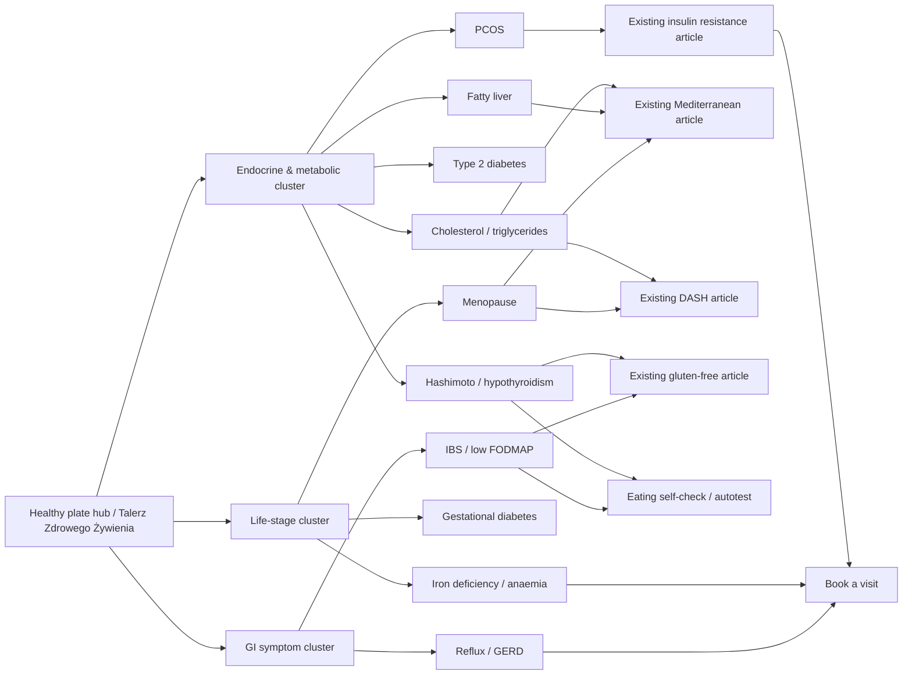

# Poland-first bilingual nutrition content plan for nataliacorvo.com/blog

## Executive summary

The live blog already covers ten broad, upper-funnel topics in a calm bilingual format: the healthy plate, weight management, keto, Mediterranean eating, DASH, gluten-free eating, vegan eating, intermittent fasting, insulin resistance and anti-inflammatory eating. The site also positions itself as educational, evidence-informed and explicitly non-diagnostic. That means the strongest next tranche is not “more general wellness”, but **diagnosis-driven, patient-intent content** that sits one step closer to consultation: thyroid, PCOS, cardiometabolic markers, digestive symptoms, pregnancy-related nutrition, iron deficiency and menopause. citeturn1view0turn2view0turn3view0turn3view1

For Poland-first prioritisation, I weighted three factors: **patient intent** (“what do I eat now that I have this diagnosis / this lab result / these symptoms?”), **clinical relevance** in the Polish public-health context, and **SEO opportunity** created by gaps in the current site. I prioritised Polish official sources first, especially entity["organization","Narodowy Fundusz Zdrowia","poland"], entity["organization","Narodowe Centrum Edukacji Żywieniowej","poland"] and entity["organization","NIZP PZH-PIB","public health institute poland"], then used current international guidance to tighten YMYL safety. The rationale for a more clinical cluster is reinforced by Polish demand signals around nutrition help: the NFZ diet portal reports more than 780,000 users, and NFZ has highlighted the scale of overweight and obesity in adults in Poland. citeturn9view11turn10search0turn9view10

Two important assumptions remain unspecified, so they should be treated as editorial assumptions rather than hard facts. First, **no Search Console, GA4, Ahrefs, Semrush or Senuto export was supplied**, so the “difficulty” and “priority score” below are expert estimates, not measured keyword volumes. Second, the current site architecture appears to use **one bilingual page per article under `/articles/`**, with Polish and English on the same URL; the recommendations below preserve that pattern unless you later decide to split language versions with hreflang. citeturn1view0turn2view0

## Method and assumptions

The research logic was:

1. Audit the live site and exclude current themes already covered on the blog. citeturn1view0turn2view0  
2. Prioritise Polish official guidance for topics where diet is clearly part of patient management: hypothyroidism, PCOS, type 2 diabetes, dyslipidaemia, reflux, IBS/low FODMAP, gestational diabetes, fatty liver, iron deficiency and menopause. citeturn24view1turn24view2turn25view1turn24view3turn24view4turn22view0turn25view0turn24view5turn24view6turn24view0  
3. Cross-check with recent or current high-authority guidance where YMYL nuance matters, including the 2023 international PCOS guideline, 2026 diabetes standards, current GERD guidance, current dyslipidaemia update, 2024 MASLD guidance, and 2025 menopause lifestyle guidance. citeturn21view0turn11search4turn21view5turn21view3turn16search0turn23view3  
4. Keep the tone aligned with the site’s existing editorial stance: calm, practical, educational, no miracle promises, and with clear referral boundaries. citeturn1view0turn3view0turn3view1

The result is a set of **publishable answer-first cores**. Where I suggest a higher final word count than the draft length shown here, that is intentional: the suggested count is the **ideal production target** for organic search depth, while the draft text below is a **compact, fully structured publishable core** that can be expanded with examples, recipe callouts, CTA blocks and clinician-reviewed quote boxes.

## Topic comparison and cluster map

### Ranked comparison table

| Rank | Topic title PL | Topic title EN | Search intent | Difficulty | Priority score | One-sentence rationale |
|---|---|---|---|---|---:|---|
| 1 | Dieta przy Hashimoto i niedoczynności tarczycy: co jeść, czego nie eliminować bez potrzeby | Hashimoto and hypothyroidism diet: what to eat and what not to eliminate unnecessarily | Informational, diagnosis-driven | High | 95 | Strong patient intent, strong Polish female audience fit, high myth-busting need, clear official guidance. |
| 2 | Dieta przy PCOS: regularne posiłki, niski ładunek glikemiczny i mniej chaosu | PCOS diet: regular meals, lower glycaemic load and less chaos | Informational, diagnosis-driven | High | 93 | PCOS is common, closely linked to insulin resistance and weight concerns, and drives practical food queries. |
| 3 | Dieta na cholesterol i trójglicerydy: co realnie pomaga obniżyć LDL | Diet for cholesterol and triglycerides: what actually helps lower LDL | Informational, lab-result driven | High | 91 | Lab-result searches are highly actionable and connect strongly to existing DASH and Mediterranean hubs. |
| 4 | Dieta przy cukrzycy typu 2: prosty talerz, regularność i mniej skoków glukozy | Type 2 diabetes diet: a simple plate, regular meals and fewer glucose spikes | Informational, diagnosis-driven | High | 90 | Core cardiometabolic topic with direct patient intent and strong evidence base. |
| 5 | Dieta przy refluksie i zgadze: co jeść, czego unikać i kiedy zgłosić się do lekarza | Reflux and heartburn diet: what to eat, what to avoid and when to see a clinician | Informational, symptom-driven | Medium | 87 | Symptom-led queries are common, practical and suited to answer-first formatting. |
| 6 | Dieta low FODMAP przy IBS: jak zacząć i nie utknąć w eliminacji | Low FODMAP diet for IBS: how to start without getting stuck in elimination | Informational, symptom-driven | Medium | 86 | Very strong conversational-search fit, especially with the new NCEZ low-FODMAP material. |
| 7 | Dieta przy niedoborze żelaza i niedokrwistości: co naprawdę wspiera leczenie | Diet for iron deficiency and anaemia: what really supports treatment | Informational, symptom/lab-driven | Medium | 84 | Strong relevance for women and pregnancy-adjacent patients, but must be written carefully to avoid overpromising. |
| 8 | Dieta przy cukrzycy ciążowej: regularne posiłki bez głodzenia się | Gestational diabetes diet: regular meals without under-eating | Informational, pregnancy/diagnosis-driven | Medium | 83 | High-intent, high-trust topic with strong official Polish guidance and clear clinical boundaries. |
| 9 | Dieta przy stłuszczeniu wątroby: mniej cukru, mniej chaosu, bardziej śródziemnomorsko | Fatty liver diet: less sugar, less chaos, more Mediterranean | Informational, diagnosis/lab-driven | Medium | 81 | Rising metabolic relevance and strong fit with current Mediterranean and weight-management hubs. |
| 10 | Dieta w menopauzie: masa ciała, kości i serce bez diet-cud | Menopause diet: weight, bones and heart health without miracle diets | Informational, life-stage driven | Medium | 79 | Evergreen life-stage cluster with sustained intent and strong cross-linking potential. |

This ranking is driven by Polish official guidance, current disease burden relevance, and clear blog-gap analysis rather than proprietary keyword-volume data. The site’s current cluster covers broad patterns; the next logical cluster is endocrine, digestive and cardiometabolic patient-intent content. citeturn1view0turn9view11turn24view1turn24view2turn25view1turn24view4turn22view0turn25view0turn24view5turn24view0

### Topic-cluster flowchart

The map below shows how the next ten topics should connect to the existing blog hubs and service pages. The current blog already uses a hub pattern, with “The healthy plate” positioned as a foundational article and internal “read also” links to weight management, Mediterranean eating and insulin resistance. citeturn2view0turn1view0



### Existing internal assets already on the site

The site already contains foundational pages that these ten articles should link to and from: the healthy-plate hub, weight-management article, Mediterranean article, DASH article, gluten-free article, vegan article, intermittent-fasting article, insulin-resistance article, anti-inflammatory article, the eating self-check, and the booking page. citeturn1view0turn2view0turn3view0turn3view1

## Production packs

### Dieta przy Hashimoto i niedoczynności tarczycy: co jeść, czego nie eliminować bez potrzeby

**Rationale.** This is the strongest endocrine gap on the current site: NCEZ frames diet as support to pharmacotherapy, stresses meal timing around levothyroxine, and explicitly warns against simplistic elimination logic around goitrogens and soya; in parallel, thyroid-patient information still generates heavy myth traffic around gluten, iodine and supplements. citeturn24view1turn23view0turn17search3

**Meta title PL:** Hashimoto i niedoczynność tarczycy: dieta bez mitów  
**Meta title EN:** Hashimoto and hypothyroidism diet without myths  
**Meta description PL:** Praktyczny przewodnik dla osób z Hashimoto i niedoczynnością tarczycy: regularne posiłki, lewotyroksyna, soja, gluten i suplementy bez paniki.  
**Meta description EN:** A practical guide to eating with Hashimoto’s and hypothyroidism: meal structure, levothyroxine timing, soya, gluten and supplements without panic.  
**Slug:** `/articles/hashimoto-niedoczynnosc-tarczycy-dieta`  
**Primary keyword PL / EN:** `dieta hashimoto` / `hashimoto diet`  
**Secondary keywords PL:** `niedoczynność tarczycy dieta`; `co jeść przy hashimoto`; `lewotyroksyna a jedzenie`; `czy gluten szkodzi przy hashimoto`; `jadłospis hashimoto`  
**Secondary keywords EN:** `hypothyroidism diet`; `what to eat with hashimoto`; `levothyroxine and food`; `do you need gluten free with hashimoto`; `hashimoto meal plan`  
**Search intent:** informational, diagnosis-driven, high trust  
**Suggested production length:** 1,300–1,700 words

**H1:** Dieta przy Hashimoto i niedoczynności tarczycy: co jeść, czego nie eliminować bez potrzeby / Hashimoto and hypothyroidism diet: what to eat and what not to eliminate unnecessarily

**H2 outline.**  
`Szybka odpowiedź: jaka dieta pomaga najbardziej? / Quick answer: what diet helps most?`  
`Jak zbudować posiłek przy niedoczynności tarczycy / How to build meals with hypothyroidism`  
`Lewotyroksyna, kawa, soja, wapń i żelazo / Levothyroxine, coffee, soya, calcium and iron`  
`Gluten, warzywa kapustne, jod i suplementy / Gluten, cruciferous vegetables, iodine and supplements`  
`Przykład zwykłego dnia jedzenia / A normal day of eating`  
`Kiedy dieta to za mało i trzeba wrócić do lekarza / When diet is not enough and review is needed`

**FAQ pairings.**  
**PL:** Czy przy Hashimoto trzeba wykluczyć gluten?  
**EN:** Do you need to avoid gluten with Hashimoto’s?  
**A:** Nie rutynowo. Dieta bezglutenowa ma sens przy celiakii lub innym potwierdzonym wskazaniu, ale nie jest automatycznym standardem dla każdej osoby z Hashimoto. / Not routinely. Gluten-free eating is appropriate when coeliac disease or another clear indication is present, but it is not an automatic standard for everyone with Hashimoto’s. citeturn24view1turn1view0

**PL:** Czy soja jest zakazana?  
**EN:** Is soya forbidden?  
**A:** Nie. Problemem jest głównie moment spożycia względem lewotyroksyny, bo soja może ograniczać jej wchłanianie. / No. The main issue is timing relative to levothyroxine, because soya can reduce absorption. citeturn24view1turn23view0

**PL:** Kiedy pić kawę po leku?  
**EN:** When can you drink coffee after the tablet?  
**A:** Co najmniej po 30 minutach, a u części osób lepiej zachować dłuższy odstęp, jeśli wyniki są niestabilne. / At least 30 minutes later, and in some people a longer gap is sensible if results are unstable. citeturn24view1turn17search3

**PL:** Czy suplementy „na tarczycę” pomagają?  
**EN:** Do “thyroid support” supplements help?  
**A:** Nie powinny zastępować leczenia ani dobrze zbilansowanej diety; suplementację warto ustalać indywidualnie. / They should not replace treatment or a balanced diet; supplementation should be individualised. citeturn24view1turn23view0

**PL:** Czy można schudnąć przy niedoczynności tarczycy?  
**EN:** Can you lose weight with hypothyroidism?  
**A:** Tak, ale zwykle działa spokojna, powtarzalna struktura posiłków i wyrównane leczenie, nie dieta-cud. / Yes, but a calm repeatable meal structure and well-adjusted treatment usually matter more than a miracle diet. citeturn24view1turn23view0

**JSON-LD snippet.**
```html
<script type="application/ld+json">
{
  "@context":"https://schema.org",
  "@graph":[
    {
      "@type":"MedicalWebPage",
      "url":"https://nataliacorvo.com/articles/hashimoto-niedoczynnosc-tarczycy-dieta",
      "headline":"Dieta przy Hashimoto i niedoczynności tarczycy / Hashimoto and hypothyroidism diet",
      "inLanguage":["pl-PL","en-GB"],
      "author":{"@type":"Person","name":"Natalia Wcisło"},
      "about":{"@type":"MedicalCondition","name":"Hashimoto thyroiditis and hypothyroidism"},
      "isPartOf":{"@type":"WebSite","name":"Natural Healing Natalia Wcisło","url":"https://nataliacorvo.com/blog"}
    },
    {
      "@type":"FAQPage",
      "mainEntity":[
        {
          "@type":"Question",
          "name":"Czy przy Hashimoto trzeba wykluczyć gluten? / Do you need to avoid gluten with Hashimoto’s?",
          "acceptedAnswer":{"@type":"Answer","text":"Nie rutynowo; dieta bezglutenowa jest potrzebna przy potwierdzonym wskazaniu. / Not routinely; a gluten-free diet is needed when there is a confirmed indication."}
        },
        {
          "@type":"Question",
          "name":"Czy soja jest zakazana? / Is soya forbidden?",
          "acceptedAnswer":{"@type":"Answer","text":"Nie, ale nie powinna być jedzona blisko lewotyroksyny. / No, but it should not be eaten close to levothyroxine."}
        }
      ]
    }
  ]
}
</script>
```
Before publishing, add the remaining three FAQ pairs from the block above.

**Internal linking suggestions.** Link to the existing healthy-plate hub as the foundation, to the gluten-free article for “when not to eliminate automatically”, to the anti-inflammatory article for pattern-level discussion, to the insulin-resistance article when weight or glucose concerns coexist, and to the booking page for persistent symptoms despite treatment structure. The current site already uses hub-and-spoke linking and educational safety notes, so this article should preserve that pattern. citeturn2view0turn1view0turn3view0

**HTML blog-card snippet.**
```html
<article class="blog-card">
  <a href="/articles/hashimoto-niedoczynnosc-tarczycy-dieta">
    <p class="eyebrow">Tarczyca · Thyroid · 10 min</p>
    <h3>Dieta przy Hashimoto i niedoczynności tarczycy: co jeść, czego nie eliminować bez potrzeby</h3>
    <p>Praktyczny przewodnik o regularnych posiłkach, lewotyroksynie, soi, glutenie i suplementach bez mitów.</p>
  </a>
</article>
```

**Sources / Źródła.** NCEZ hypothyroidism guidance and Hashimoto nutrition support article. citeturn24view1turn23view0 Patient guidance from the entity["organization","American Thyroid Association","us medical society"] and the British Thyroid Foundation on how food can affect levothyroxine absorption. citeturn17search0turn17search3turn17search7

#### Draft PL

Hashimoto i niedoczynność tarczycy nie wymagają jednej „magicznej diety”. Najbardziej użyteczny model to regularne, pełnowartościowe posiłki, które wspierają odpowiednią podaż białka, błonnika, jodu, żelaza, selenu i witaminy D, a leczenie farmakologiczne pozostaje podstawą. Dieta ma wspierać leczenie, nie je zastępować. citeturn24view1turn23view0

W praktyce najlepiej działa spokojna struktura: 4–5 posiłków, warzywa, źródło białka, produkty zbożowe dobrej jakości, zdrowe tłuszcze i powtarzalny rytm dnia. Jeśli bierzesz lewotyroksynę, zostaw co najmniej 30 minut przerwy do pierwszego posiłku; kawa, soja, wapń i żelazo mogą zaburzać wchłanianie, więc nie warto łączyć ich z lekiem. citeturn24view1turn23view0turn17search3

Najwięcej chaosu budzą zakazy. Gluten nie musi być eliminowany automatycznie. Warzywa kapustne i soja nie są „zakazane”, tylko wymagają rozsądku i dobrego timing-u względem leku. Również suplementy „na tarczycę” nie powinny być kupowane na ślepo, zwłaszcza jeśli zawierają wysokie dawki jodu lub mają zastępować leczenie. citeturn24view1turn23view0turn17search7

Dobry dzień jedzenia może wyglądać zupełnie zwyczajnie: owsianka z jogurtem i jagodami, potem ryż z pieczonym łososiem i surówką, a wieczorem kanapki z twarożkiem albo tofu i warzywami. Jeśli mimo dobrze przyjmowanego leku utrzymują się nasilone objawy, masa ciała wyraźnie się zmienia, planujesz ciążę albo wyniki są niestabilne, potrzebna jest kontrola lekarska. Ten tekst ma charakter edukacyjny i nie zastępuje diagnostyki ani zmiany dawki leków. citeturn24view1turn23view0turn17search0

#### Draft EN

Hashimoto’s and hypothyroidism do not require a single “magic diet”. The most useful pattern is regular, balanced eating that supports adequate protein, fibre, iodine, iron, selenium and vitamin D intake, while medication remains the cornerstone of treatment. Food should support management, not replace it. citeturn24view1turn23view0

In practice, a calm structure works best: 4–5 meals, vegetables, a clear protein source, good-quality carbohydrates, healthy fats and a repeatable routine. If you take levothyroxine, leave at least 30 minutes before breakfast; coffee, soya, calcium and iron can interfere with absorption, so they should not be taken too close to the tablet. citeturn24view1turn23view0turn17search3

The biggest source of confusion is unnecessary restriction. Gluten does not need to be removed automatically. Cruciferous vegetables and soya are not “forbidden”; they simply need sensible timing and proportion. “Thyroid support” supplements are also not a substitute for treatment, particularly if they contain high-dose iodine or are marketed as a cure. citeturn24view1turn23view0turn17search7

A good day of eating can look very normal: porridge with yoghurt and berries, rice with baked salmon and salad, then sandwiches with cottage cheese or tofu and vegetables. If symptoms remain strong despite taking medication properly, if weight shifts substantially, if you are planning pregnancy or if blood tests remain unstable, clinical review matters. This article is educational and does not replace diagnosis, medication review or personal medical care. citeturn24view1turn23view0turn17search0

### Dieta przy PCOS: regularne posiłki, niski ładunek glikemiczny i mniej chaosu

**Rationale.** PCOS is one of the clearest Poland-first opportunities because NCEZ presents it as common in young women, often coexisting with insulin resistance and excess body mass, while the international 2023 guideline confirms its global prevalence and need for structured lifestyle care. citeturn24view2turn21view0turn21view1

**Meta title PL:** Dieta przy PCOS: co jeść i jak układać posiłki  
**Meta title EN:** PCOS diet: what to eat and how to structure meals  
**Meta description PL:** PCOS bez mitów: regularne posiłki, niższy ładunek glikemiczny, białko, błonnik i suplementy tylko wtedy, gdy mają sens.  
**Meta description EN:** PCOS without myths: regular meals, lower glycaemic load, protein, fibre and supplements only when they make sense.  
**Slug:** `/articles/pcos-dieta-regularne-posilki-insulina`  
**Primary keyword PL / EN:** `dieta PCOS` / `PCOS diet`  
**Secondary keywords PL:** `PCOS co jeść`; `insulinooporność i PCOS dieta`; `niski indeks glikemiczny PCOS`; `jadłospis PCOS`; `PCOS suplementy dieta`  
**Secondary keywords EN:** `what to eat with PCOS`; `PCOS insulin resistance diet`; `low glycaemic index PCOS`; `PCOS meal plan`; `PCOS supplements diet`  
**Search intent:** informational, diagnosis-driven  
**Suggested production length:** 1,300–1,700 words

**H1:** Dieta przy PCOS: regularne posiłki, niski ładunek glikemiczny i mniej chaosu / PCOS diet: regular meals, lower glycaemic load and less chaos

**H2 outline.**  
`Szybka odpowiedź: czy istnieje jedna dieta przy PCOS? / Quick answer: is there one PCOS diet?`  
`Jak budować posiłki przy PCOS / How to build meals with PCOS`  
`PCOS, insulinooporność i masa ciała / PCOS, insulin resistance and body weight`  
`Suplementy: co ma sens, a co jest marketingiem / Supplements: what is plausible and what is marketing`  
`Przykładowy dzień jedzenia / Example day of eating`  
`Kiedy potrzebna jest konsultacja medyczna / When medical review matters`

**FAQ pairings.**  
**PL:** Czy trzeba przejść na dietę niskowęglowodanową?  
**EN:** Do you have to go low-carb?  
**A:** Nie. Najważniejsza jest jakość i rozkład posiłków, nie skrajne cięcie węglowodanów. / No. The main issue is meal quality and structure, not extreme carbohydrate restriction. citeturn24view2turn21view0

**PL:** Czy owoce są problemem przy PCOS?  
**EN:** Are fruit a problem in PCOS?  
**A:** Nie, szczególnie gdy są częścią pełnego posiłku i nie zastępują warzyw. / No, especially when they are part of a full meal and do not crowd out vegetables. citeturn24view2

**PL:** Czy inozytol pomaga?  
**EN:** Does inositol help?  
**A:** Może być rozważany w wybranych sytuacjach, ale nie zastępuje stylu życia i leczenia. / It may be considered in selected cases, but it does not replace lifestyle care or medical treatment. citeturn23view1turn21view0

**PL:** Czy post przerywany jest najlepszy?  
**EN:** Is intermittent fasting the best option?  
**A:** Nie dla każdej osoby; przy PCOS ważniejsza jest powtarzalność i tolerancja niż modny schemat. / Not for everyone; with PCOS, consistency and tolerability matter more than a trendy schedule. citeturn24view2turn21view0

**PL:** Kiedy szukać pomocy specjalisty?  
**EN:** When should you seek specialist help?  
**A:** Gdy cykle są bardzo nieregularne, gdy planujesz ciążę, gdy masa ciała szybko się zmienia lub gdy jedzenie staje się źródłem silnego stresu. / When cycles are very irregular, when you are planning pregnancy, when weight changes quickly or when food becomes a major source of stress. citeturn24view2turn21view0

**JSON-LD snippet.**
```html
<script type="application/ld+json">
{
  "@context":"https://schema.org",
  "@graph":[
    {
      "@type":"MedicalWebPage",
      "url":"https://nataliacorvo.com/articles/pcos-dieta-regularne-posilki-insulina",
      "headline":"Dieta przy PCOS / PCOS diet",
      "inLanguage":["pl-PL","en-GB"],
      "author":{"@type":"Person","name":"Natalia Wcisło"},
      "about":{"@type":"MedicalCondition","name":"Polycystic ovary syndrome"}
    },
    {
      "@type":"FAQPage",
      "mainEntity":[
        {
          "@type":"Question",
          "name":"Czy trzeba przejść na dietę niskowęglowodanową? / Do you have to go low-carb?",
          "acceptedAnswer":{"@type":"Answer","text":"Nie; ważniejsza jest jakość i rozkład posiłków. / No; meal quality and structure matter more."}
        },
        {
          "@type":"Question",
          "name":"Czy inozytol pomaga? / Does inositol help?",
          "acceptedAnswer":{"@type":"Answer","text":"Może być rozważany indywidualnie, ale nie zastępuje podstaw leczenia. / It may be considered individually, but it does not replace core care."}
        }
      ]
    }
  ]
}
</script>
```

**Internal linking suggestions.** Link strongly to the existing insulin-resistance article, healthy-plate hub, weight-management article, anti-inflammatory article and booking page. This is the clearest bridge article from upper-funnel lifestyle reading to clinically relevant nutrition support. citeturn1view0turn2view0turn3view0

**HTML blog-card snippet.**
```html
<article class="blog-card">
  <a href="/articles/pcos-dieta-regularne-posilki-insulina">
    <p class="eyebrow">Hormony · Hormones · 10 min</p>
    <h3>Dieta przy PCOS: regularne posiłki, niski ładunek glikemiczny i mniej chaosu</h3>
    <p>Praktyczny przewodnik o białku, błonniku, strukturze talerza i tym, czego nie trzeba robić.</p>
  </a>
</article>
```

**Sources / Źródła.** NCEZ PCOS guidance and its longer article on the role of diet and supplementation. citeturn24view2turn23view1 The 2023 international PCOS guideline from the entity["organization","Monash University","australia university"] network and partner societies. citeturn21view0turn21view1

#### Draft PL

Przy PCOS nie ma jednej idealnej diety, ale są wyraźne zasady, które zwykle pomagają: regularne posiłki, więcej błonnika, wyraźne źródło białka i niższy ładunek glikemiczny. To ważne szczególnie dlatego, że PCOS często współwystępuje z insulinoopornością i nadmierną masą ciała. citeturn24view2turn21view0

Najprościej zacząć od struktury talerza. Połowę objętości powinny zajmować warzywa, dalej źródło białka, potem produkty zbożowe dobrej jakości lub inne węglowodany o rozsądnej porcji, a na końcu zdrowy tłuszcz. W praktyce oznacza to mniej przypadkowego podjadania i mniej dużych wahań energii. citeturn24view2turn23view1

PCOS nie wymaga automatycznie diety bardzo niskowęglowodanowej ani eliminacji owoców czy nabiału. Dużo ważniejsze jest to, czy posiłki są powtarzalne, czy zawierają błonnik i białko, i czy płynne kalorie, słodkie przekąski oraz bardzo przetworzone jedzenie nie zaczynają dominować dnia. Suplementy, w tym inozytol, można rozważać tylko w kontekście indywidualnym. citeturn24view2turn23view1turn21view0

Dobry dzień przy PCOS może wyglądać zwyczajnie: kanapki z pełnoziarnistego pieczywa z jajkiem i warzywami, potem kasza z pieczonym kurczakiem lub tofu i sałatką, a wieczorem jogurt naturalny z owocem i orzechami albo zupa z soczewicą. Jeśli cykle są bardzo nieregularne, planujesz ciążę, masa ciała szybko się zmienia lub jedzenie zaczyna budzić duże napięcie, potrzebna jest konsultacja lekarska i dietetyczna. Ten tekst ma charakter edukacyjny. citeturn24view2turn21view0

#### Draft EN

There is no single perfect diet for PCOS, but there are clear principles that usually help: regular meals, more fibre, a visible protein source and a lower glycaemic load. This matters even more because PCOS often coexists with insulin resistance and excess body weight. citeturn24view2turn21view0

The easiest starting point is plate structure. Half the plate should usually be vegetables, followed by a protein source, then a sensible portion of better-quality carbohydrates, plus a healthy fat. In real life that means less chaotic grazing and fewer large swings in appetite and energy. citeturn24view2turn23view1

PCOS does not automatically require a very low-carbohydrate diet or the removal of fruit and dairy. What matters much more is whether meals are repeatable, whether they contain fibre and protein, and whether liquid calories, sweet snacks and ultra-processed foods are dominating the day. Supplements, including inositol, should only be considered in an individual clinical context. citeturn24view2turn23view1turn21view0

A good day with PCOS can look very normal: wholegrain sandwiches with egg and vegetables, grains with baked chicken or tofu and salad, then natural yoghurt with fruit and nuts or lentil soup. If cycles are very irregular, if you are trying to conceive, if weight changes quickly or if eating is becoming highly stressful, medical and dietetic review is sensible. This article is educational and does not replace diagnosis or treatment. citeturn24view2turn21view0

### Dieta na cholesterol i trójglicerydy: co realnie pomaga obniżyć LDL

**Rationale.** This topic is high-value because it is triggered by blood-test results, links cleanly to the existing Mediterranean and DASH articles, and official guidance is unusually practical on what to replace, what to limit and when medication still matters. citeturn24view3turn21view3turn22view3

**Meta title PL:** Dieta na cholesterol i trójglicerydy: co działa  
**Meta title EN:** Diet for cholesterol and triglycerides: what works  
**Meta description PL:** Wysoki cholesterol lub trójglicerydy? Sprawdź, jak ograniczyć tłuszcze nasycone i cukry proste oraz co realnie wspiera obniżanie LDL.  
**Meta description EN:** High cholesterol or triglycerides? Learn how to cut saturated fat and excess sugar and what really helps lower LDL.  
**Slug:** `/articles/cholesterol-triglicerydy-dieta-co-jesc`  
**Primary keyword PL / EN:** `dieta na cholesterol` / `diet for high cholesterol`  
**Secondary keywords PL:** `wysoki cholesterol co jeść`; `trójglicerydy dieta`; `jak obniżyć LDL dietą`; `jadłospis cholesterol`; `cholesterol dieta śródziemnomorska`  
**Secondary keywords EN:** `high cholesterol what to eat`; `triglycerides diet`; `how to lower LDL with diet`; `cholesterol meal plan`; `cholesterol Mediterranean diet`  
**Search intent:** informational, lab-result driven  
**Suggested production length:** 1,300–1,800 words

**H2 outline.**  
`Szybka odpowiedź: co obniża LDL, a co najbardziej szkodzi? / Quick answer: what lowers LDL and what drives it up?`  
`Tłuszcze nasycone, trans i zamienniki / Saturated fat, trans fat and better swaps`  
`Błonnik, strączki, owies i ryby / Fibre, beans, oats and fish`  
`Cholesterol a trójglicerydy: to nie jest to samo / Cholesterol and triglycerides are not the same thing`  
`Suplementy, alkohol i kiedy same zmiany stylu życia nie wystarczą / Supplements, alcohol and when lifestyle alone is not enough`  
`Praktyczny jednodniowy jadłospis / Practical one-day plan`

**FAQ pairings.**  
**PL:** Czy jajka trzeba mocno ograniczać?  
**EN:** Do eggs need to be heavily restricted?  
**A:** Zwykle ważniejszy jest cały wzorzec diety niż samo jedno jedzenie. / Usually the overall diet pattern matters more than one single food. citeturn24view3turn22view3

**PL:** Co bardziej podnosi trójglicerydy: tłuszcz czy cukier?  
**EN:** What tends to raise triglycerides more: fat or sugar?  
**A:** Nadmiar cukrów prostych i alkoholu bywa bardzo istotny przy wysokich trójglicerydach. / Excess simple sugars and alcohol can be especially relevant when triglycerides are high. citeturn24view3

**PL:** Czy suplementy obniżają cholesterol?  
**EN:** Do supplements lower cholesterol?  
**A:** Nie są podstawą leczenia i nie powinny zastępować leków ani diety. / They are not the foundation of treatment and should not replace medication or dietary change. citeturn22view3turn21view3

**PL:** Czy dieta śródziemnomorska ma sens?  
**EN:** Does the Mediterranean diet make sense here?  
**A:** Tak, to jeden z najlepiej wspieranych modeli przy zaburzeniach lipidowych. / Yes, it is one of the best-supported patterns for lipid disorders. citeturn24view3

**PL:** Kiedy sama dieta nie wystarczy?  
**EN:** When is diet alone not enough?  
**A:** Przy wyższym ryzyku sercowo-naczyniowym lub nasilonych nieprawidłowościach często potrzebne jest też leczenie farmakologiczne. / In higher cardiovascular-risk situations or more severe abnormalities, medication is often needed as well. citeturn24view3turn21view3

**JSON-LD snippet.**
```html
<script type="application/ld+json">
{
  "@context":"https://schema.org",
  "@graph":[
    {
      "@type":"MedicalWebPage",
      "url":"https://nataliacorvo.com/articles/cholesterol-triglicerydy-dieta-co-jesc",
      "headline":"Dieta na cholesterol i trójglicerydy / Diet for cholesterol and triglycerides",
      "inLanguage":["pl-PL","en-GB"],
      "author":{"@type":"Person","name":"Natalia Wcisło"},
      "about":{"@type":"MedicalCondition","name":"Dyslipidaemia"}
    },
    {
      "@type":"FAQPage",
      "mainEntity":[
        {
          "@type":"Question",
          "name":"Czy suplementy obniżają cholesterol? / Do supplements lower cholesterol?",
          "acceptedAnswer":{"@type":"Answer","text":"Nie są podstawą leczenia. / They are not the foundation of treatment."}
        },
        {
          "@type":"Question",
          "name":"Czy dieta śródziemnomorska ma sens? / Does the Mediterranean diet make sense?",
          "acceptedAnswer":{"@type":"Answer","text":"Tak, jest jednym z najlepiej wspieranych modeli. / Yes, it is one of the best-supported patterns."}
        }
      ]
    }
  ]
}
</script>
```

**Internal linking suggestions.** Link to the existing Mediterranean article, DASH article, weight-management article, anti-inflammatory article and booking page. This article should also link back to the healthy-plate hub for first-time readers. citeturn1view0turn2view0

**HTML blog-card snippet.**
```html
<article class="blog-card">
  <a href="/articles/cholesterol-triglicerydy-dieta-co-jesc">
    <p class="eyebrow">Serce · Heart health · 10 min</p>
    <h3>Dieta na cholesterol i trójglicerydy: co realnie pomaga obniżyć LDL</h3>
    <p>Co ograniczyć, co dodać i dlaczego suplementy nie są skrótem do lepszych wyników.</p>
  </a>
</article>
```

**Sources / Źródła.** NCEZ lipid-disorder guidance. citeturn24view3 Advice from the entity["organization","American Heart Association","us heart charity"] on dietary priorities, and the 2025 focused dyslipidaemia update from the entity["organization","European Society of Cardiology","europe medical society"] and entity["organization","European Atherosclerosis Society","europe lipid society"]. citeturn22view3turn21view3turn13search5

#### Draft PL

Jeśli masz wysoki LDL albo trójglicerydy, najważniejsza nie jest dieta „bez cholesterolu”, tylko taka, która ogranicza tłuszcze nasycone i nadmiar cukrów prostych, a zwiększa ilość błonnika, strączków, warzyw, pełnych ziaren, orzechów i ryb. To znaczy mniej masła, śmietany, tłustych wędlin i słodyczy, a więcej oliwy, owsa i prostych domowych posiłków. citeturn24view3turn22view3

Wysoki cholesterol i wysokie trójglicerydy nie są tym samym. Przy LDL szczególnie liczy się zamiana tłuszczów pochodzenia zwierzęcego na tłuszcze nienasycone. Przy trójglicerydach często duże znaczenie mają słodkie napoje, alkohol i przypadkowe podjadanie. Dlatego wyniki warto czytać w kontekście całego stylu życia, a nie tylko jednej listy „produktów zakazanych”. citeturn24view3turn22view3

Najbardziej praktyczny model to dieta śródziemnomorska lub podobny wzorzec roślinno-sercowy. Owsianka, jogurt naturalny, pieczywo pełnoziarniste, zupy z roślin strączkowych, ryba 1–2 razy w tygodniu i mniej przetworzonych mięs to działania mniej efektowne niż suplementy, ale lepiej wspierane przez dane. Suplementy nie powinny zastępować leczenia. citeturn24view3turn22view3turn21view3

Jeśli ryzyko sercowo-naczyniowe jest większe albo nieprawidłowości są nasilone, sama dieta może nie wystarczyć i leki pozostają ważną częścią terapii. Ten tekst ma charakter edukacyjny i nie powinien być traktowany jako samodzielna decyzja o odstawieniu lub niebraniu leków. citeturn24view3turn21view3

#### Draft EN

If your LDL cholesterol or triglycerides are high, the key issue is not a simplistic “low-cholesterol diet”. It is a pattern that reduces saturated fat and excess simple sugars while increasing fibre, beans, vegetables, whole grains, nuts and fish. In practice that means less butter, cream, fatty processed meat and sweets, and more olive oil, oats and straightforward home meals. citeturn24view3turn22view3

High cholesterol and high triglycerides are not identical problems. LDL is strongly influenced by the replacement of animal fats with unsaturated fats. Triglycerides are often especially affected by sugary drinks, alcohol and chaotic snacking. That is why results should be interpreted in the context of the whole lifestyle rather than one simplistic banned-food list. citeturn24view3turn22view3

The most practical pattern is Mediterranean-style or similarly plant-forward heart-healthy eating. Porridge, natural yoghurt, wholegrain bread, bean soups, fish once or twice a week and less processed meat are less dramatic than supplements, but much better supported by evidence. Supplements should not replace treatment. citeturn24view3turn22view3turn21view3

If cardiovascular risk is higher or lipid abnormalities are marked, diet alone may not be enough and medication remains important. This article is educational and should not be used to stop, delay or avoid prescribed treatment. citeturn24view3turn21view3

### Dieta przy cukrzycy typu 2: prosty talerz, regularność i mniej skoków glukozy

**Rationale.** This is a core high-intent topic because Polish guidance emphasises lifestyle as the basis of care, while current standards remain person-centred rather than “one diabetic diet for everyone”. citeturn25view1turn11search4turn11search13

**Meta title PL:** Cukrzyca typu 2: dieta bez skrajności  
**Meta title EN:** Type 2 diabetes diet without extremes  
**Meta description PL:** Praktyczny przewodnik przy cukrzycy typu 2: talerz, regularne posiłki, owoce, pieczywo, białko i kiedy dieta nie wystarczy sama.  
**Meta description EN:** A practical guide for type 2 diabetes: plate structure, meal timing, fruit, bread, protein and when diet alone is not enough.  
**Slug:** `/articles/cukrzyca-typu-2-dieta-talerz-posilkow`  
**Primary keyword PL / EN:** `cukrzyca typu 2 dieta` / `type 2 diabetes diet`  
**Secondary keywords PL:** `co jeść przy cukrzycy typu 2`; `jadłospis cukrzyca typu 2`; `niski IG cukrzyca`; `glukoza po posiłku dieta`; `HbA1c dieta`  
**Secondary keywords EN:** `what to eat with type 2 diabetes`; `type 2 diabetes meal plan`; `low GI diabetes`; `post meal glucose diet`; `HbA1c diet`  
**Search intent:** informational, diagnosis-driven  
**Suggested production length:** 1,400–1,900 words

**H2 outline.**  
`Szybka odpowiedź: od czego zacząć po diagnozie? / Quick answer: where do you start after diagnosis?`  
`Talerz, porcja węglowodanów i jakość produktów / The plate, carbohydrate portion and food quality`  
`Owoce, chleb i ziemniaki: co naprawdę trzeba ograniczać? / Fruit, bread and potatoes: what really needs limiting?`  
`Napoje, podjadanie i rytm dnia / Drinks, grazing and daily rhythm`  
`Masa ciała, HbA1c i cele realne / Weight, HbA1c and realistic goals`  
`Kiedy potrzebna jest indywidualizacja leczenia / When treatment needs tighter individualisation`

**FAQ pairings.**  
**PL:** Czy przy cukrzycy trzeba odstawić owoce?  
**EN:** Do you need to cut out fruit?  
**A:** Nie, ale warto pilnować porcji i łączyć owoce z pełnym posiłkiem lub białkiem. / No, but portions matter and fruit works best as part of a fuller meal or with protein. citeturn25view1

**PL:** Czy chleb i ziemniaki są zakazane?  
**EN:** Are bread and potatoes forbidden?  
**A:** Nie. Znaczenie ma jakość, porcja i to, z czym je jesz. / No. Quality, portion and meal context all matter. citeturn25view1

**PL:** Czy trzeba przejść na niski IG?  
**EN:** Do you have to eat strictly low GI?  
**A:** Niski lub niższy IG bywa pomocny, ale ważniejszy jest cały wzorzec talerza. / Lower-GI choices can help, but the overall plate pattern matters more. citeturn25view1

**PL:** Czy redukcja masy ciała ma znaczenie?  
**EN:** Does weight loss matter?  
**A:** Tak, już umiarkowana redukcja może przynieść korzyści metaboliczne, jeśli jest wskazana. / Yes, even moderate loss can improve metabolic outcomes when appropriate. citeturn25view1

**PL:** Czy dieta może zastąpić leki?  
**EN:** Can diet replace medication?  
**A:** U części osób poprawa stylu życia bardzo pomaga, ale nie należy samodzielnie odstawiać leków. / Lifestyle change can help a great deal, but medication should not be stopped without clinical advice. citeturn25view1turn11search13

**JSON-LD snippet.**
```html
<script type="application/ld+json">
{
  "@context":"https://schema.org",
  "@graph":[
    {
      "@type":"MedicalWebPage",
      "url":"https://nataliacorvo.com/articles/cukrzyca-typu-2-dieta-talerz-posilkow",
      "headline":"Dieta przy cukrzycy typu 2 / Type 2 diabetes diet",
      "inLanguage":["pl-PL","en-GB"],
      "author":{"@type":"Person","name":"Natalia Wcisło"},
      "about":{"@type":"MedicalCondition","name":"Type 2 diabetes mellitus"}
    },
    {
      "@type":"FAQPage",
      "mainEntity":[
        {
          "@type":"Question",
          "name":"Czy przy cukrzycy trzeba odstawić owoce? / Do you need to cut out fruit?",
          "acceptedAnswer":{"@type":"Answer","text":"Nie; ważna jest porcja i kontekst posiłku. / No; portion and meal context matter."}
        },
        {
          "@type":"Question",
          "name":"Czy dieta może zastąpić leki? / Can diet replace medication?",
          "acceptedAnswer":{"@type":"Answer","text":"Nie należy samodzielnie odstawiać leków. / Medication should not be stopped without clinical advice."}
        }
      ]
    }
  ]
}
</script>
```

**Internal linking suggestions.** Link to insulin resistance, healthy plate, weight-management, Mediterranean eating and the booking page. A paragraph comparing this article with the site’s existing intermittent-fasting and keto articles could also improve internal depth. citeturn1view0turn2view0

**HTML blog-card snippet.**
```html
<article class="blog-card">
  <a href="/articles/cukrzyca-typu-2-dieta-talerz-posilkow">
    <p class="eyebrow">Glikemia · Glucose · 11 min</p>
    <h3>Dieta przy cukrzycy typu 2: prosty talerz, regularność i mniej skoków glukozy</h3>
    <p>Co jeść po diagnozie, jak myśleć o chlebie, owocach i przekąskach oraz kiedy potrzebna jest indywidualizacja.</p>
  </a>
</article>
```

**Sources / Źródła.** NCEZ type 2 diabetes guidance. citeturn25view1 The 2026 standards from the entity["organization","American Diabetes Association","us medical charity"] and current Polish diabetes-guideline ecosystem from entity["organization","Polskie Towarzystwo Diabetologiczne","poland"]. citeturn11search0turn11search4turn11search9turn11search13

#### Draft PL

Przy cukrzycy typu 2 nie ma jednej „diety cukrzycowej” dla wszystkich. Najlepszy start to regularne, pełnowartościowe posiłki, mniej cukrów prostych, lepsza jakość węglowodanów i spokojna struktura talerza. Styl życia pozostaje podstawą leczenia, ale plan musi być dopasowany do wyników, leków i codzienności. citeturn25view1turn11search13

W praktyce połowę talerza powinny stanowić warzywa, około jedną czwartą źródło białka, a jedną czwartą produkty zbożowe, ziemniaki, ryż lub kasza. Owoce nie są zakazane, ale zwykle lepiej działają w rozsądnej porcji i jako część większego posiłku. Chleb i ziemniaki także nie znikają automatycznie z diety. Liczy się porcja, jakość i to, z czym są jedzone. citeturn25view1

Duże znaczenie mają też napoje i podjadanie. Słodzone napoje, soki, kawa „jak deser” i przypadkowe przekąski potrafią podnosić glikemię bardziej niż zwykły domowy obiad. Jeśli masz nadwagę lub otyłość, stopniowa redukcja masy ciała może poprawić wrażliwość na insulinę i inne parametry metaboliczne. citeturn25view1

Dieta może bardzo pomóc, ale nie powinna prowadzić do samodzielnego odstawiania leków. Jeśli zdarzają się hipoglikemie, duże wahania glukozy, szybki spadek masy ciała albo trudność w ułożeniu jedzenia pod leczenie, potrzebna jest indywidualna konsultacja. Tekst ma charakter edukacyjny. citeturn25view1turn11search13

#### Draft EN

There is no single “diabetic diet” for everyone with type 2 diabetes. The best starting point is regular balanced meals, less simple sugar, better carbohydrate quality and a calm plate structure. Lifestyle remains the basis of care, but the plan has to fit blood results, medication and real life. citeturn25view1turn11search13

In practice, about half the plate should be vegetables, roughly a quarter a protein source, and about a quarter grains, potatoes, rice or another carbohydrate food. Fruit is not forbidden, but it usually works better in sensible portions and as part of a fuller meal. Bread and potatoes do not disappear automatically either. Portion, quality and context matter. citeturn25view1

Drinks and grazing matter as well. Sugary drinks, juices, “dessert coffees” and random snacks can raise glucose more than an ordinary home meal. If you have overweight or obesity, gradual weight loss can improve insulin sensitivity and other metabolic markers. citeturn25view1

Diet can help a great deal, but it should not trigger self-directed medication changes. If you get hypos, large glucose swings, rapid weight loss or difficulty matching food to treatment, more individual support is needed. This article is educational and does not replace personal clinical care. citeturn25view1turn11search13

### Dieta przy refluksie i zgadze: co jeść, czego unikać i kiedy zgłosić się do lekarza

**Rationale.** Reflux content performs well because it is symptom-led, highly conversational and genuinely useful when written with nuance: official guidance emphasises smaller regular meals, last meal timing and personalised trigger avoidance rather than one universal banned-food list. citeturn24view4turn21view5

**Meta title PL:** Refluks i zgaga: dieta, która naprawdę pomaga  
**Meta title EN:** Reflux and heartburn: a diet that actually helps  
**Meta description PL:** Refluks bez mitów: małe posiłki, kolacja o dobrej porze, mniej tłustych potraw i wskazówki, kiedy potrzebna jest diagnostyka.  
**Meta description EN:** Reflux without myths: smaller meals, better dinner timing, less heavy food and the signs that mean further assessment is needed.  
**Slug:** `/articles/refluks-zgaga-dieta-co-jesc`  
**Primary keyword PL / EN:** `refluks dieta` / `reflux diet`  
**Secondary keywords PL:** `zgaga co jeść`; `refluks czego unikać`; `jadłospis przy refluksie`; `GERD dieta`; `kolacja przy refluksie`  
**Secondary keywords EN:** `heartburn what to eat`; `foods to avoid with reflux`; `reflux meal plan`; `GERD diet`; `dinner for reflux`  
**Search intent:** informational, symptom-driven  
**Suggested production length:** 1,200–1,600 words

**H2 outline.**  
`Szybka odpowiedź: co zwykle pomaga najbardziej? / Quick answer: what usually helps most?`  
`Objętość posiłku, pora kolacji i napoje / Meal size, dinner timing and drinks`  
`Produkty, które często nasilają objawy / Foods that often worsen symptoms`  
`Jak ułożyć zwykły dzień jedzenia / How to structure an ordinary day of eating`  
`Masa ciała, pozycja po posiłku i sen / Body weight, posture after meals and sleep`  
`Objawy alarmowe i moment na konsultację / Red flags and when to seek assessment`

**FAQ pairings.**  
**PL:** Czy przy refluksie trzeba wykluczyć kawę?  
**EN:** Do you always need to cut out coffee?  
**A:** Nie zawsze; znaczenie ma indywidualna tolerancja i pora spożycia. / Not always; individual tolerance and timing matter. citeturn24view4turn21view5

**PL:** Czy lepiej jeść częściej?  
**EN:** Is eating more often better?  
**A:** Często pomagają mniejsze, regularne posiłki zamiast bardzo dużych porcji. / Smaller, more regular meals often help more than very large portions. citeturn24view4turn21view5

**PL:** Jak późno można jeść kolację?  
**EN:** How late can you eat dinner?  
**A:** Zwykle warto zostawić 3–4 godziny do snu. / Usually it is sensible to leave 3–4 hours before lying down to sleep. citeturn24view4

**PL:** Czy refluks to tylko kwestia diety?  
**EN:** Is reflux only about diet?  
**A:** Nie. Znaczenie mają też masa ciała, pozycja po posiłku i leczenie. / No. Body weight, posture after meals and medication also matter. citeturn21view5

**PL:** Kiedy potrzebna jest pilniejsza diagnostyka?  
**EN:** When is more urgent assessment needed?  
**A:** Gdy pojawia się trudność w połykaniu, krwawienie, niedokrwistość, utrata masy ciała lub silne utrzymywanie się objawów. / When there is dysphagia, bleeding, anaemia, weight loss or persistent severe symptoms. citeturn14search2turn21view5

**JSON-LD snippet.**
```html
<script type="application/ld+json">
{
  "@context":"https://schema.org",
  "@graph":[
    {
      "@type":"MedicalWebPage",
      "url":"https://nataliacorvo.com/articles/refluks-zgaga-dieta-co-jesc",
      "headline":"Dieta przy refluksie i zgadze / Reflux and heartburn diet",
      "inLanguage":["pl-PL","en-GB"],
      "author":{"@type":"Person","name":"Natalia Wcisło"},
      "about":{"@type":"MedicalCondition","name":"Gastroesophageal reflux disease"}
    }
  ]
}
</script>
```

**Internal linking suggestions.** Link to healthy plate, weight-management, the existing keto article as a “when high-fat eating may be unhelpful” contrast, the booking page, and the eating self-check if the reader is sliding into excessive food fear. citeturn1view0turn3view1

**HTML blog-card snippet.**
```html
<article class="blog-card">
  <a href="/articles/refluks-zgaga-dieta-co-jesc">
    <p class="eyebrow">Jelita i przełyk · Gut & reflux · 9 min</p>
    <h3>Dieta przy refluksie i zgadze: co jeść, czego unikać i kiedy zgłosić się do lekarza</h3>
    <p>Mniejsze porcje, lepsza pora kolacji i mniej internetowych zakazów.</p>
  </a>
</article>
```

**Sources / Źródła.** NCEZ reflux guidance. citeturn24view4 Guidance from the entity["organization","American Gastroenterological Association","us gastro society"] and NICE-related reflux guidance. citeturn21view5turn14search2

#### Draft PL

Najbardziej praktyczna dieta przy refluksie nie polega zwykle na bardzo długiej liście zakazów. Częściej pomaga mniejsza objętość posiłków, regularny rytm jedzenia, wcześniejsza kolacja i obserwacja produktów, po których objawy rzeczywiście się nasilają. citeturn24view4turn21view5

U wielu osób problemem są duże, tłuste posiłki jedzone późno, popijane dużą ilością płynów i zakończone położeniem się w krótkim czasie po jedzeniu. W praktyce warto zjeść ostatni posiłek 3–4 godziny przed snem, unikać smażenia z dużą ilością tłuszczu i nie pić dużych objętości w trakcie posiłku. citeturn24view4

Kawa, czekolada, ostre przyprawy czy cytrusy nie są uniwersalnie zakazane. Jeśli nie nasilają objawów, nie trzeba automatycznie ich eliminować. Znacznie lepiej działa indywidualna obserwacja niż kopiowanie z internetu bardzo restrykcyjnych list. Jeśli masz nadwagę lub otyłość, redukcja masy ciała także może pomóc. citeturn24view4turn21view5

Jeśli poza zgagą pojawia się trudność w połykaniu, krwawienie, anemia, utrata masy ciała lub bardzo uporczywe objawy, potrzebna jest dalsza diagnostyka. Ten tekst ma charakter edukacyjny i nie zastępuje oceny lekarskiej. citeturn14search2turn21view5

#### Draft EN

The most practical reflux diet is usually not a very long banned-food list. What often helps more is smaller meals, a steadier meal rhythm, an earlier evening meal and paying attention to the foods that genuinely worsen your symptoms. citeturn24view4turn21view5

For many people the main problem is large heavy meals eaten late, washed down with a lot of fluid and followed by lying down too soon afterwards. In practice it is sensible to leave 3–4 hours before bed, avoid frying in lots of fat and avoid large fluid loads during meals. citeturn24view4

Coffee, chocolate, spicy foods and citrus are not universally forbidden. If they do not trigger symptoms for you, they do not need to be removed automatically. Individual observation is usually more useful than copying highly restrictive internet lists. If you have overweight or obesity, weight reduction may also help. citeturn24view4turn21view5

If heartburn comes with difficulty swallowing, bleeding, anaemia, weight loss or very persistent symptoms, further assessment is needed. This article is educational and does not replace clinical review. citeturn14search2turn21view5

### Dieta low FODMAP przy IBS: jak zacząć i nie utknąć w eliminacji

**Rationale.** This topic fits conversational search exceptionally well because the updated Polish NCEZ material now spells out the 3-stage structure clearly, making it possible to publish a practical article that is both patient-friendly and safety-conscious. citeturn22view0turn21view6turn15search11

**Meta title PL:** Low FODMAP przy IBS: 3 etapy bez chaosu  
**Meta title EN:** Low FODMAP for IBS: the 3 stages without chaos  
**Meta description PL:** Jak zacząć low FODMAP przy IBS, ile trwa etap eliminacji i jak nie utknąć na zbyt restrykcyjnej diecie.  
**Meta description EN:** How to start low FODMAP for IBS, how long restriction lasts and how not to get stuck in unnecessary long-term elimination.  
**Slug:** `/articles/low-fodmap-ibs-jak-zaczac`  
**Primary keyword PL / EN:** `low FODMAP IBS` / `low FODMAP IBS`  
**Secondary keywords PL:** `IBS dieta`; `wzdęcia dieta low FODMAP`; `3 etapy low FODMAP`; `co jeść przy IBS`; `jadłospis low FODMAP`  
**Secondary keywords EN:** `IBS diet`; `bloating low FODMAP`; `3 stages low FODMAP`; `what to eat with IBS`; `low FODMAP meal plan`  
**Search intent:** informational, symptom-driven  
**Suggested production length:** 1,400–1,900 words

**H2 outline.**  
`Szybka odpowiedź: dla kogo low FODMAP ma sens? / Quick answer: who is low FODMAP for?`  
`Jak działają FODMAP i dlaczego nie każdy reaguje tak samo / How FODMAPs work and why not everyone reacts the same way`  
`3 etapy diety low FODMAP / The 3 phases of the low FODMAP diet`  
`Najprostsze zamiany produktów na start / The easiest starter food swaps`  
`Jak nie zrobić z low FODMAP diety na całe życie / How not to turn low FODMAP into a lifelong diet`  
`Kiedy potrzebna jest diagnoza i opieka dietetyczna / When diagnosis and dietetic support matter`

**FAQ pairings.**  
**PL:** Czy low FODMAP jest dla każdej osoby z wzdęciami?  
**EN:** Is low FODMAP right for everyone with bloating?  
**A:** Nie. To narzędzie przede wszystkim dla osób z rozpoznanym IBS lub podobnym wzorcem objawów po ocenie medycznej. / No. It is mainly a tool for people with diagnosed IBS or a similar symptom profile after appropriate assessment. citeturn22view0turn15search11

**PL:** Jak długo trwa etap eliminacji?  
**EN:** How long should the restriction phase last?  
**A:** Zwykle 2–6 tygodni, a potem powinno przejść się do prowokacji i personalizacji. / Usually 2–6 weeks, then reintroduction and personalisation should follow. citeturn21view6turn15search16

**PL:** Czy to dieta bezglutenowa?  
**EN:** Is it a gluten-free diet?  
**A:** Nie. Część produktów pszennych jest ograniczana z powodu FODMAP, a nie automatycznie z powodu glutenu. / No. Some wheat foods are reduced because of FODMAP content, not automatically because of gluten. citeturn22view0

**PL:** Czy można utknąć na low FODMAP za długo?  
**EN:** Can you stay on low FODMAP for too long?  
**A:** Tak, dlatego dieta ma trzy etapy i nie powinna pozostać szeroką eliminacją bez potrzeby. / Yes, which is why it has three stages and should not stay a broad elimination diet unnecessarily. citeturn22view0turn21view6

**PL:** Kiedy to nie jest dobry pomysł?  
**EN:** When is it not a good idea?  
**A:** Gdy nie ma diagnozy, są objawy alarmowe lub historia zaburzeń odżywiania wymaga ostrożności. / When there is no diagnosis, there are red-flag symptoms or an eating-disorder history makes restriction risky. citeturn15search18turn22view0

**JSON-LD snippet.**
```html
<script type="application/ld+json">
{
  "@context":"https://schema.org",
  "@graph":[
    {
      "@type":"MedicalWebPage",
      "url":"https://nataliacorvo.com/articles/low-fodmap-ibs-jak-zaczac",
      "headline":"Dieta low FODMAP przy IBS / Low FODMAP diet for IBS",
      "inLanguage":["pl-PL","en-GB"],
      "author":{"@type":"Person","name":"Natalia Wcisło"},
      "about":{"@type":"MedicalCondition","name":"Irritable bowel syndrome"}
    }
  ]
}
</script>
```

**Internal linking suggestions.** Link to the gluten-free article for “low FODMAP is not the same as gluten-free”, the anti-inflammatory article for broader gut-friendly eating after reintroduction, the self-check page for overly restrictive eating patterns, and the booking page for personalised reintroduction work. citeturn1view0turn3view1

**HTML blog-card snippet.**
```html
<article class="blog-card">
  <a href="/articles/low-fodmap-ibs-jak-zaczac">
    <p class="eyebrow">IBS · Gut symptoms · 11 min</p>
    <h3>Dieta low FODMAP przy IBS: jak zacząć i nie utknąć w eliminacji</h3>
    <p>Trzy etapy, najprostsze zamiany i najczęstszy błąd: zbyt długa restrykcja.</p>
  </a>
</article>
```

**Sources / Źródła.** Updated NCEZ low-FODMAP guidance and the older NCEZ explanatory article. citeturn22view0turn9view6 Practical step guidance from the Monash FODMAP programme and the ACG IBS guideline. citeturn21view6turn15search11

#### Draft PL

Dieta low FODMAP nie jest dietą „na całe życie” ani rozwiązaniem dla każdego, kto ma wzdęcia. To narzędzie stosowane przede wszystkim przy IBS, którego celem jest zmniejszenie objawów i sprawdzenie, które grupy produktów naprawdę nasilają dolegliwości. citeturn22view0turn15search11

Najważniejsza rzecz to zrozumienie, że low FODMAP ma trzy etapy. Najpierw krótka faza ograniczenia, zwykle 2–6 tygodni. Potem etap stopniowego wprowadzania poszczególnych grup FODMAP. Na końcu dieta personalizowana, czyli tylko takie ograniczenia, które faktycznie są potrzebne. Utkwienie na pierwszym etapie to najczęstszy błąd. citeturn22view0turn21view6turn15search16

Na start zwykle upraszcza się największe źródła problemu: cebulę, czosnek, część produktów pszennych, niektóre owoce, część strączków i niektóre nabiały. To nie znaczy, że wszystko trzeba wykluczyć na zawsze. Low FODMAP nie jest też po prostu dietą bezglutenową. citeturn22view0

Jeśli masz krew w stolcu, nocne objawy, niezamierzoną utratę masy ciała, anemię albo bardzo nasilone ograniczanie jedzenia, potrzebna jest diagnoza i ostrożność. Ten tekst ma charakter edukacyjny i nie zastępuje oceny medycznej ani prowadzenia przez dietetyka. citeturn15search18turn22view0

#### Draft EN

The low FODMAP diet is not a lifelong diet and it is not the answer for everyone with bloating. It is mainly a tool used in IBS to reduce symptoms and identify which carbohydrate groups genuinely trigger discomfort. citeturn22view0turn15search11

The most important point is that low FODMAP has three stages. First comes a short restriction phase, usually 2–6 weeks. Then comes structured reintroduction of the different FODMAP groups. Finally there is personalisation, where only the truly relevant triggers remain limited. Getting stuck in stage one is the commonest mistake. citeturn22view0turn21view6turn15search16

At the start, the biggest trigger sources are usually simplified: onion, garlic, some wheat foods, certain fruits, some pulses and some dairy products. That does not mean they must be removed forever. Low FODMAP is also not simply the same thing as gluten-free eating. citeturn22view0

If you have blood in the stool, night symptoms, unintentional weight loss, anaemia or severe food restriction, you need diagnosis and caution before trying elimination diets. This article is educational and does not replace medical assessment or dietitian-led reintroduction. citeturn15search18turn22view0

### Dieta przy niedoborze żelaza i niedokrwistości: co naprawdę wspiera leczenie

**Rationale.** This is a strong Poland-first topic because it fits women’s health searches, fatigue-driven symptom searches and lab-result queries, while NCEZ is explicit that diet supports treatment but does not remove the need to identify the cause. citeturn24view6turn22view1

**Meta title PL:** Niedobór żelaza i anemia: dieta, która ma sens  
**Meta title EN:** Iron deficiency and anaemia: a diet that makes sense  
**Meta description PL:** Co jeść przy niedoborze żelaza, jak poprawiać wchłanianie i dlaczego sama dieta nie wystarczy, jeśli nie znasz przyczyny anemii.  
**Meta description EN:** What to eat with iron deficiency, how to improve absorption and why diet alone is not enough if the cause of anaemia is unknown.  
**Slug:** `/articles/niedobor-zelaza-anemia-dieta`  
**Primary keyword PL / EN:** `niedobór żelaza dieta` / `iron deficiency diet`  
**Secondary keywords PL:** `anemia dieta`; `niska ferrytyna co jeść`; `żelazo w diecie`; `co poprawia wchłanianie żelaza`; `jadłospis niedobór żelaza`  
**Secondary keywords EN:** `anaemia diet`; `low ferritin what to eat`; `iron in food`; `how to improve iron absorption`; `iron deficiency meal plan`  
**Search intent:** informational, symptom/lab-driven  
**Suggested production length:** 1,300–1,700 words

**H2 outline.**  
`Szybka odpowiedź: dieta pomaga, ale nie zastępuje diagnostyki / Quick answer: diet helps, but does not replace diagnosis`  
`Żelazo hemowe i niehemowe / Heme and non-heme iron`  
`Co poprawia, a co utrudnia wchłanianie / What improves and what reduces absorption`  
`Niska ferrytyna, suplementy i kiedy nie warto zwlekać / Low ferritin, supplements and when not to wait`  
`Przykładowe posiłki wspierające podaż żelaza / Example meals that support iron intake`  
`Kiedy potrzebny jest lekarz / When medical review matters`

**FAQ pairings.**  
**PL:** Czy sok z buraka leczy anemię?  
**EN:** Does beetroot juice treat anaemia?  
**A:** Nie. Może być dodatkiem do diety, ale nie zastępuje diagnostyki ani leczenia. / No. It can be part of the diet, but it does not replace diagnosis or treatment. citeturn22view1turn24view6

**PL:** Czy dieta roślinna może dostarczyć żelaza?  
**EN:** Can a plant-based diet provide iron?  
**A:** Tak, ale wymaga dobrego planowania i dbania o wchłanianie. / Yes, but it requires good planning and attention to absorption. citeturn24view6turn22view1

**PL:** Co poprawia wchłanianie żelaza?  
**EN:** What improves iron absorption?  
**A:** Między innymi witamina C i odpowiednie zestawienie posiłku. / Vitamin C and smart meal composition can help. citeturn23view2turn20search6

**PL:** Czy kawa i herbata mogą przeszkadzać?  
**EN:** Can coffee and tea interfere?  
**A:** Tak, szczególnie spożywane bardzo blisko posiłku lub suplementu z żelazem. / Yes, especially when taken very close to an iron-rich meal or supplement. citeturn24view6turn23view2

**PL:** Kiedy sama dieta nie wystarczy?  
**EN:** When is diet alone not enough?  
**A:** Gdy anemia jest potwierdzona, objawy są nasilone lub trzeba ustalić przyczynę niedoboru. / When anaemia is confirmed, symptoms are significant or the cause still needs to be identified. citeturn22view1turn24view6

**JSON-LD snippet.**
```html
<script type="application/ld+json">
{
  "@context":"https://schema.org",
  "@graph":[
    {
      "@type":"MedicalWebPage",
      "url":"https://nataliacorvo.com/articles/niedobor-zelaza-anemia-dieta",
      "headline":"Dieta przy niedoborze żelaza i niedokrwistości / Diet for iron deficiency and anaemia",
      "inLanguage":["pl-PL","en-GB"],
      "author":{"@type":"Person","name":"Natalia Wcisło"},
      "about":{"@type":"MedicalCondition","name":"Iron deficiency and anaemia"}
    }
  ]
}
</script>
```

**Internal linking suggestions.** Link to the vegan article, healthy-plate hub, children page when discussing selective eating in adolescent girls only as a careful side-note, and the booking page. A sidebar link to the self-check is also appropriate if the reader describes escalating food restriction. citeturn1view0turn3view1turn3view2

**HTML blog-card snippet.**
```html
<article class="blog-card">
  <a href="/articles/niedobor-zelaza-anemia-dieta">
    <p class="eyebrow">Niedobory · Deficiency · 10 min</p>
    <h3>Dieta przy niedoborze żelaza i niedokrwistości: co naprawdę wspiera leczenie</h3>
    <p>Źródła żelaza, witamina C, najczęstsze mity i moment, w którym sama dieta nie wystarcza.</p>
  </a>
</article>
```

**Sources / Źródła.** NCEZ anaemia guidance and the newer NCEZ anaemia e-book summary. citeturn24view6turn22view1 Dietary iron reference material from the NIH Office of Dietary Supplements. citeturn23view2turn20search6

#### Draft PL

Dieta może realnie wspierać leczenie niedoboru żelaza i niedokrwistości, ale nie zastępuje odpowiedzi na pytanie, **dlaczego** niedobór się pojawił. Jeśli hemoglobina lub ferrytyna są niskie, trzeba myśleć nie tylko o jedzeniu, ale też o przyczynie i ewentualnej suplementacji lub leczeniu. citeturn22view1turn24view6

Najlepiej przyswajalne jest żelazo hemowe obecne w mięsie, rybach i jajach. Żelazo niehemowe z roślin także ma znaczenie, ale lepiej działa w dobrze ułożonych posiłkach, na przykład z dodatkiem witaminy C. To oznacza, że strączki, pełne ziarna, pestki i zielone warzywa nadal są ważne, tylko wymagają lepszego planowania. citeturn24view6turn23view2

W praktyce pomagają proste rzeczy: kanapki z jajkiem i papryką, owsianka wzbogacona pestkami, obiad z rybą lub soczewicą i surówką, a jeśli zalecono suplement żelaza, rozsądne oddzielenie go od kawy, herbaty czy wapnia. Sok z buraka może być elementem diety, ale nie leczy samodzielnie anemii. citeturn24view6turn23view2turn22view1

Jeśli pojawia się duże zmęczenie, duszność, kołatanie serca, nasilone wypadanie włosów albo wyniki są wyraźnie nieprawidłowe, nie warto zwlekać z konsultacją. Ten tekst ma charakter edukacyjny i nie zastępuje diagnostyki przyczyny niedokrwistości. citeturn22view1turn24view6

#### Draft EN

Diet can genuinely support care in iron deficiency and anaemia, but it does not replace the need to ask **why** the deficiency appeared in the first place. If haemoglobin or ferritin are low, it is not only about food; the cause and possible supplementation or treatment matter too. citeturn22view1turn24view6

Heme iron from meat, fish and eggs is absorbed best. Non-heme iron from plant foods also matters, but it works better when meals are built thoughtfully, for example with vitamin C-rich foods. That means pulses, whole grains, seeds and green vegetables still matter, but they need slightly better planning. citeturn24view6turn23view2

In practice, simple combinations help: sandwiches with egg and peppers, porridge enriched with seeds, a meal with fish or lentils and salad, and if an iron supplement is prescribed, sensible spacing from coffee, tea or calcium. Beetroot juice can be part of the diet, but it does not treat anaemia by itself. citeturn24view6turn23view2turn22view1

If you have marked fatigue, breathlessness, palpitations, major hair shedding or clearly abnormal blood results, do not delay review. This article is educational and does not replace diagnostic evaluation of the cause of anaemia. citeturn22view1turn24view6

### Dieta przy cukrzycy ciążowej: regularne posiłki bez głodzenia się

**Rationale.** This topic is high-trust and high-intent because the diagnosis is frightening, the nutrition questions are immediate, and both Polish and international guidance emphasise meal rhythm, carbohydrate distribution and non-starvation. citeturn25view0turn21view8

**Meta title PL:** Cukrzyca ciążowa: dieta krok po kroku  
**Meta title EN:** Gestational diabetes diet step by step  
**Meta description PL:** Cukrzyca ciążowa bez paniki: regularne posiłki, rozkład węglowodanów, II kolacja, bezpieczeństwo żywności i kontrola glikemii.  
**Meta description EN:** Gestational diabetes without panic: meal timing, carbohydrate distribution, bedtime snack, food safety and glucose control.  
**Slug:** `/articles/cukrzyca-ciazowa-dieta-regularne-posilki`  
**Primary keyword PL / EN:** `cukrzyca ciążowa dieta` / `gestational diabetes diet`  
**Secondary keywords PL:** `GDM co jeść`; `jadłospis cukrzyca ciążowa`; `glukoza w ciąży dieta`; `śniadanie w cukrzycy ciążowej`; `II kolacja cukrzyca ciążowa`  
**Secondary keywords EN:** `GDM what to eat`; `gestational diabetes meal plan`; `pregnancy glucose diet`; `breakfast for gestational diabetes`; `bedtime snack gestational diabetes`  
**Search intent:** pregnancy/diagnosis-driven  
**Suggested production length:** 1,300–1,700 words

**H2 outline.**  
`Szybka odpowiedź: co robić po diagnozie? / Quick answer: what to do after diagnosis`  
`Rytm 5–6 posiłków i rozkład węglowodanów / A 5–6 meal rhythm and carbohydrate distribution`  
`Śniadanie, napoje i podjadanie / Breakfast, drinks and grazing`  
`Bezpieczeństwo żywności w ciąży / Food safety in pregnancy`  
`Przykładowy dzień jedzenia / Example day of eating`  
`Co po porodzie i kiedy wrócić do kontroli / What happens after delivery and when follow-up matters`

**FAQ pairings.**  
**PL:** Czy przy cukrzycy ciążowej trzeba jeść mniej?  
**EN:** Do you need to eat less in gestational diabetes?  
**A:** Nie chodzi o głodzenie się, tylko o lepszy rozkład posiłków i źródeł węglowodanów. / The goal is not under-eating, but better meal distribution and carbohydrate choices. citeturn25view0

**PL:** Czy 6 posiłków dziennie to standard?  
**EN:** Is six meals a day standard?  
**A:** Często tak się zaleca, ale liczba posiłków powinna być dopasowana indywidualnie. / It is often recommended, but the exact pattern should be individualised. citeturn25view0

**PL:** Czy owoc na pusty żołądek to dobry pomysł?  
**EN:** Is fruit on its own a good idea?  
**A:** Często lepiej wypada jako część pełniejszego posiłku lub przekąski z białkiem. / It often works better as part of a fuller meal or snack with protein. citeturn25view0

**PL:** Czy trzeba uważać na produkty surowe?  
**EN:** Do you need to be careful with raw foods?  
**A:** Tak, bo w ciąży ważne jest także bezpieczeństwo mikrobiologiczne żywności. / Yes, because pregnancy also requires attention to food safety. citeturn25view0

**PL:** Czy po ciąży problem znika całkowicie?  
**EN:** Does the problem disappear completely after pregnancy?  
**A:** U większości glikemia wraca do normy, ale ryzyko przyszłej cukrzycy typu 2 pozostaje wyższe. / Glucose usually normalises, but future type 2 diabetes risk remains higher. citeturn25view0turn21view8

**JSON-LD snippet.**
```html
<script type="application/ld+json">
{
  "@context":"https://schema.org",
  "@graph":[
    {
      "@type":"MedicalWebPage",
      "url":"https://nataliacorvo.com/articles/cukrzyca-ciazowa-dieta-regularne-posilki",
      "headline":"Dieta przy cukrzycy ciążowej / Gestational diabetes diet",
      "inLanguage":["pl-PL","en-GB"],
      "author":{"@type":"Person","name":"Natalia Wcisło"},
      "about":{"@type":"MedicalCondition","name":"Gestational diabetes mellitus"}
    }
  ]
}
</script>
```

**Internal linking suggestions.** Link to healthy plate, insulin resistance, weight management in the context of pre-pregnancy or post-partum risk, and the booking page. Keep the CTA careful, because pregnancy-related YMYL pages need a calmer tone than generic weight content. citeturn1view0turn3view0

**HTML blog-card snippet.**
```html
<article class="blog-card">
  <a href="/articles/cukrzyca-ciazowa-dieta-regularne-posilki">
    <p class="eyebrow">Ciąża · Pregnancy · 10 min</p>
    <h3>Dieta przy cukrzycy ciążowej: regularne posiłki bez głodzenia się</h3>
    <p>Jak jeść spokojniej po diagnozie, rozłożyć węglowodany i zadbać o bezpieczeństwo żywności.</p>
  </a>
</article>
```

**Sources / Źródła.** NCEZ gestational-diabetes guidance. citeturn25view0 The first global pregnancy-diabetes guidance from the entity["organization","World Health Organization","un health agency"]. citeturn21view8

#### Draft PL

Cukrzyca ciążowa nie oznacza, że trzeba jeść bardzo mało albo przejść na skrajną dietę. Najważniejsze są regularne, pełnowartościowe posiłki, rozsądny rozkład węglowodanów i ograniczenie produktów, które szybko i wyraźnie podnoszą glikemię. citeturn25view0

W praktyce często zaleca się 5–6 posiłków dziennie, w tym śniadanie, główne posiłki i niewielką II kolację, ale schemat powinien być dopasowany do glikemii i zaleceń prowadzącego zespołu. Dobrze działa talerz oparty o warzywa, źródło białka i kontrolowaną porcję produktów zbożowych lub innych źródeł węglowodanów. citeturn25view0

Ważne jest także to, co pijesz i jak jesz między posiłkami. Słodkie napoje, soki i przypadkowe przekąski potrafią psuć wyniki bardziej niż zwykły obiad. W ciąży dochodzi jeszcze kwestia bezpieczeństwa żywności: unikanie niepasteryzowanych produktów oraz surowego lub niedogotowanego mięsa, ryb i jaj. citeturn25view0

Po porodzie u większości kobiet glikemia wraca do normy, ale ryzyko późniejszej cukrzycy typu 2 pozostaje wyższe, więc kontrola nadal ma sens. Ten tekst ma charakter edukacyjny i nie zastępuje zaleceń Twojego lekarza, położnej lub diabetologa. citeturn25view0turn21view8

#### Draft EN

Gestational diabetes does not mean you need to eat very little or switch to an extreme diet. The key issues are regular balanced meals, sensible carbohydrate distribution and cutting the foods and drinks that push glucose up quickly. citeturn25view0

In practice, 5–6 eating occasions are often recommended, including breakfast, main meals and a small bedtime snack, but the exact pattern should fit glucose readings and the advice of your care team. A plate built around vegetables, protein and a controlled portion of carbohydrate foods is usually the most practical starting point. citeturn25view0

What you drink and how you snack also matter. Sugary drinks, juices and random high-sugar snacks can disrupt readings more than an ordinary meal. In pregnancy there is also the issue of food safety, including avoiding unpasteurised products and raw or undercooked meat, fish and eggs. citeturn25view0

After delivery, glucose usually returns to normal, but future type 2 diabetes risk remains higher, so follow-up still matters. This article is educational and does not replace the advice of your doctor, midwife or diabetes team. citeturn25view0turn21view8

### Dieta przy stłuszczeniu wątroby: mniej cukru, mniej chaosu, bardziej śródziemnomorsko

**Rationale.** This is an important metabolic bridge topic because NCEZ links fatty liver tightly to obesity and type 2 diabetes, while current guidance supports weight loss and Mediterranean-style eating as central non-pharmacological tools. citeturn24view5turn16search0

**Meta title PL:** Stłuszczenie wątroby: dieta bez detoxu  
**Meta title EN:** Fatty liver diet without detox myths  
**Meta description PL:** Stłuszczenie wątroby bez detoxu: redukcja masy ciała, mniej cukru i bardziej śródziemnomorski sposób jedzenia.  
**Meta description EN:** Fatty liver without detox myths: gradual weight loss, less sugar and a more Mediterranean way of eating.  
**Slug:** `/articles/stluszczenie-watroby-dieta-srodziemnomorska`  
**Primary keyword PL / EN:** `stłuszczenie wątroby dieta` / `fatty liver diet`  
**Secondary keywords PL:** `NAFLD dieta`; `MASLD dieta`; `co jeść przy stłuszczeniu wątroby`; `stłuszczona wątroba jadłospis`; `redukcja masy ciała wątroba`  
**Secondary keywords EN:** `NAFLD diet`; `MASLD diet`; `what to eat with fatty liver`; `fatty liver meal plan`; `weight loss fatty liver`  
**Search intent:** informational, diagnosis/lab-driven  
**Suggested production length:** 1,300–1,700 words

**H2 outline.**  
`Szybka odpowiedź: co ma największy wpływ? / Quick answer: what matters most?`  
`Masa ciała i dlaczego crash-diety nie pomagają / Body weight and why crash diets are unhelpful`  
`Dieta śródziemnomorska i mniej cukrów prostych / Mediterranean eating and less simple sugar`  
`Czy trzeba unikać tłuszczu? / Do you need to avoid fat?`  
`Przykładowy dzień jedzenia / Example day of eating`  
`Kiedy potrzebna jest opieka lekarska / When medical follow-up matters`

**FAQ pairings.**  
**PL:** Czy stłuszczenie wątroby można poprawić dietą?  
**EN:** Can fatty liver improve with diet?  
**A:** Tak, szczególnie gdy udaje się poprawić jakość diety i stopniowo redukować masę ciała, jeśli jest nadmiarowa. / Yes, especially if diet quality improves and weight is gradually reduced when excess weight is present. citeturn24view5turn16search0

**PL:** Czy potrzebny jest detox?  
**EN:** Do you need a detox?  
**A:** Nie. Najwięcej sensu ma spokojna, długofalowa zmiana stylu życia. / No. What makes sense is a sustainable long-term lifestyle change. citeturn24view5

**PL:** Czy dieta śródziemnomorska pomaga nawet bez dużego chudnięcia?  
**EN:** Can Mediterranean-style eating help even without major weight loss?  
**A:** Tak, ten wzorzec jest korzystny także niezależnie od samej zmiany masy ciała. / Yes, this pattern can be helpful even independent of weight change. citeturn24view5

**PL:** Czy trzeba bać się tłuszczu?  
**EN:** Do you need to fear fat?  
**A:** Nie wszystkiego; większy sens ma poprawa rodzaju tłuszczu niż całkowita wojna z tłuszczem. / Not all fat; improving fat quality is more useful than waging war on all fat. citeturn24view5

**PL:** Czy alkohol ma znaczenie?  
**EN:** Does alcohol still matter?  
**A:** Tak, nawet jeśli problem ma tło metaboliczne, alkohol może pogarszać sytuację. / Yes, even when the main issue is metabolic, alcohol can still worsen the picture. citeturn16search3turn24view5

**JSON-LD snippet.**
```html
<script type="application/ld+json">
{
  "@context":"https://schema.org",
  "@graph":[
    {
      "@type":"MedicalWebPage",
      "url":"https://nataliacorvo.com/articles/stluszczenie-watroby-dieta-srodziemnomorska",
      "headline":"Dieta przy stłuszczeniu wątroby / Fatty liver diet",
      "inLanguage":["pl-PL","en-GB"],
      "author":{"@type":"Person","name":"Natalia Wcisło"},
      "about":{"@type":"MedicalCondition","name":"Metabolic dysfunction-associated steatotic liver disease"}
    }
  ]
}
</script>
```

**Internal linking suggestions.** Link to Mediterranean eating, weight-management, insulin resistance, DASH and the booking page. This article is one of the best internal bridges between the site’s existing broad-pattern content and lab-result-driven patient needs. citeturn1view0turn2view0

**HTML blog-card snippet.**
```html
<article class="blog-card">
  <a href="/articles/stluszczenie-watroby-dieta-srodziemnomorska">
    <p class="eyebrow">Wątroba · Liver · 10 min</p>
    <h3>Dieta przy stłuszczeniu wątroby: mniej cukru, mniej chaosu, bardziej śródziemnomorsko</h3>
    <p>Bez detoxów i sokowych mitów: co rzeczywiście pomaga poprawiać wyniki i nawyki.</p>
  </a>
</article>
```

**Sources / Źródła.** NCEZ fatty-liver nutrition guidance. citeturn24view5 The 2024 MASLD guidance from the entity["organization","European Association for the Study of the Liver","europe liver society"] and partners. citeturn16search0turn16search3

#### Draft PL

Przy stłuszczeniu wątroby najwięcej znaczenia ma nie „detox”, tylko długofalowa zmiana sposobu jedzenia i ruchu. Jeśli występuje nadwaga lub otyłość, stopniowa redukcja masy ciała może wyraźnie poprawić stłuszczenie, a większa redukcja bywa korzystna także dla zmian zapalnych. citeturn24view5turn16search0

Najpraktyczniejszy kierunek to dieta śródziemnomorska: więcej warzyw, roślin strączkowych, pełnych ziaren, oliwy i ryb, a mniej przetworzonego mięsa, słodkich napojów i bardzo przetworzonej żywności. Szczególnie warto ograniczyć cukry proste i płynne kalorie, bo łatwo zwiększają nadmiar energii. citeturn24view5

Nie chodzi o eliminację całego tłuszczu, tylko o poprawę jego jakości. Oliwa, orzechy, pestki i tłuste ryby są lepszym kierunkiem niż nadmiar smażonych dań, fast foodów i tłuszczów pochodzenia zwierzęcego. Alkohol także ma znaczenie i może pogarszać sytuację. citeturn24view5turn16search3

Ten temat wymaga współpracy z lekarzem zwłaszcza wtedy, gdy pojawiają się nieprawidłowe enzymy wątrobowe, cukrzyca typu 2 lub otyłość. Artykuł ma charakter edukacyjny i nie zastępuje oceny przyczyny ani stopnia zaawansowania choroby. citeturn24view5turn16search0

#### Draft EN

With fatty liver, the main issue is not a “detox” but a sustainable change in eating and activity. If overweight or obesity is present, gradual weight loss can clearly improve steatosis, and larger reductions may also help inflammatory changes. citeturn24view5turn16search0

The most practical direction is Mediterranean-style eating: more vegetables, pulses, whole grains, olive oil and fish, and less processed meat, sugary drinks and ultra-processed food. It is especially useful to cut simple sugars and liquid calories because they make excess energy intake easy. citeturn24view5

The goal is not to eliminate all fat, but to improve fat quality. Olive oil, nuts, seeds and oily fish are a better direction than lots of fried food, takeaway and animal-fat-heavy meals. Alcohol still matters and can worsen the situation. citeturn24view5turn16search3

This topic deserves medical follow-up, especially when liver enzymes are abnormal or when type 2 diabetes or obesity are also present. This article is educational and does not replace assessment of the cause or stage of disease. citeturn24view5turn16search0

### Dieta w menopauzie: masa ciała, kości i serce bez diet-cud

**Rationale.** Menopause is a strong evergreen cluster because NCEZ now explicitly connects it with body-composition changes and healthier fat and fibre choices, while current menopause-lifestyle guidance supports food patterns over miracle fixes. citeturn24view0turn23view3turn21view9

**Meta title PL:** Dieta w menopauzie: co naprawdę ma znaczenie  
**Meta title EN:** Menopause diet: what really matters  
**Meta description PL:** Menopauza bez diet-cud: masa ciała, błonnik, zdrowe tłuszcze, kości, serce i codzienne posiłki, które da się utrzymać.  
**Meta description EN:** Menopause without miracle diets: weight, fibre, healthy fats, bones, heart health and everyday meals you can actually sustain.  
**Slug:** `/articles/menopauza-dieta-masa-ciala-kosci`  
**Primary keyword PL / EN:** `dieta w menopauzie` / `menopause diet`  
**Secondary keywords PL:** `menopauza co jeść`; `przybieranie na wadze menopauza dieta`; `menopauza kości wapń`; `uderzenia gorąca dieta`; `jadłospis menopauza`  
**Secondary keywords EN:** `what to eat in menopause`; `menopause weight gain diet`; `menopause bone health calcium`; `hot flushes diet`; `menopause meal plan`  
**Search intent:** informational, life-stage driven  
**Suggested production length:** 1,300–1,700 words

**H2 outline.**  
`Szybka odpowiedź: czy istnieje dieta menopauzalna? / Quick answer: is there a menopause diet?`  
`Masa ciała i zmiana składu ciała / Weight and body-composition change`  
`Błonnik, białko i zdrowe tłuszcze / Fibre, protein and healthy fats`  
`Kości, wapń, witamina D i ruch / Bones, calcium, vitamin D and movement`  
`Czy dieta wpływa na objawy? / Can diet influence symptoms?`  
`Przykładowy dzień jedzenia / Example day of eating`

**FAQ pairings.**  
**PL:** Czy istnieje specjalna dieta menopauzalna?  
**EN:** Is there a special menopause diet?  
**A:** Nie jedna konkretna; najlepiej sprawdza się pełnowartościowy, powtarzalny wzorzec żywienia. / No single one; a balanced repeatable eating pattern works best. citeturn24view0turn23view3

**PL:** Dlaczego w menopauzie łatwiej przybiera się na wadze?  
**EN:** Why does weight gain become easier in menopause?  
**A:** Zmiany hormonalne mogą wpływać na skład ciała i odkładanie tłuszczu w okolicy brzucha. / Hormonal changes can influence body composition and more abdominal fat storage. citeturn24view0

**PL:** Czy dieta śródziemnomorska ma sens?  
**EN:** Does Mediterranean-style eating make sense?  
**A:** Tak, jest jednym z najlepiej wspieranych modeli dla zdrowia metabolicznego i długofalowego. / Yes, it is one of the best-supported patterns for long-term metabolic health. citeturn19search8turn23view3

**PL:** Czy wapń i witamina D są ważne?  
**EN:** Do calcium and vitamin D matter?  
**A:** Tak, ale najlepiej myśleć o nich w kontekście całego jadłospisu, suplementacji zależnej od potrzeb i aktywności fizycznej. / Yes, but ideally in the context of the whole diet, need-based supplementation and physical activity. citeturn24view0turn9view10

**PL:** Czy jedzenie może wpływać na uderzenia gorąca?  
**EN:** Can food affect hot flushes?  
**A:** U części osób tak, ale reakcje są indywidualne i nie ma jednej listy dla wszystkich. / In some people yes, but responses are individual and there is no universal list. citeturn23view3turn21view9

**JSON-LD snippet.**
```html
<script type="application/ld+json">
{
  "@context":"https://schema.org",
  "@graph":[
    {
      "@type":"MedicalWebPage",
      "url":"https://nataliacorvo.com/articles/menopauza-dieta-masa-ciala-kosci",
      "headline":"Dieta w menopauzie / Menopause diet",
      "inLanguage":["pl-PL","en-GB"],
      "author":{"@type":"Person","name":"Natalia Wcisło"},
      "about":{"@type":"MedicalCondition","name":"Menopause"}
    }
  ]
}
</script>
```

**Internal linking suggestions.** Link to Mediterranean eating, DASH, weight-management, anti-inflammatory eating, and the booking page. This is also a good place for a sidebar CTA to services by entity["people","Natalia Wcisło","nutrition specialist dublin"] because the article naturally attracts readers in a high-trust life-stage context. citeturn3view0turn1view0

**HTML blog-card snippet.**
```html
<article class="blog-card">
  <a href="/articles/menopauza-dieta-masa-ciala-kosci">
    <p class="eyebrow">Menopauza · Menopause · 10 min</p>
    <h3>Dieta w menopauzie: masa ciała, kości i serce bez diet-cud</h3>
    <p>Jak jeść praktycznie, żeby wspierać energię, kości i zdrowie metaboliczne bez skrajności.</p>
  </a>
</article>
```

**Sources / Źródła.** NCEZ menopause article and Polish nutrition norms base. citeturn24view0turn9view10 Lifestyle guidance from the entity["organization","International Menopause Society","professional society"] and entity["organization","European Menopause and Andropause Society","professional society"]. citeturn23view3turn21view9turn19search8

#### Draft PL

W menopauzie nie istnieje jedna „dieta menopauzalna”, która magicznie zatrzyma objawy albo cofnie zmiany hormonalne. Największy sens ma wzorzec żywienia, który pomaga utrzymać masę ciała, wspiera serce i kości i da się powtarzać bez ciągłego zaczynania od nowa. citeturn24view0turn23view3

Zmiany hormonalne mogą sprzyjać większemu odkładaniu tkanki tłuszczowej w okolicy brzucha, dlatego warto wrócić do podstaw: więcej błonnika, warzyw, strączków, pełnych ziaren, odpowiednia ilość białka i lepsza jakość tłuszczów. To zwykle działa lepiej niż modne „diety menopauzalne”. citeturn24view0

Dla zdrowia kości i ogólnej sprawności liczą się też wapń, witamina D, ruch i trening oporowy. Dieta śródziemnomorska lub podobny wzorzec oparty na warzywach, roślinach strączkowych, orzechach, oliwie i rybach ma solidne uzasadnienie jako kierunek długofalowy. Objawy takie jak uderzenia gorąca mogą częściowo reagować na styl życia, ale nie ma jednej listy produktów działającej dla każdej osoby. citeturn24view0turn23view3turn19search8

Jeśli przyrost masy ciała jest gwałtowny, pojawiają się nasilone objawy, duży spadek nastroju albo wątpliwości dotyczące hormonoterapii i suplementacji, potrzebna jest konsultacja. Ten tekst ma charakter edukacyjny. citeturn23view3turn21view9

#### Draft EN

There is no single “menopause diet” that magically stops symptoms or reverses hormonal change. What makes the most sense is an eating pattern that helps with weight stability, supports heart and bone health and can be repeated without constant restarting. citeturn24view0turn23view3

Hormonal change can favour more abdominal fat gain, so it is worth returning to the basics: more fibre, vegetables, pulses, whole grains, enough protein and better fat quality. That usually works better than trendy “menopause diets”. citeturn24view0

For bone health and general function, calcium, vitamin D, movement and resistance exercise matter too. Mediterranean-style eating or a similar plant-forward pattern built around vegetables, beans, nuts, olive oil and fish has strong logic as a long-term direction. Symptoms such as hot flushes may partly respond to lifestyle, but there is no universal food list that works for everyone. citeturn24view0turn23view3turn19search8

If weight changes suddenly, symptoms become severe, mood drops markedly or you need advice about hormone therapy or supplements, review is sensible. This article is educational and does not replace personalised care. citeturn23view3turn21view9

## Implementation notes

The publishing order should start with **Hashimoto**, **PCOS**, **cholesterol/triglycerides** and **type 2 diabetes**, because these combine the best patient-intent fit with the strongest internal-link leverage to the site’s existing healthy-plate, Mediterranean, DASH and insulin-resistance content. Reflux and low FODMAP should follow quickly because they diversify the cluster into symptom-led GI queries and expand the site beyond cardiometabolic topics. citeturn1view0turn2view0

For SEO and AI-crawling quality, every article should preserve the current site’s strengths: bilingual answer-first introductions, explicit subheadings, FAQ blocks, educational disclaimer language, and a clean internal-link path back to the healthy-plate hub and consultation page. If you keep the current one-page bilingual pattern, add `inLanguage`, clear language switches, canonical tags and consistent schema per page. If you later split PL and EN into separate URLs, add reciprocal hreflang and keep the Polish version as the default ranking target for Poland. The current site already signals educational purpose and non-diagnostic intent, which should remain visible on every YMYL page. citeturn1view0turn2view0turn3view0turn3view1

Three details remain explicitly unspecified and should be resolved before production sign-off. First, there is no measured keyword-volume dataset, so priority and difficulty are editorial estimates. Second, author bio, credentials markup and review process were not supplied; for YMYL content, adding a reviewed-by block and a last-reviewed date would materially improve trust. Third, the site’s privacy, GDPR and production-form notice is still visibly pending on the live site, so governance and medical-disclaimer consistency should be tightened before scaling the blog further. citeturn3view0turn1view0