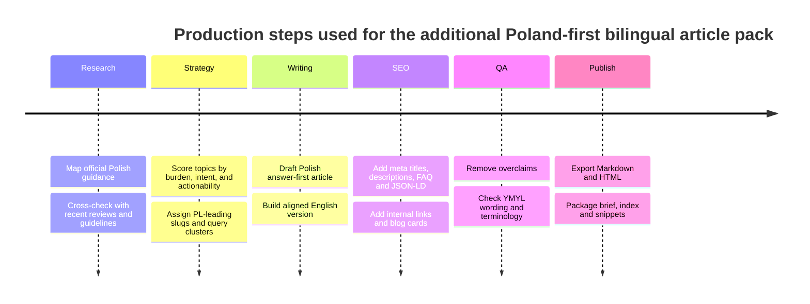
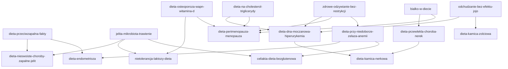

# Additional bilingual Poland-first nutrition content package for nataliacorvo.com

## Executive summary

I treated this as a **third-wave clinical content pack**, not as a literal “top 10 by verified public search volume”, because open, primary Polish keyword-volume data are not publicly verifiable without paid third-party tools. Instead, I prioritised the next 10 topics by combining three stronger signals: official Polish coverage, public-health burden, and obvious patient-intent search patterns. That is a sound proxy in this niche because the public diet ecosystem in Poland is now large and mature: Diety NFZ had about 870,000 registered users and more than 15 million page views in the year to February 2024, then expanded to more than 900,000 users and 18 diet plans by July 2024; the live plan list explicitly includes condition-specific plans such as celiac disease, gout and gallstones. citeturn25view1turn25view0turn25view2

The resulting topic slate is: iron deficiency and anaemia, perimenopause/menopause, endometriosis, chronic kidney disease, lactose intolerance, gout/hyperuricaemia, gallstones, kidney stones, celiac disease, and inflammatory bowel disease. I selected these because they sit closest to diagnosis-led queries, symptom relief, medication-adjacent nutrition decisions, and long-term behaviour change that can realistically lead a Polish patient from search to consultation. Some topics had especially strong Poland-first justification: chronic kidney disease affects an estimated more than 4.5 million people in Poland and may reach 5.2 million by 2034; NFZ launched a new comprehensive endometriosis care model from 1 July 2025; NFZ patient education notes that around 70% of peri-menopausal women have excess body weight; and kidney stones are common and recurrent, with recurrence in about half of patients within 5–10 years after a first attack. citeturn11view10turn11view9turn24view0turn11view11

I also kept the content deliberately YMYL-safe. The live site already states that its content is educational and does not replace medical diagnosis, and the current article pattern resolves under `/articles/`, so the package follows that same structural and editorial logic. citeturn27view0

## Research basis and source hierarchy

The source stack was built from Polish official institutions first, then recent reviews and guidelines. The baseline nutrition layer was anchored to the 2024 Polish dietary norms from entity["organization","Narodowy Instytut Zdrowia Publicznego PZH – PIB","public health institute"] and to patient-facing disease pages from entity["organization","Narodowe Centrum Edukacji Żywieniowej","nutrition education poland"]. I then overlaid recent higher-level evidence so that the package would distinguish between topics where diet is core treatment and topics where diet is clearly adjunctive support. citeturn10search0turn10search2turn16search26turn17search0turn15search20turn17search2

That distinction matters. The highest-confidence article candidates were celiac disease, CKD, gout, kidney stones, gallstones, iron deficiency and lactose intolerance, because Polish official sources already contain actionable rules: strict lifelong gluten avoidance only after diagnosis in celiac disease; protein, sodium, potassium and phosphorus individualisation in CKD; purine and alcohol restriction in gout; hydration with lower salt and lower meat intake in kidney stone prevention; fibre, meal regularity and slower weight loss in gallstones; better iron absorption pairing and myth correction in anaemia; and calcium-preserving substitution logic in lactose intolerance. Menopause and endometriosis were included too, but written as **supportive** content rather than cure-content; IBD was explicitly framed around remission versus flare, because adult evidence does not support one universal anti-flare diet. citeturn13view3turn12view0turn11view5turn26view0turn22view0turn11view0turn11view2turn17search0turn15search20turn17search2

The main Polish institutional anchors in the report were entity["organization","Narodowy Fundusz Zdrowia","public payer poland"], NCEZ, NIZP PZH-PIB, and entity["organization","Najwyższa Izba Kontroli","state audit poland"], with scientific support from KDIGO, AGA, ECCO, PubMed-indexed reviews and other primary guideline/review sources. citeturn11view10turn16search26turn17search0turn23search3

## Prioritised topic slate

The live blog already covers foundational topics such as the healthy plate, insulin resistance, anti-inflammatory eating, gut health, protein, office-work nutrition, cravings and meal planning, so I used this wave to push deeper into diagnosis-led clinical content rather than repeating basics. citeturn1view0

| Priority | PL title | EN title | Slug | Primary target queries |
|---|---|---|---|---|
| 94 | Dieta przy niedoborze żelaza i anemii: co jeść, jak zwiększyć wchłanianie i kiedy sama dieta nie wystarczy | Iron deficiency and anaemia diet: what to eat, how to improve absorption, and when diet alone is not enough | `dieta-przy-niedoborze-zelaza-anemii` | dieta przy niedoborze żelaza / iron deficiency diet |
| 92 | Dieta w perimenopauzie i menopauzie: masa ciała, białko, wapń, witamina D i realne wsparcie objawów | Perimenopause and menopause diet: body weight, protein, calcium, vitamin D, and realistic symptom support | `dieta-perimenopauza-menopauza` | dieta menopauza / menopause diet |
| 91 | Dieta przy endometriozie: co naprawdę wiadomo o żywieniu, stanie zapalnym i kontroli objawów | Diet for endometriosis: what we actually know about nutrition, inflammation, and symptom control | `dieta-endometrioza` | dieta endometrioza / endometriosis diet |
| 90 | Dieta w przewlekłej chorobie nerek: białko, sól, potas, fosfor i najważniejsza zasada indywidualizacji | Diet in chronic kidney disease: protein, salt, potassium, phosphorus, and the key rule of individualisation | `dieta-przewlekla-choroba-nerek` | dieta przewlekła choroba nerek / chronic kidney disease diet |
| 88 | Nietolerancja laktozy: dieta, tolerowane porcje i jak nie nabawić się niedoboru wapnia | Lactose intolerance: diet, tolerated portions, and how to avoid a calcium gap | `nietolerancja-laktozy-dieta` | nietolerancja laktozy dieta / lactose intolerance diet |
| 87 | Dieta przy dnie moczanowej i hiperurykemii: co ograniczać, co jeść częściej i jak nie wpaść w skrajności | Diet for gout and hyperuricaemia: what to limit, what to eat more often, and how to avoid extremes | `dieta-dna-moczanowa-hiperurykemia` | dieta dna moczanowa / gout diet |
| 86 | Dieta przy kamicy żółciowej: tłuszcz, błonnik, masa ciała i jak jeść, żeby nie pogarszać objawów | Diet for gallstones: fat, fibre, body weight, and how to eat without worsening symptoms | `dieta-kamica-zolciowa` | dieta kamica żółciowa / gallstone diet |
| 85 | Dieta przy kamicy nerkowej: nawodnienie, sól, białko i dlaczego nie każdy kamień wymaga tej samej tabeli zakazów | Diet for kidney stones: hydration, salt, protein, and why not every stone needs the same forbidden-food list | `dieta-kamica-nerkowa` | dieta kamica nerkowa / kidney stone diet |
| 84 | Celiakia i dieta bezglutenowa: co jeść, jak czytać etykiety i czego nie robić przed diagnozą | Celiac disease and the gluten-free diet: what to eat, how to read labels, and what not to do before diagnosis | `celiakia-dieta-bezglutenowa` | celiakia dieta bezglutenowa / celiac disease diet |
| 83 | Dieta w nieswoistych chorobach zapalnych jelit: co jeść w remisji, co zmieniać w zaostrzeniu i czego nie obiecywać | Diet in inflammatory bowel disease: what to eat in remission, what to change in flare, and what not to promise | `dieta-nieswoiste-choroby-zapalne-jelit` | dieta nieswoiste choroby zapalne jelit / IBD diet |

What makes this list defensible is that the official Polish disease-content landscape already supports it. NCEZ has patient-oriented pages for anaemia, celiac disease, lactose intolerance, menopause, endometriosis, gout, CKD, IBD and gallstone prevention; Diety NFZ now exposes condition-specific plans for celiac disease, gout and gallstones; and recent scientific reviews support cautious, non-sensational framing for menopause, endometriosis and IBD. citeturn11view0turn13view3turn11view2turn11view3turn11view4turn11view5turn12view0turn12view1turn22view0turn25view2turn15search20turn17search0turn17search2

## Delivered publication package

The publication package is ready in the workspace and includes 10 full Markdown articles, 10 full HTML articles, a research brief, a machine-readable index, a CSV topic table, and a combined blog-card snippet file.

The files are here:

- [Download the full ZIP package](sandbox:/mnt/data/nataliacorvo_additional10_nutrition_articles_PL_EN_deepresearch.zip)
- [Open the research brief](sandbox:/mnt/data/nataliacorvo_additional10_deepresearch/SEO_RESEARCH_BRIEF_ADDITIONAL_10_PL_EN.md)
- [Open the blog-card HTML snippet](sandbox:/mnt/data/nataliacorvo_additional10_deepresearch/BLOG_CARDS_ADDITIONAL_10_SNIPPET.html)
- [Open the machine-readable article index](sandbox:/mnt/data/nataliacorvo_additional10_deepresearch/articles_index.json)

Each article includes the deliverables you specified: full Polish and English article copy, answer-first lead, PL/EN metadata, slug, keyword cluster, FAQ, JSON-LD for `MedicalWebPage` and `FAQPage`, suggested internal links, and references. The HTML versions also include canonical URL and meta-description placement aligned to the current site’s `/articles/` structure. citeturn27view0

## Internal linking and production flow

The internal-linking strategy is meant to turn the live blog into a layered topical graph: live basics at the top, condition pages in the middle, and cross-links among related diagnoses at the bottom. That is especially useful here because several of the new pages naturally reinforce each other: iron deficiency connects to celiac disease and endometriosis; menopause connects to osteoporosis and lipid content; gout connects to kidney stones and cardiometabolic pages; and IBD connects to gut-health and deficiency content. That structure is more useful for crawling and for human navigation than publishing ten isolated pages. The current live archive already gives you the basic cluster needed for that approach. citeturn1view0turn27view0

## Assumptions and evidence limits

The package assumes an **adult Polish patient audience** because age was not specified. It is not written as paediatric-first content, not written for pregnancy unless explicitly relevant, and not written as a substitute for diagnosis. That matches the live site disclaimer. citeturn27view0

The evidence strength is intentionally uneven where the science is uneven. Celiac disease is a treatment-by-diet topic, so the article is firm and direct. CKD, gout, kidney stones and gallstones are strong medical-nutrition-management topics, so the wording is practical but still conditional on disease stage, labs or stone type. Menopause and endometriosis are written as supportive topics, not “healing protocol” topics. IBD is written with the clearest caution of all: remission and flare are different, deficiencies are common, and current adult evidence does not justify promising one universal diet that prevents flares in everyone. citeturn13view3turn12view0turn26view0turn22view0turn15search20turn17search0

The only major omission is verified open monthly keyword volume. I did not fabricate those numbers. Instead, the selection relies on the better signal available in this market: strong usage of the NFZ diet ecosystem, explicit expansion of condition-specific NFZ plans, official Polish disease-content density, and current guideline/review support. For a Poland-first health blog, that is the more rigorous choice. citeturn25view1turn25view0turn25view2turn10search0turn10search2