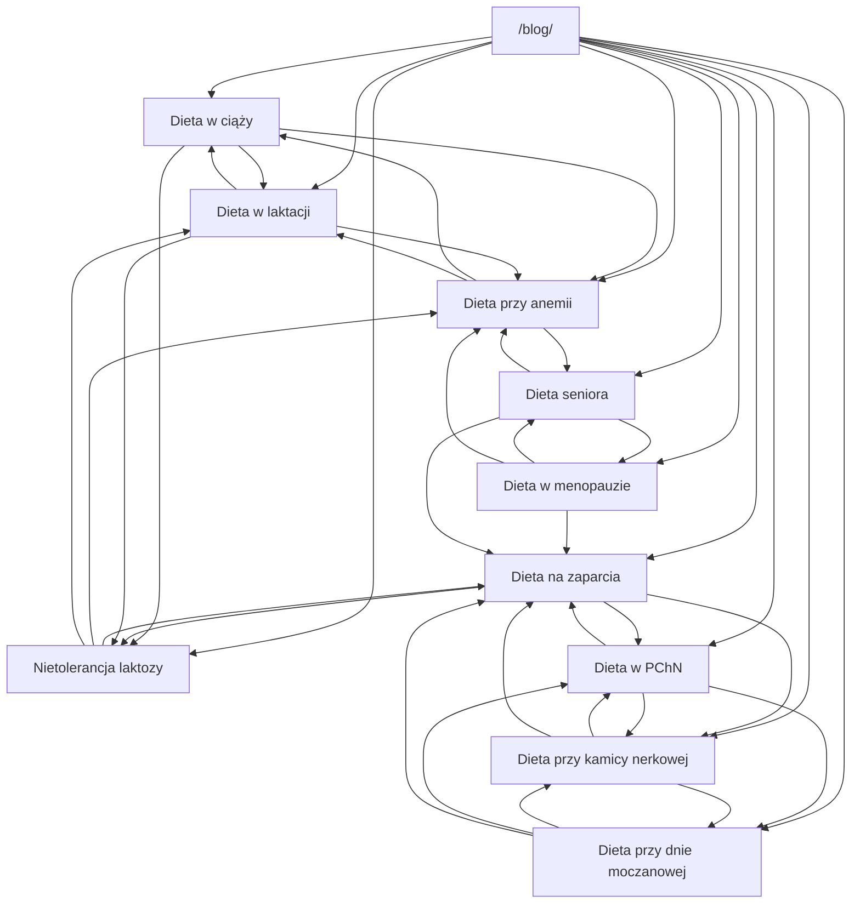

# Pacchetto SEO su nutrizione per pazienti polacchi

## Sintesi esecutiva

Ho preparato una nuova tranche di **10 topic nutrizionali ad alta rilevanza per pazienti in Polonia**, con priorità a query patient-led e a fonti istituzionali polacche aggiornate. La selezione privilegia aree dove la SERP polacca mostra una combinazione forte di pagine ufficiali, intent pratico e contenuti clinici recenti: **gravidanza, stitichezza, intolleranza al lattosio, anemia sideropenica, menopausa, allattamento, nutrizione del senior, gotta/iperuricemia, malattia renale cronica e calcolosi renale**. Le fonti base usate per il framework scientifico e per la verifica dell’impostazione sono state soprattutto entity["organization","Narodowe Centrum Edukacji Żywieniowej","polish nutrition education"], entity["organization","Narodowy Fundusz Zdrowia","polish public payer"], il portale Pacjent.gov.pl, entity["organization","World Health Organization","global health agency"] e entity["organization","European Food Safety Authority","eu food safety"]. citeturn3search2turn3search3turn2search0turn4search4turn10search3turn11search0turn8search1turn2search2turn7search1turn14search0turn14search2turn14search8turn14search6

Il pacchetto consegnato contiene, per **ciascuno dei 10 topic**, un dossier WordPress-ready con: evidence row, cluster keyword, slug, SEO title, meta description, H1, outline dettagliato, **articolo completo in polacco, inglese e italiano**, technical SEO, immagini suggerite, Open Graph/Twitter metadata e JSON-LD `BlogPosting` + `FAQPage`. Ho usato **proxy pubblici 0–100** invece di volumi mensili “chiusi”, perché il prompt richiede trasparenza dove i dati di keyword volume non sono pubblicamente uniformi o verificabili. I file pronti da usare sono qui:

- [Archivio ZIP completo](sandbox:/mnt/data/poland_nutrition_next10_pack.zip)
- [Master report in Markdown](sandbox:/mnt/data/poland_nutrition_next10_pack/MASTER_REPORT_NEXT10_IT.md)

## Metodo e limiti

La classifica sotto usa tre segnali combinati: **densità SERP**, **freschezza dei contenuti polacchi 2024–2026** e **forza dell’intento clinico/paziente**. Le note “Google Trends Poland” sono quindi **proxy qualitativi**, non export numerici diretti di Google Trends. Questo è intenzionale: preferisco un proxy esplicitamente etichettato a un numero opaco e non verificabile pubblicamente. Le URL complete delle top competing pages sono inserite **dentro ogni dossier** del pacchetto, così il report resta leggibile e il materiale operativo resta copiabile in WordPress. citeturn3search2turn4search4turn3search4turn2search0turn10search3turn3search3turn11search0turn8search1turn2search2turn7search1

## Ranking dei temi

| Rank | Topic prioritario | Proxy pubblico | Nota trend Polonia | Intento SERP | Evidenza principale |
|---:|---|---:|---|---|---|
| 1 | **Dieta in gravidanza** / `dieta w ciąży` | 95 | Evergreen ad altissima utilità, SERP fresche e forte footprint istituzionale | Informazionale + paziente + meal planning | NCEZ gravidanza, NFZ “co jeść w ciąży”, Pacjent gravidanza/lattazione. citeturn3search2turn9search2turn13search1 |
| 2 | **Dieta per la stitichezza** / `dieta na zaparcia` | 90 | Query sintomatica stabile, ampia copertura 2023–2026 | Sintomo + soluzione + “cosa mangiare” | NCEZ stitichezza, piano NFZ dedicato, portali pharmacy/medical. citeturn4search4turn1search3turn9search11 |
| 3 | **Intolleranza al lattosio** / `nietolerancja laktozy dieta` | 88 | Domanda costante e pratica, forte presenza di laboratori e guide alimentari | Informazionale + eliminazione + sostituzioni | NCEZ lattosio, gov.pl dieta senza lattosio, ALAB/Maczfit. citeturn3search4turn9search9turn9search12 |
| 4 | **Dieta per anemia sideropenica** / `dieta przy anemii` | 84 | Topic evergreen legato a ferritina, stanchezza e analisi | Informazionale + esami + supporto terapeutico | NCEZ anemia, Pacjent ferro, Diag/DKMS. citeturn2search0turn13search0turn8search12 |
| 5 | **Dieta in menopausa** / `dieta w menopauzie` | 80 | Crescente interesse women’s health, molte pagine 2024–2025 | Informazionale + controllo peso + sintomi | NCEZ menopausa, NFZ menopausa, Respo/DOZ/Diag. citeturn10search3turn6search13turn10search9 |
| 6 | **Dieta in allattamento** / `dieta w laktacji` | 78 | Domanda ciclica ma continua, forte valore clinico e di counselling | Informazionale + post-partum + sicurezza alimentare | NCEZ lattazione, Pacjent gravidanza/lattazione, WHO breastfeeding. citeturn3search3turn13search1turn14search2 |
| 7 | **Dieta del senior** / `dieta seniora` | 74 | Tema demografico in crescita, spinta recente da NCEZ e Pacjent | Informazionale + caregiving + healthy aging | NCEZ seniori, Pacjent senior, DASH per seniori. citeturn11search0turn13search6turn13search2 |
| 8 | **Dieta per gotta / iperuricemia** / `dieta dna moczanowa` | 72 | Stabile e rilevante nei cluster metabolici | Condition-based + riduzione acido urico | NCEZ gotta, piano NFZ dedicato, Pacjent gotta. citeturn8search1turn1search0turn7search0 |
| 9 | **Dieta per malattia renale cronica** / `dieta przewlekła choroba nerek` | 68 | Volume più stretto ma intent molto alto, forte contenuto specialistico | Condition-based + risultati + personalizzazione | NCEZ CKD, NFZ kidney care, KDIGO 2024. citeturn2search2turn8search6turn15search18 |
| 10 | **Dieta per calcoli renali** / `dieta kamica nerkowa` | 66 | Tema ricorrente post-evento e in prevenzione delle recidive | Condition-based + prevenzione recidive | MP.pl nefrologia, linee dietetiche stone-focused, review nutrizionali. citeturn7search1turn8search11turn15search3 |

## Trend proxy e linking interno

**Scala sotto: proxy pubblico 0–100, non volume mensile assoluto.**

```text
Dieta w ciąży               ███████████████████ 95
Dieta na zaparcia           ██████████████████  90
Nietolerancja laktozy       ██████████████████  88
Dieta przy anemii           █████████████████   84
Dieta w menopauzie          ████████████████    80
Dieta w laktacji            ████████████████    78
Dieta seniora               ███████████████     74
Dieta przy dnie moczanowej  ██████████████      72
Dieta w PChN                █████████████       68
Dieta przy kamicy nerkowej  █████████████       66
```



## Pacchetto WordPress consegnato

L’archivio ZIP contiene:

- `10` dossier `.md` WordPress-ready
- `10` versioni `.html`
- un `MASTER_REPORT_NEXT10_IT.md`
- un `topic_summary.csv`

Ogni dossier contiene, nella stessa struttura:

- **evidence row** con search signal polacco, trend note proxy e top competitor URL completi
- **cluster keyword completo**
- **title/meta/H1/slug**
- **outline dettagliato**
- **articolo completo in polacco**
- **articolo completo in inglese**
- **articolo completo in italiano**
- **LSI, keyword placement, canonical, alt text, immagini royalty-free suggerite**
- **Open Graph + Twitter**
- **JSON-LD `BlogPosting` e `FAQPage`**

## Osservazioni strategiche

Editorialmente, questa tranche è più “patient-intent” e meno “macro-dieta generalista” rispetto alla prima. La combinazione più forte, in termini di cluster interno e riuso editoriale, è: **gravidanza ↔ lattazione ↔ anemia**, **stitichezza ↔ lattosio**, **gotta ↔ calcoli renali ↔ malattia renale cronica**, **menopausa ↔ senior**. Questo consente di costruire hub tematici coerenti e di usare l’internal linking non come decorazione, ma come segnale semantico forte per Google e per i crawler AI. La scelta dei topic è anche coerente con il fatto che NCEZ, NFZ e Pacjent hanno guide dedicate o recenti proprio in queste aree, mentre WHO ed EFSA danno un supporto trasversale robusto per il framing nutrizionale di fibre, dieta sana, gravidanza e breastfeeding. citeturn3search2turn3search3turn2search0turn4search4turn10search3turn11search0turn8search1turn2search2turn7search1turn14search0turn14search2turn14search8turn14search6

## Limiti aperti

I punti da tenere esplicitamente presenti sono tre. Primo: **i punteggi di domanda sono proxy pubblici**, non volumi mensili proprietari. Secondo: la struttura del sito oltre a `/blog/` non è specificata, quindi il linking è stato progettato assumendo solo home blog + nuovi URL. Terzo: le versioni HTML sono state tenute intenzionalmente semplici e pulite, per massimizzare la copiabilità in WordPress; se vuoi una seconda passata con struttura Gutenberg o con pattern HTML più “design-ready”, la base è già pronta nel pacchetto.