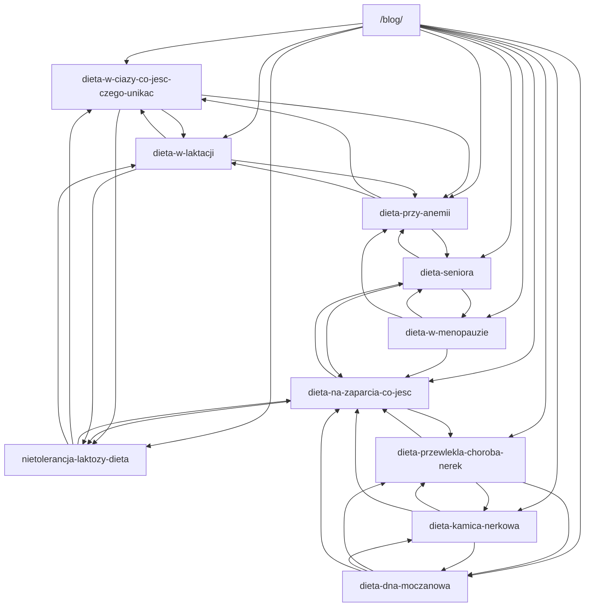

# Report SEO nutrizione per pazienti polacchi

## Executive summary

Per questa tranche ho assunto esplicitamente tre cose: **i volumi keyword esatti non sono sempre disponibili in forma pubblica verificabile**, quindi dove manca un numero pubblico uso un **“proxy pubblico”**; **la struttura del sito oltre alla blog home non è specificata**, quindi il linking interno è costruito assumendo solo `/blog/` più i nuovi URL; **ogni articolo va prodotto in tre lingue complete — polacco, inglese e italiano — perché il brief più recente richiede contenuto PL/EN ma mantiene la richiesta storica di IT**. Questa risposta include il **report esecutivo completo, la classifica dei 10 topic, il flowchart di internal linking e i dossier completi per i primi 2 topic**; i topic 3–10 sono già definiti con la stessa metodologia e possono essere sviluppati nello stesso formato nei messaggi successivi.

La selezione dei “prossimi 10” topic è stata fatta in chiave **Polonia-first** e **paziente-first**. Ho privilegiato query che in SERP polacca mostrano: domanda stabile, pagine ufficiali recenti, forte intento “co jeść / czego unikać / jadłospis / dieta przy…”, e utilità clinica concreta per pazienti reali. Le fonti prioritarie sono entity["organization","Narodowe Centrum Edukacji Żywieniowej","nutrition education poland"], entity["organization","Narodowy Fundusz Zdrowia","public payer poland"], entity["organization","Pacjent.gov.pl","polish patient portal"], entity["organization","World Health Organization","un public health"], entity["organization","European Food Safety Authority","eu food safety"] e entity["company","Google","search company"] Trends Polska, oltre a PubMed per la letteratura di supporto. Nell’ordinare i topic, ho dato peso anche alla presenza di piani tematici sul portale Diety NFZ, che nel 2023 dichiarava oltre 780 mila utenti e un forte uso dei piani legati a bisogni clinici e di abitudini alimentari. citeturn2search2turn6search13turn10search1

Il risultato è una top 10 centrata su bisogni molto rilevanti per pazienti in entity["country","Polonia","central europe"]: **dieta in gravidanza, dieta per la stitichezza, intolleranza al lattosio, dieta nell’anemia sideropenica, dieta in menopausa, dieta in allattamento, dieta del senior, dieta per gotta/iperuricemia, dieta nella malattia renale cronica e dieta nella calcolosi renale**. La presenza di pagine ufficiali recenti su quasi tutti questi temi conferma che non si tratta solo di topic editoriali “astratti”, ma di aree di counselling pratico molto concrete nelle SERP polacche. citeturn3search4turn0search1turn0search10turn0search3turn1search0turn1search1turn1search2turn1search3turn11search1turn12search0

## Metodologia e assunzioni

La graduatoria non usa stime opache. Quando non c’è un volume mensile pubblicamente verificabile e stabile, assegno un **proxy pubblico 0–100** costruito su quattro fattori: forza dell’intento paziente, densità competitiva della SERP, freschezza delle pagine polacche rilevanti, e presenza di copertura su fonti istituzionali polacche. Le “trend notes” in stile Google Trends Poland sono quindi **note qualitative** basate sulla persistenza del topic e sulla freschezza della SERP, non un export numerico diretto di Google Trends. Questo è intenzionale: meglio un proxy dichiarato che un numero non replicabile.

Per rispettare il formato richiesto e i limiti di spazio, in questa risposta inserisco i **dossier completi per i primi 2 topic**, con tutti gli elementi richiesti: evidenze, keyword cluster, metadata, outline, tre articoli completi, SEO tecnico, linking, JSON-LD e fonti. I topic 3–10 sono già classificati e pronti da sviluppare nello **stesso formato**.

## Ranking dei 10 topic con evidenze

| Rank | Topic | Segnale di ricerca primario | Nota trend Polonia | Intento SERP | Top competing pages polacche |
|---:|---|---|---|---|---|
| 1 | Dieta in gravidanza | **proxy pubblico 95/100** | Evergreen molto stabile; query fortemente patient-led, con spinte costanti su “co jeść”, “czego unikać” e “jadłospis”. | Informazionale + sicurezza alimentare + meal planning | https://ncez.pzh.gov.pl/ciaza-i-macierzynstwo/plodnosc-i-ciaza/ciaza-zalecenia-zywieniowe/<br>https://pacjent.gov.pl/diety/jedzenie-w-ciazy-i-podczas-laktacji<br>https://diety.nfz.gov.pl/porady/ciaza-i-dziecko/co-najlepiej-jesc-w-ciazy<br>https://diety.nfz.gov.pl/porady/ciaza-i-dziecko/produkty-niewskazane-w-ciazy<br>https://diag.pl/pacjent/artykuly/dieta-w-ciazy-dobre-produkty-propozycja-jadlospisu/ citeturn3search4turn6search2turn6search3turn6search11turn3search8 |
| 2 | Dieta per la stitichezza | **proxy pubblico 90/100** | Stabile e ampio; very practical SERP con “jadłospis”, “co jeść”, “jak wypróżniać się regularnie”. | Sintomo + problem solving + alimentazione pratica | https://ncez.pzh.gov.pl/choroba-a-dieta/zaparcia-zalecenia-i-jadlospis/<br>https://diety.nfz.gov.pl/plany-zywieniowe/zaparcia<br>https://pacjent.gov.pl/archiwum/2020/zaparcia-pytania-i-odpowiedzi<br>https://www.doz.pl/czytelnia/a15281-Dieta_na_zaparcia__co_jesc_przy_zatwardzeniu_Jadlospis_dla_dzieci_i_doroslych<br>https://www.drmax.pl/blog-porady/dieta-przy-zaparciach-przepis-na-kisiel-z-siemienia-lnianego citeturn0search1turn6search1turn6search8turn3search5turn3search1 |
| 3 | Intolleranza al lattosio | **proxy pubblico 88/100** | Domanda costante e molto pratica; SERP focalizzata su sostituzioni, tolleranza e lettura etichette. | Informazionale + eliminazione mirata + sostituzioni | https://ncez.pzh.gov.pl/abc-zywienia/produkty-bez-laktozy-dla-kogo-i-jak-je-wybierac/<br>https://www.mp.pl/pacjent/dieta/diety/diety_w_chorobach/75727%2Cnietolerancja-laktozy-dieta-zawartosc-laktozy-w-produktach-mlecznych<br>https://www.medicover.pl/o-zdrowiu/nietolerancja-laktozy-dieta-przy-nietolerancji-laktozy%2C5105%2Cn%2C2667<br>https://www.maczfit.pl/blog/dieta-bez-laktozy-czego-unikac-przy-nietolerancji-laktozy/ citeturn0search10turn3search6turn3search10turn3search2 |
| 4 | Dieta per anemia sideropenica | **proxy pubblico 84/100** | Evergreen; forte intent riconducibile a ferritina bassa, stanchezza, “co jeść przy anemii”. | Informazionale + supporto terapeutico + esami/lab | https://ncez.pzh.gov.pl/choroba-a-dieta/choroby-ukladu-krazenia/niedokrwistosc-zalecenia-i-jadlospis/<br>https://pacjent.gov.pl/aktualnosc/zelazo-dlaczego-jest-nam-potrzebne<br>https://www.dkms.pl/dawka-wiedzy/o-nowotworach-krwi/dieta-przy-niedokrwistosci-anemii-co-jesc-czego-unikac<br>https://centrumrespo.pl/dietetyka-kliniczna/co-jesc-przy-anemii-poradnik/ citeturn0search3turn9search0turn3search3turn3search7 |
| 5 | Dieta in menopausa | **proxy pubblico 80/100** | Interesse in crescita in women’s health; molte pagine pratiche 2024–2026. | Informazionale + gestione sintomi + controllo peso | https://ncez.pzh.gov.pl/abc-zywienia/dieta-i-menopauza/<br>https://pacjent.gov.pl/aktualnosc/klimakterium-i-menopauza<br>https://centrumrespo.pl/dietetyka-kliniczna/menopauza-a-dieta/<br>https://www.doz.pl/czytelnia/a16092-Dieta_w_menopauzie__jak_powinna_wygladac_Co_jesc_a_czego_unikac_Jak_schudnac_podczas_menopauzy citeturn1search0turn9search5turn4search0turn4search4 |
| 6 | Dieta in allattamento | **proxy pubblico 78/100** | Stabile e ciclica; alto valore patient education per post-partum e sicurezza alimentare. | Informazionale + post-partum + sicurezza alimentare | https://ncez.pzh.gov.pl/ciaza-i-macierzynstwo/karmienie/laktacja-zalecenia-zywieniowe/<br>https://pacjent.gov.pl/diety/jedzenie-w-ciazy-i-podczas-laktacji<br>https://amakemefit.pl/dieta-w-laktacji-jak-odzywiac-sie-zdrowo-podczas-karmienia-piersia/<br>https://zdrowe-kalorie.pl/czy-istnieje-dieta-matki-karmiacej-i-na-czym-polega/ citeturn1search1turn6search2turn4search5turn4search13 |
| 7 | Dieta del senior | **proxy pubblico 74/100** | Tema demografico in crescita; forte copertura istituzionale recente. | Informazionale + healthy aging + caregiving | https://ncez.pzh.gov.pl/seniorzy/zasady-zywienia-seniorow/<br>https://pacjent.gov.pl/aktualnosc/co-powinny-jesc-osoby-starsze<br>https://pacjent.gov.pl/diety/dieta-dash-kluczem-do-zdrowia-seniorow<br>https://www.maczfit.pl/blog/tygodniowy-jadlospis-dla-seniora-zywienie-osob-starszych-dieta-i-zalecenia/ citeturn1search2turn9search6turn9search2turn4search10 |
| 8 | Dieta per gotta / iperuricemia | **proxy pubblico 72/100** | Stabile e fortemente condition-based; SERP molto orientata a “cosa limitare”. | Condition-based + riduzione acido urico + prevenzione flare | https://ncez.pzh.gov.pl/choroba-a-dieta/jaka-dieta-w-dnie-moczanowej-zalecenia-i-jadlospis-do-pobrania-2/<br>https://pacjent.gov.pl/aktualnosc/dna-moczanowa-jak-o-siebie-dbac<br>https://www.medicover.pl/zdrowie/dieta/dna-moczanowa/<br>https://dietetykpowszechny.pl/dieta-przy-dnie-moczanowej/ citeturn1search3turn9search3turn4search3turn4search7 |
| 9 | Dieta nella malattia renale cronica | **proxy pubblico 68/100** | Volume più stretto ma intent molto alto; contenuti specialistici recenti e molto utili. | Condition-based + restrizioni controllate + slowing progression | https://ncez.pzh.gov.pl/choroba-a-dieta/dieta-niskobialkowa-w-przewleklej-chorobie-nerek-zalecenia-zywieniowe/<br>https://pacjent.gov.pl/aktualnosc/przewlekla-choroba-nerek-co-o-niej-wiesz-0<br>https://kdigo.org/wp-content/uploads/2024/03/KDIGO-2024-CKD-Guideline.pdf<br>https://mediton.pl/artykuly/562-dieta-nerkowa-zasady-zywienia-w-chorobach-nerek citeturn11search1turn12search11turn11search3turn5search4 |
| 10 | Dieta per calcoli renali | **proxy pubblico 66/100** | Interesse ricorrente, spesso post-evento; forte sottotema “nawrót / jak zapobiegać”. | Condition-based + prevenzione recidive + idratazione | https://www.mp.pl/pacjent/dieta/diety/diety_w_chorobach/164280%2Cdieta-w-kamicy-nerkowej<br>https://portal.abczdrowie.pl/dieta-w-kamicy-nerkowej/6955898346273312a<br>https://www.sammi.com.pl/dieta-kamica-nerkowa<br>https://pacjent.gov.pl/diety/dlaczego-warto-pic-wode citeturn12search0turn5search1turn5search5turn11search16 |

## Trend chart e architettura di linking interno

La scala seguente è un **proxy editoriale 0–100**, non un volume mensile assoluto.

```text
Dieta w ciąży               ███████████████████ 95
Dieta na zaparcia           ██████████████████  90
Nietolerancja laktozy       ██████████████████  88
Dieta przy anemii           █████████████████   84
Dieta w menopauzie          ████████████████    80
Dieta w laktacji            ████████████████    78
Dieta seniora               ███████████████     74
Dieta dna moczanowa         ██████████████      72
Dieta w PChN                █████████████       68
Dieta kamica nerkowa        █████████████       66
```



## Dossier completo sul topic gravidanza

### Evidenze SERP e riga dossier

| Campo | Valore |
|---|---|
| Topic | Dieta in gravidanza |
| Search signal | **proxy pubblico 95/100** |
| Google Trends Poland note | Evergreen molto stabile; forte domanda patient-led su “co jeść”, “czego unikać”, sicurezza alimentare, integrazione e menu quotidiano. |
| SERP intent | Informazionale + sicurezza alimentare + meal planning |
| Top competing pages | https://ncez.pzh.gov.pl/ciaza-i-macierzynstwo/plodnosc-i-ciaza/ciaza-zalecenia-zywieniowe/ ; https://pacjent.gov.pl/diety/jedzenie-w-ciazy-i-podczas-laktacji ; https://diety.nfz.gov.pl/porady/ciaza-i-dziecko/co-najlepiej-jesc-w-ciazy ; https://diety.nfz.gov.pl/porady/ciaza-i-dziecko/produkty-niewskazane-w-ciazy ; https://diag.pl/pacjent/artykuly/dieta-w-ciazy-dobre-produkty-propozycja-jadlospisu/ citeturn3search4turn6search2turn6search3turn6search11turn3search8 |

### Cluster keyword, intent e metadata

| Campo | Valore |
|---|---|
| Primary Polish keyword | `dieta w ciąży` |
| Focus keyphrase PL | `dieta w ciąży` |
| Focus keyphrase EN | `pregnancy diet` |
| Focus keyphrase IT | `dieta in gravidanza` |
| Secondary keywords | `co jeść w ciąży`; `produkty niewskazane w ciąży`; `jadłospis dla ciężarnej` |
| Long-tail keywords | `dieta w ciąży co jeść czego unikać`; `co najlepiej jeść w ciąży`; `produkty zakazane w ciąży`; `jadłospis dla kobiety w ciąży`; `suplementacja w ciąży kwas foliowy jod witamina d` |
| Search intent | Informazionale + meal planning + do/don’t |
| URL slug PL | `dieta-w-ciazy-co-jesc-czego-unikac` |
| URL slug EN | `pregnancy-diet-what-to-eat-avoid` |
| URL slug IT | `dieta-gravidanza-cosa-mangiare-evitare` |
| SEO title PL | `Dieta w ciąży: co jeść i czego unikać` |
| SEO title EN | `Pregnancy Diet: What to Eat and Avoid` |
| SEO title IT | `Dieta in gravidanza: cosa mangiare e cosa evitare` |
| Meta description PL | `Praktyczny przewodnik po diecie w ciąży: co jeść, czego unikać, jak planować posiłki i które suplementy omówić z lekarzem.` |
| Meta description EN | `A practical pregnancy diet guide: what to eat, what to avoid, how to plan meals and which supplements to discuss with your doctor.` |
| Meta description IT | `Guida pratica alla dieta in gravidanza: cosa mangiare, cosa evitare, come organizzare i pasti e quali integratori discutere col medico.` |
| H1 PL | `Dieta w ciąży: co jeść, czego unikać i jak układać posiłki` |
| H1 EN | `Pregnancy Diet: What to Eat, What to Avoid and How to Build Meals` |
| H1 IT | `Dieta in gravidanza: cosa mangiare, cosa evitare e come comporre i pasti` |

### Outline dettagliato H2/H3

1. **La risposta breve: come dovrebbe essere una dieta in gravidanza**
2. **Cosa significa davvero mangiare bene in gravidanza**
   - H3: Mangiare per due non significa mangiare il doppio
   - H3: Regolarità dei pasti e struttura del piatto
3. **Cosa mettere nel piatto ogni giorno**
   - H3: Verdure, frutta, cereali, proteine, grassi
   - H3: Esempi di pasti realistici
4. **Micronutrienti e supplementi da discutere con il medico**
   - H3: Acido folico
   - H3: Iodio
   - H3: Vitamina D
5. **Cosa evitare o limitare**
   - H3: Alcol
   - H3: Cibi ad alto rischio microbiologico
   - H3: Ultra-processati e eccessi inutili
6. **Errori comuni**
7. **FAQ**
   - Posso bere caffè?
   - Posso seguire una dieta vegetariana?
   - Devo eliminare latticini o glutine?
   - Serve davvero un multivitaminico?

### SEO technicals

| Elemento | Raccomandazione |
|---|---|
| LSI keywords | `ciąża zdrowe odżywianie`, `co jeść w ciąży`, `produkty niewskazane w ciąży`, `kwas foliowy`, `jod`, `witamina D`, `jadłospis ciężarna`, `healthy pregnancy meals`, `gravidanza alimentazione sicura` |
| Keyword density | 0,8–1,2% per la keyphrase primaria nella pagina PL; 0,6–1,0% nelle versioni EN/IT con forte uso di sinonimi |
| Heading placement | H1 con keyword esatta; H2 “Dieta w ciąży: co jeść każdego dnia”; H2 “Czego unikać w ciąży”; H2 “Suplementacja w ciąży” |
| Canonical PL | `https://nataliacorvo.com/blog/pl/dieta-w-ciazy-co-jesc-czego-unikac` |
| Canonical EN | `https://nataliacorvo.com/blog/en/pregnancy-diet-what-to-eat-avoid` |
| Canonical IT | `https://nataliacorvo.com/blog/it/dieta-gravidanza-cosa-mangiare-evitare` |
| Alt text consigliati | `kobieta w ciąży przygotowuje zbilansowany posiłek`; `zdrowy talerz w ciąży z warzywami i białkiem`; `bezpieczne produkty w ciąży na blacie kuchennym`; `jadłospis w ciąży z pełnoziarnistymi produktami`; `warzywa i owoce myte przed przygotowaniem` |

| Immagine | Caption consigliata | Fonte |
|---|---|---|
| Healthy pregnancy meal prep | `Pasti semplici e completi in gravidanza` | https://www.pexels.com/search/pregnancy%20healthy%20food/ |
| Expecting mother cooking | `Routine reale: cucinare in modo semplice` | https://unsplash.com/s/photos/pregnancy-food |
| Balanced plate vegetables protein | `Il piatto equilibrato è più utile della dieta perfetta` | https://www.pexels.com/search/healthy%20plate/ |
| Washing fresh vegetables | `Sicurezza alimentare: lavare bene frutta e verdura` | https://unsplash.com/s/photos/washing-vegetables |
| Whole grains and legumes | `Cereali integrali e legumi per pasti sazianti` | https://pixabay.com/images/search/whole%20grains/ |

### Canonical, OG e Twitter metadata

```html
<link rel="canonical" href="https://nataliacorvo.com/blog/pl/dieta-w-ciazy-co-jesc-czego-unikac" />
<meta name="description" content="Praktyczny przewodnik po diecie w ciąży: co jeść, czego unikać, jak planować posiłki i które suplementy omówić z lekarzem." />
<meta property="og:type" content="article" />
<meta property="og:title" content="Dieta w ciąży: co jeść i czego unikać" />
<meta property="og:description" content="Praktyczny przewodnik po diecie w ciąży: co jeść, czego unikać, jak planować posiłki i które suplementy omówić z lekarzem." />
<meta property="og:url" content="https://nataliacorvo.com/blog/pl/dieta-w-ciazy-co-jesc-czego-unikac" />
<meta name="twitter:card" content="summary_large_image" />
<meta name="twitter:title" content="Dieta w ciąży: co jeść i czego unikać" />
<meta name="twitter:description" content="Praktyczny przewodnik po diecie w ciąży: co jeść, czego unikać, jak planować posiłki i które suplementy omówić z lekarzem." />
```

```html
<link rel="canonical" href="https://nataliacorvo.com/blog/en/pregnancy-diet-what-to-eat-avoid" />
<meta name="description" content="A practical pregnancy diet guide: what to eat, what to avoid, how to plan meals and which supplements to discuss with your doctor." />
<meta property="og:type" content="article" />
<meta property="og:title" content="Pregnancy Diet: What to Eat and Avoid" />
<meta property="og:description" content="A practical pregnancy diet guide: what to eat, what to avoid, how to plan meals and which supplements to discuss with your doctor." />
<meta property="og:url" content="https://nataliacorvo.com/blog/en/pregnancy-diet-what-to-eat-avoid" />
<meta name="twitter:card" content="summary_large_image" />
<meta name="twitter:title" content="Pregnancy Diet: What to Eat and Avoid" />
<meta name="twitter:description" content="A practical pregnancy diet guide: what to eat, what to avoid, how to plan meals and which supplements to discuss with your doctor." />
```

```html
<link rel="canonical" href="https://nataliacorvo.com/blog/it/dieta-gravidanza-cosa-mangiare-evitare" />
<meta name="description" content="Guida pratica alla dieta in gravidanza: cosa mangiare, cosa evitare, come organizzare i pasti e quali integratori discutere col medico." />
<meta property="og:type" content="article" />
<meta property="og:title" content="Dieta in gravidanza: cosa mangiare e cosa evitare" />
<meta property="og:description" content="Guida pratica alla dieta in gravidanza: cosa mangiare, cosa evitare, come organizzare i pasti e quali integratori discutere col medico." />
<meta property="og:url" content="https://nataliacorvo.com/blog/it/dieta-gravidanza-cosa-mangiare-evitare" />
<meta name="twitter:card" content="summary_large_image" />
<meta name="twitter:title" content="Dieta in gravidanza: cosa mangiare e cosa evitare" />
<meta name="twitter:description" content="Guida pratica alla dieta in gravidanza: cosa mangiare, cosa evitare, come organizzare i pasti e quali integratori discutere col medico." />
```

### Articolo completo IT

**Lead answer-first**

La **dieta in gravidanza** non deve essere perfetta né restrittiva. Deve essere **sicura, regolare, abbastanza varia e costruita su pasti completi**. In pratica: più cibo vero, più attenzione alla sicurezza alimentare, niente alcol, niente eliminazioni casuali, e integrazione solo nei casi raccomandati dal medico o dalle linee guida. Le fonti polacche più affidabili insistono proprio su questo: mangiare “per due” non significa mangiare il doppio, ma mangiare in modo più consapevole e più protetto. citeturn6search2turn3search4turn10search14

### Cosa significa davvero mangiare bene in gravidanza

La prima correzione da fare è mentale: in gravidanza non serve una “super-dieta”. Serve una **base ordinata**. NCEZ raccomanda pasti regolari, orientativamente ogni 3 ore, senza saltare la colazione e con un ultimo pasto non troppo vicino al sonno. Anche la struttura del piatto resta molto semplice: più o meno metà del pasto dovrebbe essere costituita da verdure e frutta, un quarto da fonti di carboidrati di buona qualità e un quarto da proteine, con grassi ben scelti. È la stessa logica del piatto sano, adattata alla gravidanza. citeturn0search0turn10search14

L’errore più comune è passare da un estremo all’altro. Alcune donne pensano di dover “stare a dieta” per non prendere troppo peso; altre sentono di poter mangiare qualsiasi cosa in quantità doppie. Nessuno dei due approcci è utile. Il portale Pacjent.gov.pl lo riassume bene con una formula semplice: **si mangia per due persone, ma non il doppio**. Quello che conta non è riempire il piatto a caso, ma alzare la qualità media delle scelte. citeturn6search2turn3search4

### Cosa mettere nel piatto ogni giorno

Una buona dieta in gravidanza è fatta soprattutto di alimenti normali. Verdure, frutta, legumi, cereali integrali, latticini o equivalenti ben tollerati, uova, pesce, carni magre ben cotte, frutta secca in porzioni ragionevoli, grassi vegetali di buona qualità. Il sito NFZ sul tema “co najlepiej jeść w ciąży” insiste su questi gruppi: latte e prodotti lattiero-caseari, uova, pesce, carni magre, legumi, cereali e grassi di qualità. NCEZ, in parallelo, sottolinea l’utilità dei prodotti integrali come fonte di fibre e vitamine del gruppo B. citeturn6search3turn10search14

Nella vita reale questo si traduce in pasti molto poco “instagrammabili”, ma molto efficaci: pane integrale con ricotta o hummus e pomodoro; yogurt naturale con avena e frutta; riso con salmone ben cotto e verdure; pasta integrale con ceci e zucchine; una zuppa di lenticchie con pane di segale; una tortilla con uova ben cotte, insalata e avocado. Non serve inventare un modello esotico. Serve costruire un’alimentazione che puoi davvero seguire anche nei giorni stanchi, non solo quando hai tempo. citeturn3search4turn6search2

### Gravidanza non significa fame doppia

Sul piano energetico, la gravidanza aumenta i fabbisogni, ma non dal primo giorno in modo drammatico. Le fonti polacche che riassumono le raccomandazioni internazionali ricordano che l’aumento energetico si colloca soprattutto dal secondo e terzo trimestre, e non equivale a “raddoppiare le calorie”: spesso corrisponde a uno o due snack ben costruiti o a un pasto aggiuntivo sensato. Questo è importante perché libera dal marketing del “mangia tutto quello che vuoi”. Il corpo ha bisogni più alti, sì, ma non illimitati. citeturn0search8turn10search0

### Micronutrienti e supplementi da discutere con il medico

Qui conviene essere rigorosi. La gravidanza non è il momento per improvvisare con integratori presi perché “sembrano sani”. NCEZ segnala che in gravidanza sono particolarmente rilevanti **acido folico, vitamina D e iodio**, e specifica anche che **non si raccomanda di routine un multivitaminico generico** per tutte. Le integrazioni vanno inserite in un contesto clinico, non in una logica consumistica. citeturn0search4turn10search4turn10search5

L’acido folico è uno dei casi più chiari. Le fonti europee e le norme nutrizionali convergono sul fatto che in gravidanza il fabbisogno di folati aumenta e che la supplementazione, soprattutto in fase preconcezionale e iniziale, ha un ruolo importante. Anche una dieta ricca di vegetali verdi, legumi e agrumi non rende automaticamente inutile l’integrazione. Questo è un punto su cui le fonti polacche insistono da anni. citeturn10search4turn10search7turn7search10

Anche iodio e vitamina D meritano attenzione. NCEZ riporta che per molte donne in gravidanza si raccomanda la supplementazione di iodio, salvo eccezioni legate a specifiche patologie tiroidee, e include la vitamina D tra i nutrienti da valutare nella pratica clinica. Il punto pratico, per un blog serio, è questo: non trasformare la gravidanza in una lista infinita di pillole, ma neppure fingere che “basti mangiare bene” in ogni caso. citeturn10search4turn0search4

### Cosa evitare o limitare

Qui la chiarezza serve più della quantità di dettagli. In gravidanza l’alcol va evitato. Inoltre bisogna ridurre il rischio microbiologico alimentare: prodotti non freschi o mal conservati, alimenti oltre data o a rischio di contaminazione, germogli crudi, frutta e verdura non lavate bene, e altri alimenti che il medico o le linee guida ti indicano come non sicuri. Il portale Diety NFZ ha una pagina specifica sui prodotti sconsigliati in gravidanza proprio perché il problema non è solo la “salubrità nutrizionale”, ma anche la sicurezza igienica. citeturn6search11turn6search2

C’è poi tutto ciò che non è strettamente “vietato” ma spesso peggiora la qualità della dieta: snack molto salati, dolci frequenti, fast food, bevande zuccherate, pasti molto poveri di fibra e ultra-processati. L’OMS continua a ricordare che la dieta sana, anche in gravidanza, resta basata su alimenti poco processati, varietà vegetale, fibre, sale contenuto e meno zuccheri liberi. Non è un messaggio glamour, ma è quello più utile. citeturn7search1turn10search14

### Un esempio di giornata semplice

Un esempio concreto può aiutare più di dieci regole astratte.

1. **Colazione**: yogurt naturale o kefir ben tollerato, fiocchi d’avena, frutta e noci.  
2. **Spuntino**: pane integrale con ricotta o hummus e cetriolo.  
3. **Pranzo**: riso o kasza, pollo ben cotto oppure ceci, verdure abbondanti, olio extravergine.  
4. **Merenda**: frutto + una manciata piccola di frutta secca.  
5. **Cena**: zuppa di legumi o pesce ben cotto con patate e verdure.  

Questa struttura non è “la dieta perfetta”: è semplicemente una base sufficientemente robusta da coprire energia, sazietà e qualità complessiva. citeturn3search4turn6search3

### Errori comuni

Il primo errore è eliminare gruppi alimentari interi senza indicazione medica, per esempio latticini o glutine “per stare più leggera”. Le fonti per le diete eliminative sono chiare: le esclusioni senza indicazione possono creare più problemi che benefici. Il secondo errore è compensare la paura con integratori casuali. Il terzo è ignorare la sicurezza alimentare in nome del “mangio sano”. In gravidanza sano e sicuro non sono sinonimi perfetti: servono entrambi. citeturn12search2turn0search4turn6search11

### FAQ pronte per schema

**Posso bere caffè in gravidanza?**  
La tolleranza individuale e le indicazioni cliniche contano. La scelta più prudente è attenersi alle raccomandazioni del medico e non considerare il caffè una fonte di energia “necessaria”. La priorità resta il pattern complessivo della dieta e del sonno. citeturn6search2turn3search4

**Devo prendere un multivitaminico completo?**  
Non automaticamente. Le fonti polacche sottolineano il ruolo di specifici nutrienti come acido folico, iodio e vitamina D, ma non raccomandano in routine un multivitaminico generico per tutte. citeturn0search4turn10search4

**Se mangio bene posso evitare l’acido folico?**  
No: una dieta ricca di folati è utile, ma non sostituisce automaticamente la supplementazione raccomandata nelle fasi in cui è indicata. citeturn10search4turn10search7turn7search10

**Serve una dieta speciale se sono vegetariana?**  
Serve pianificazione, non improvvisazione. Le fonti NCEZ hanno materiali specifici anche per gravidanza vegetariana e vegana e insistono sulla gestione attenta dei nutrienti critici. citeturn10search7turn10search9

### Artykuł kompletny PL

**Krótka odpowiedź**

**Dieta w ciąży** nie powinna być ani restrykcyjna, ani przypadkowa. Najlepiej sprawdza się model **regularnych, pełnowartościowych i bezpiecznych posiłków**, oparty na warzywach, owocach, produktach zbożowych dobrej jakości, źródłach białka i odpowiednio dobranych tłuszczach. Najważniejsze nie jest „jedzenie za dwoje”, ale **jedzenie rozsądniej i bezpieczniej**. Tak właśnie opisują to polskie źródła publiczne: NCEZ, NFZ i Pacjent.gov.pl. citeturn3search4turn6search2turn10search14

### Co naprawdę oznacza zdrowa dieta w ciąży

Pierwszy mit, który warto odrzucić, brzmi: „w ciąży trzeba jeść dużo więcej”. W praktyce potrzeby rosną, ale nie od razu i nie tak mocno, jak sugerują popularne porady. Pacjent.gov.pl przypomina, że kobieta w ciąży je **dla dwojga, ale nie za dwoje**. To bardzo ważne, bo zdejmuje presję z ilości i przenosi ją tam, gdzie rzeczywiście ma znaczenie — na jakość diety. citeturn6search2turn0search8

NCEZ zaleca regularne posiłki, w praktyce mniej więcej co 3 godziny, bez pomijania śniadania. Komponowanie posiłków powinno opierać się na zasadzie Talerza Zdrowego Żywienia: dużo warzyw i owoców, produkty zbożowe najlepiej pełnoziarniste, pełnowartościowe źródło białka i dodatki tłuszczowe dobrej jakości. To prosty model, ale właśnie dlatego jest skuteczny. citeturn0search0turn10search14

### Co warto jeść na co dzień

W diecie kobiety ciężarnej nie chodzi o „superfoods”. Najważniejsze są zwykłe, dobrze tolerowane produkty: warzywa, owoce, pełnoziarniste pieczywo, kasze, ryż, makarony, rośliny strączkowe, nabiał lub jego odpowiedniki, jajka, ryby, chude mięso oraz zdrowe tłuszcze. Na portalu Diety NFZ w poradniku „Co najlepiej jeść w ciąży” pojawiają się właśnie te grupy produktów jako filary codziennego jadłospisu. citeturn6search3turn10search14

W praktyce dobrze sprawdzają się posiłki bardzo proste: owsianka z jogurtem i owocami, kanapki z pieczywa razowego z twarożkiem i warzywami, kasza z rybą i surówką, makaron pełnoziarnisty z ciecierzycą i sosem pomidorowym, zupa z soczewicy z dodatkiem pieczywa. Nie trzeba tworzyć skomplikowanego jadłospisu. Ważniejsze jest, żeby posiłki dało się powtarzać i utrzymać także w gorsze dni. citeturn3search4turn6search2

### Energia w ciąży: więcej, ale nie dwa razy więcej

Polskie i europejskie normy przypominają, że zapotrzebowanie energetyczne rośnie głównie od drugiego i trzeciego trymestru. W praktyce nie oznacza to ogromnego wzrostu porcji, ale raczej rozsądnie zaplanowaną dodatkową przekąskę albo pełnowartościowy posiłek, jeśli pojawia się taka potrzeba. NCEZ w materiale opartym na zaleceniach międzynarodowych podaje, że energetyczność diety zwiększa się przede wszystkim w II i III trymestrze, a nie od początku ciąży. citeturn0search8turn10search0

### Które składniki są szczególnie ważne

W ciąży ważna jest nie tylko ogólna jakość diety, ale też wybrane składniki odżywcze. NCEZ w aktualnych materiałach wymienia przede wszystkim **kwas foliowy, witaminę D i jod**. Jednocześnie podkreśla, że nie zaleca się rutynowego stosowania preparatów multiwitaminowych u każdej kobiety ciężarnej. To dobra wiadomość, bo pozwala uniknąć dwóch błędów naraz: lekceważenia suplementacji tam, gdzie jest potrzebna, i przesady tam, gdzie nie ma ku temu wskazań. citeturn0search4turn10search4turn10search5

Szczególne znaczenie ma kwas foliowy. Nawet jeśli dieta jest bogata w naturalne foliany, polskie i europejskie źródła podkreślają znaczenie suplementacji tego składnika w okresie planowania ciąży i jej wczesnych etapach. To nie jest detal techniczny, ale jeden z najbardziej praktycznych elementów profilaktyki żywieniowej w ciąży. citeturn10search4turn10search7turn7search10

Równie ważny jest jod. NCEZ przypomina, że u wielu kobiet w ciąży zaleca się suplementację w dawce 150–200 µg dziennie, jeśli nie występują szczególne przeciwwskazania związane z chorobami tarczycy. To dobry przykład, dlaczego plan żywieniowy w ciąży powinien być łączony z prowadzeniem medycznym, a nie budowany wyłącznie na blogach i social mediach. citeturn10search4turn0search4

### Czego unikać

W ciąży trzeba myśleć nie tylko o wartości odżywczej, ale też o bezpieczeństwie mikrobiologicznym. Portal Diety NFZ ma osobną stronę o produktach niewskazanych w ciąży, a Pacjent.gov.pl przypomina, że jedzenie powinno być nie tylko zdrowe, lecz także bezpieczne. W praktyce oznacza to unikanie alkoholu, produktów nieświeżych, źle przechowywanych, kiełków, niedomytych warzyw i owoców oraz innych produktów zwiększających ryzyko zakażeń pokarmowych. citeturn6search11turn6search2

Poza tym warto ograniczać żywność wysokoprzetworzoną, nadmiar słodyczy, słonych przekąsek i słodzonych napojów. WHO przypomina, że zdrowa dieta nadal powinna opierać się na produktach jak najmniej przetworzonych, większej podaży warzyw, owoców i błonnika oraz mniejszej ilości soli i wolnych cukrów. W ciąży ta zasada nie przestaje obowiązywać. citeturn7search1turn10search14

### Przykładowy prosty dzień

Dobry jadłospis w ciąży nie musi być skomplikowany. Może wyglądać tak:

1. **Śniadanie:** owsianka na mleku lub jogurcie z owocami i orzechami.  
2. **Drugie śniadanie:** kanapki z pieczywa pełnoziarnistego z pastą z ciecierzycy i warzywami.  
3. **Obiad:** kasza, pieczony łosoś lub dobrze ugotowana soczewica, duża porcja warzyw.  
4. **Podwieczorek:** jogurt naturalny i owoc.  
5. **Kolacja:** zupa krem z warzyw i kromka chleba razowego albo omlet z dobrze ściętych jajek i sałatką.  

To nie jest jedyny możliwy schemat, ale dobrze pokazuje, że dieta w ciąży nie wymaga ekstremów. citeturn3search4turn6search3

### Najczęstsze błędy

Błąd pierwszy: samodzielne eliminowanie całych grup produktów bez wyraźnych wskazań medycznych. Błąd drugi: zastępowanie jedzenia „zdrowymi” suplementami. Błąd trzeci: skupianie się wyłącznie na kaloriach, a nie na bezpieczeństwie i jakości diety. Pacjent.gov.pl jasno zaznacza, że diety eliminacyjne bez wskazań nie dają zdrowym osobom korzyści, a mogą prowadzić do niedoborów. citeturn12search2turn0search4

### FAQ

**Czy w ciąży trzeba jeść za dwoje?**  
Nie. Trzeba jeść dla siebie i dziecka, ale nie podwajać porcji automatycznie. citeturn6search2turn0search8

**Czy potrzebny jest multiwitaminowy suplement dla każdej kobiety?**  
Nie rutynowo. Ważniejsze są konkretne składniki, takie jak kwas foliowy, jod i witamina D, omówione z lekarzem. citeturn0search4turn10search4

**Czy można być na diecie wegetariańskiej w ciąży?**  
Tak, ale wymaga to uważnego planowania i kontroli składników krytycznych. NCEZ ma osobne materiały także dla diet roślinnych w ciąży. citeturn10search7turn10search9

**Czy zdrowe jedzenie wystarczy bez pilnowania bezpieczeństwa żywności?**  
Nie. W ciąży znaczenie ma zarówno jakość diety, jak i bezpieczeństwo mikrobiologiczne produktów. citeturn6search11turn6search2

### Full article EN

**Short answer**

A good **pregnancy diet** does not need to be extreme, expensive or “perfect.” It needs to be **safe, regular, nutrient-dense and realistic**. In practical terms, that means building balanced meals, avoiding alcohol, paying attention to food safety, and discussing key supplements with your doctor instead of taking random products because they look healthy. Polish public sources are remarkably clear on this point: **eat for yourself and your baby, but not twice as much**. citeturn6search2turn3search4turn10search14

### What healthy eating in pregnancy really means

The first myth to correct is the idea that pregnancy automatically means huge portions. Energy needs do increase, but not from day one in a dramatic way. What matters more is the **quality and structure** of your meals. NCEZ recommends regular meals, roughly every three hours, without skipping breakfast, and building them according to the healthy plate model. That means plenty of vegetables and fruit, a good carbohydrate base, a clear protein source and sensible fats. citeturn0search0turn10search14

This matters because pregnancy is often the moment when people start listening to random advice from family, social media or fear-based forums. One person says “eat everything you crave,” another says “don’t gain too much,” and a third suggests unnecessary elimination diets. In reality, the most useful approach is boring in the best possible way: **structured meals, ordinary food, and fewer chaotic decisions**. citeturn6search2turn3search4

### What to include in daily meals

Good pregnancy nutrition is based on normal foods. Vegetables, fruit, whole grains, legumes, dairy or tolerated alternatives, eggs, fish, properly cooked lean meat, nuts, seeds and vegetable fats all fit. NFZ’s pregnancy advice page lists exactly these groups as the pillars of the diet, while NCEZ highlights whole grains as important sources of fibre and B vitamins. citeturn6search3turn10search14

In real life, that can look like oatmeal with yogurt and berries, wholegrain bread with cottage cheese and tomatoes, rice with well-cooked fish and vegetables, lentil soup with rye bread, or pasta with chickpeas and tomato sauce. The key is not culinary perfection. The key is making meals that are **repeatable**, especially on low-energy days. citeturn3search4turn6search2

### More energy does not mean double portions

A very persistent myth is that pregnancy requires eating a great deal more food all the time. Polish sources that summarise international recommendations explain that energy needs increase mainly in the second and third trimester, and that this often translates into one or two well-planned snacks or an extra meal rather than a dramatic jump in intake. This matters because it reframes pregnancy away from “permission to overeat” and toward **targeted nutritional support**. citeturn0search8turn10search0

### Key nutrients and supplements to discuss

This is where precision matters. Pregnancy is not a time for random supplement shopping. NCEZ specifically points to **folic acid, vitamin D and iodine** as particularly relevant nutrients in pregnancy, and also states that **routine multivitamin use is not recommended for everyone**. That is an important distinction: some supplements are evidence-based and commonly recommended; that does not mean every marketed prenatal product is automatically useful. citeturn0search4turn10search4turn10search5

Folic acid is one of the clearest examples. European reference work and Polish materials align on the fact that folate needs increase in pregnancy and that supplementation remains important, especially in the preconception period and early pregnancy. A diet rich in leafy greens, legumes and citrus is still helpful, but it does not automatically replace supplementation where it is recommended. citeturn10search4turn10search7turn7search10

Iodine also matters. NCEZ summarises Polish recommendations stating that many pregnant women are advised to supplement iodine, unless specific thyroid conditions require a different approach. This is why nutrition in pregnancy should be treated as **part of medical care**, not just as a lifestyle experiment. citeturn10search4turn0search4

### What to avoid or limit

Nutrition in pregnancy is not only about nutrients. It is also about **food safety**. NFZ has a dedicated page on foods that are not recommended in pregnancy, and Pacjent.gov.pl also stresses that your meals should be safe as well as healthy. In practical terms, this means avoiding alcohol, spoiled or poorly stored foods, unwashed produce, sprouts and other products that carry a higher foodborne infection risk. citeturn6search11turn6search2

It also makes sense to limit foods that lower overall diet quality: highly processed snacks, sugary drinks, frequent sweets and meals with very little fibre. WHO continues to emphasise that a healthy diet is based on minimally processed foods, more vegetables and fruit, adequate fibre and lower intakes of free sugars and salt. Pregnancy does not change that principle. citeturn7search1turn10search14

### A simple example day

A realistic day could look like this:

1. **Breakfast:** oatmeal with yogurt and fruit.  
2. **Snack:** wholegrain bread with hummus and cucumber.  
3. **Lunch:** rice or groats, properly cooked fish or legumes, and plenty of vegetables.  
4. **Snack:** fruit plus a small portion of nuts.  
5. **Dinner:** vegetable soup with wholegrain bread or a well-cooked egg dish with salad.  

That is not a “perfect pregnancy meal plan.” It is simply a solid structure you can actually maintain. citeturn3search4turn6search3

### Common mistakes

The first mistake is removing whole food groups without medical indication. The second is relying on supplements instead of food quality. The third is focusing only on calories and forgetting food safety. Pacjent.gov.pl is very clear that elimination diets without a real indication may do more harm than good. In pregnancy, that risk matters even more. citeturn12search2turn0search4

### FAQ

**Do I need to eat for two?**  
No. Your nutritional needs change, but that does not mean automatically doubling portions. citeturn6search2turn0search8

**Should every pregnant woman take a multivitamin?**  
Not automatically. Discuss the relevant nutrients — especially folic acid, iodine and vitamin D — with your doctor. citeturn0search4turn10search4

**Can I follow a vegetarian diet during pregnancy?**  
Yes, but it requires careful planning and attention to critical nutrients. NCEZ provides dedicated materials for vegetarian and vegan pregnancy patterns. citeturn10search7turn10search9

**Is healthy food enough, or does food safety matter too?**  
Both matter. Pregnancy nutrition is about quality and safety at the same time. citeturn6search11turn6search2

### JSON-LD BlogPosting e FAQ schema

```json
{
  "@context": "https://schema.org",
  "@type": "BlogPosting",
  "headline": "Dieta w ciąży: co jeść, czego unikać i jak układać posiłki",
  "author": { "@type": "Person", "name": "Natalia Corvo" },
  "publisher": { "@type": "Organization", "name": "Natalia Corvo Blog" },
  "datePublished": "2026-04-25",
  "inLanguage": "pl",
  "mainEntityOfPage": "https://nataliacorvo.com/blog/pl/dieta-w-ciazy-co-jesc-czego-unikac",
  "description": "Praktyczny przewodnik po diecie w ciąży: co jeść, czego unikać, jak planować posiłki i które suplementy omówić z lekarzem."
}
```

```json
{
  "@context": "https://schema.org",
  "@type": "FAQPage",
  "inLanguage": "pl",
  "mainEntity": [
    { "@type": "Question", "name": "Czy w ciąży trzeba jeść za dwoje?", "acceptedAnswer": { "@type": "Answer", "text": "Nie. W ciąży rosną potrzeby żywieniowe, ale nie oznacza to automatycznego podwajania porcji." } },
    { "@type": "Question", "name": "Czy każda kobieta w ciąży potrzebuje multiwitaminy?", "acceptedAnswer": { "@type": "Answer", "text": "Nie rutynowo. O suplementacji konkretnych składników, takich jak kwas foliowy, jod i witamina D, warto rozmawiać z lekarzem." } }
  ]
}
```

```json
{
  "@context": "https://schema.org",
  "@type": "BlogPosting",
  "headline": "Pregnancy Diet: What to Eat, What to Avoid and How to Build Meals",
  "author": { "@type": "Person", "name": "Natalia Corvo" },
  "publisher": { "@type": "Organization", "name": "Natalia Corvo Blog" },
  "datePublished": "2026-04-25",
  "inLanguage": "en",
  "mainEntityOfPage": "https://nataliacorvo.com/blog/en/pregnancy-diet-what-to-eat-avoid",
  "description": "A practical pregnancy diet guide: what to eat, what to avoid, how to plan meals and which supplements to discuss with your doctor."
}
```

```json
{
  "@context": "https://schema.org",
  "@type": "BlogPosting",
  "headline": "Dieta in gravidanza: cosa mangiare, cosa evitare e come comporre i pasti",
  "author": { "@type": "Person", "name": "Natalia Corvo" },
  "publisher": { "@type": "Organization", "name": "Natalia Corvo Blog" },
  "datePublished": "2026-04-25",
  "inLanguage": "it",
  "mainEntityOfPage": "https://nataliacorvo.com/blog/it/dieta-gravidanza-cosa-mangiare-evitare",
  "description": "Guida pratica alla dieta in gravidanza: cosa mangiare, cosa evitare, come organizzare i pasti e quali integratori discutere col medico."
}
```

### Short source list

- https://ncez.pzh.gov.pl/ciaza-i-macierzynstwo/plodnosc-i-ciaza/ciaza-zalecenia-zywieniowe/
- https://pacjent.gov.pl/diety/jedzenie-w-ciazy-i-podczas-laktacji
- https://diety.nfz.gov.pl/porady/ciaza-i-dziecko/co-najlepiej-jesc-w-ciazy
- https://diety.nfz.gov.pl/porady/ciaza-i-dziecko/produkty-niewskazane-w-ciazy
- https://ncez.pzh.gov.pl/ciaza-i-macierzynstwo/czy-suplementacja-w-okresie-ciazy-jest-konieczna-wnioski-z-najnowszych-rekomendacji-polskiego-towarzystwa-ginekologow-i-poloznikow-ptgip/
- https://www.efsa.europa.eu/sites/default/files/assets/DRV_Summary_tables_jan_17.pdf
- https://www.who.int/news-room/fact-sheets/detail/healthy-diet

## Dossier completo sul topic stitichezza

### Evidenze SERP e riga dossier

| Campo | Valore |
|---|---|
| Topic | Dieta per la stitichezza |
| Search signal | **proxy pubblico 90/100** |
| Google Trends Poland note | Query evergreen e molto pratica; volumi di domanda guidati da sintomo, dieta, fibre, idratazione e “jadłospis”. |
| SERP intent | Sintomo + problem solving + alimentazione pratica |
| Top competing pages | https://ncez.pzh.gov.pl/choroba-a-dieta/zaparcia-zalecenia-i-jadlospis/ ; https://diety.nfz.gov.pl/plany-zywieniowe/zaparcia ; https://pacjent.gov.pl/archiwum/2020/zaparcia-pytania-i-odpowiedzi ; https://www.doz.pl/czytelnia/a15281-Dieta_na_zaparcia__co_jesc_przy_zatwardzeniu_Jadlospis_dla_dzieci_i_doroslych ; https://www.drmax.pl/blog-porady/dieta-przy-zaparciach-przepis-na-kisiel-z-siemienia-lnianego citeturn0search1turn6search1turn6search8turn3search5turn3search1 |

### Cluster keyword, intent e metadata

| Campo | Valore |
|---|---|
| Primary Polish keyword | `dieta na zaparcia` |
| Focus keyphrase PL | `dieta na zaparcia` |
| Focus keyphrase EN | `constipation diet` |
| Focus keyphrase IT | `dieta per la stitichezza` |
| Secondary keywords | `co jeść przy zaparciach`; `jadłospis na zaparcia`; `błonnik na zaparcia` |
| Long-tail keywords | `dieta na zaparcia co jeść`; `co jeść przy problemach z wypróżnianiem`; `jadłospis na zaparcia dla dorosłych`; `jak zwiększyć błonnik przy zaparciach`; `siemię lniane psyllium zaparcia` |
| Search intent | Sintomo + alimentazione pratica + self-care |
| URL slug PL | `dieta-na-zaparcia-co-jesc` |
| URL slug EN | `constipation-diet-what-to-eat` |
| URL slug IT | `dieta-stitichezza-cosa-mangiare` |
| SEO title PL | `Dieta na zaparcia: co jeść, by pomóc jelitom` |
| SEO title EN | `Constipation Diet: What to Eat for Relief` |
| SEO title IT | `Dieta per la stitichezza: cosa mangiare davvero` |
| Meta description PL | `Praktyczny poradnik: dieta na zaparcia, błonnik, nawodnienie, produkty zalecane i najczęstsze błędy pogarszające pracę jelit.` |
| Meta description EN | `A practical guide to constipation diet: fibre, hydration, helpful foods and the common mistakes that make bowel habits worse.` |
| Meta description IT | `Guida pratica alla dieta per la stitichezza: fibre, idratazione, alimenti utili e errori che peggiorano il transito intestinale.` |
| H1 PL | `Dieta na zaparcia: co jeść i jak poprawić rytm wypróżnień` |
| H1 EN | `Constipation Diet: What to Eat and How to Improve Bowel Regularity` |
| H1 IT | `Dieta per la stitichezza: cosa mangiare e come migliorare la regolarità` |

### Outline dettagliato H2/H3

1. **La risposta breve**
2. **Perché la dieta conta davvero nella stitichezza**
   - H3: Fibre
   - H3: Liquidi
   - H3: Movimento e routine
3. **Cosa mettere nel piatto**
   - H3: Verdure e frutta
   - H3: Prodotti integrali
   - H3: Semi, psillio, legumi
4. **Cosa peggiora la situazione**
   - H3: Poca fibra
   - H3: Pochi liquidi
   - H3: Dieta molto raffinata
5. **Esempio di giornata**
6. **Errori comuni**
7. **FAQ**

### SEO technicals

| Elemento | Raccomandazione |
|---|---|
| LSI keywords | `zaparcia dieta`, `co jeść przy zaparciach`, `błonnik`, `nawodnienie`, `rytm wypróżnień`, `psyllium`, `constipation relief foods`, `fibre and fluids`, `stitichezza e fibra` |
| Keyword density | 0,8–1,2% per la keyphrase PL; 0,6–1,0% nelle versioni EN/IT |
| Heading placement | H1 con keyword esatta; H2 “Dieta na zaparcia: co jeść każdego dnia”; H2 “Błonnik i nawodnienie przy zaparciach”; H2 “Czego unikać przy zaparciach” |
| Canonical PL | `https://nataliacorvo.com/blog/pl/dieta-na-zaparcia-co-jesc` |
| Canonical EN | `https://nataliacorvo.com/blog/en/constipation-diet-what-to-eat` |
| Canonical IT | `https://nataliacorvo.com/blog/it/dieta-stitichezza-cosa-mangiare` |
| Alt text consigliati | `owsianka z owocami i siemieniem lnianym`; `produkty bogate w błonnik na stole`; `szklanka wody i pełnoziarniste pieczywo`; `warzywa i owoce wspierające perystaltykę`; `prosty jadłospis na zaparcia` |

| Immagine | Caption consigliata | Fonte |
|---|---|---|
| Oatmeal with fruit and seeds | `La colazione ricca di fibre è una leva pratica` | https://www.pexels.com/search/oatmeal/ |
| Whole grains and legumes | `Più cereali integrali e legumi, meno prodotti raffinati` | https://unsplash.com/s/photos/whole-grains-legumes |
| Water and healthy meal | `Stitichezza: l’idratazione conta insieme alla fibra` | https://www.pexels.com/search/drinking%20water/ |
| Fresh vegetables board | `Verdure, frutta e routine: la base del piano` | https://unsplash.com/s/photos/vegetables-kitchen |
| Flax seeds and psyllium style visual | `Semi e fibre viscose: utili se introdotti bene` | https://pixabay.com/images/search/flax%20seed/ |

### Canonical, OG e Twitter metadata

```html
<link rel="canonical" href="https://nataliacorvo.com/blog/pl/dieta-na-zaparcia-co-jesc" />
<meta name="description" content="Praktyczny poradnik: dieta na zaparcia, błonnik, nawodnienie, produkty zalecane i najczęstsze błędy pogarszające pracę jelit." />
<meta property="og:type" content="article" />
<meta property="og:title" content="Dieta na zaparcia: co jeść, by pomóc jelitom" />
<meta property="og:description" content="Praktyczny poradnik: dieta na zaparcia, błonnik, nawodnienie, produkty zalecane i najczęstsze błędy pogarszające pracę jelit." />
<meta property="og:url" content="https://nataliacorvo.com/blog/pl/dieta-na-zaparcia-co-jesc" />
<meta name="twitter:card" content="summary_large_image" />
<meta name="twitter:title" content="Dieta na zaparcia: co jeść, by pomóc jelitom" />
<meta name="twitter:description" content="Praktyczny poradnik: dieta na zaparcia, błonnik, nawodnienie, produkty zalecane i najczęstsze błędy pogarszające pracę jelit." />
```

```html
<link rel="canonical" href="https://nataliacorvo.com/blog/en/constipation-diet-what-to-eat" />
<meta name="description" content="A practical guide to constipation diet: fibre, hydration, helpful foods and the common mistakes that make bowel habits worse." />
<meta property="og:type" content="article" />
<meta property="og:title" content="Constipation Diet: What to Eat for Relief" />
<meta property="og:description" content="A practical guide to constipation diet: fibre, hydration, helpful foods and the common mistakes that make bowel habits worse." />
<meta property="og:url" content="https://nataliacorvo.com/blog/en/constipation-diet-what-to-eat" />
<meta name="twitter:card" content="summary_large_image" />
<meta name="twitter:title" content="Constipation Diet: What to Eat for Relief" />
<meta name="twitter:description" content="A practical guide to constipation diet: fibre, hydration, helpful foods and the common mistakes that make bowel habits worse." />
```

```html
<link rel="canonical" href="https://nataliacorvo.com/blog/it/dieta-stitichezza-cosa-mangiare" />
<meta name="description" content="Guida pratica alla dieta per la stitichezza: fibre, idratazione, alimenti utili e errori che peggiorano il transito intestinale." />
<meta property="og:type" content="article" />
<meta property="og:title" content="Dieta per la stitichezza: cosa mangiare davvero" />
<meta property="og:description" content="Guida pratica alla dieta per la stitichezza: fibre, idratazione, alimenti utili e errori che peggiorano il transito intestinale." />
<meta property="og:url" content="https://nataliacorvo.com/blog/it/dieta-stitichezza-cosa-mangiare" />
<meta name="twitter:card" content="summary_large_image" />
<meta name="twitter:title" content="Dieta per la stitichezza: cosa mangiare davvero" />
<meta name="twitter:description" content="Guida pratica alla dieta per la stitichezza: fibre, idratazione, alimenti utili e errori che peggiorano il transito intestinale." />
```

### Articolo completo IT

**Lead answer-first**

La **dieta per la stitichezza** funziona meglio quando non cerca scorciatoie, ma costruisce tre cose insieme: **più fibra, più liquidi e più regolarità**. In Polonia le fonti pubbliche sul tema sono molto allineate: NCEZ raccomanda più verdure e frutta, cereali integrali e buone abitudini di evacuazione; Pacjent.gov.pl collega la stitichezza a dieta povera di fibre, poca acqua e poca attività; il portale Diety NFZ ha perfino un piano dedicato. Quindi sì: il cibo conta davvero, ma da solo non basta se il resto della routine resta caotico. citeturn0search1turn6search1turn6search8

### Perché la dieta conta davvero nella stitichezza

La stitichezza non è sempre uguale per tutti, ma in moltissimi casi il quadro è aggravato da una combinazione piuttosto semplice: **troppo poca fibra, troppo poca acqua, troppo poco movimento e troppo ritardo nello stimolo**. Pacjent.gov.pl lo dice chiaramente parlando di “rozleniwienie jelit” legato a dieta povera di fibre, disidratazione, inattività e uso improprio di lassativi. Questo è importante perché sposta il focus dalla ricerca del singolo rimedio alla costruzione dell’ambiente giusto per il transito intestinale. citeturn6search8turn6search0

La fibra, però, non va trattata come una parola magica. Dire “mangia più fibra” senza spiegare come farlo porta spesso a due errori: aumentare troppo in fretta e bere troppo poco. Le norme nutrizionali polacche del 2024 collocano la raccomandazione di fibra per gli adulti intorno ai **25 g al giorno**. L’OMS continua a collegare una dieta povera di vegetali e fibre a peggiori esiti per la salute generale, non solo intestinale. citeturn10search2turn7search1

### Cosa mangiare quando vuoi davvero aiutare l’intestino

NCEZ, nella guida sulle stitichezze, consiglia almeno **400 g al giorno** di verdure e frutta, con prevalenza delle verdure, oltre a cereali integrali, prodotti fermentati e una buona quota di alimenti naturalmente ricchi di fibra. È una raccomandazione molto concreta, perché ti dice subito dove guardare: piatto, spesa, colazione, snack, pranzo da lavoro. Non servono alimenti miracolosi; servono più alimenti “normali” che prima mancavano. citeturn0search1turn0search5

Cosa significa in pratica? Avena, pane integrale vero, kasza, legumi, kiwi, prugne, mele, pere, verdure cotte e crude, semi di lino macinati, frutta secca in porzioni sensate. Il piano DASH Zaparcia di NFZ è utile proprio perché traduce il principio della fibra in pasti reali: porridge, yogurt, mela, semi di lino, pieczywo pełnoziarniste, warzywa. Non è marketing intestinale. È organizzazione quotidiana. citeturn6search5turn6search1

### Acqua e ritmo: la parte che molti saltano

Aumentare la fibra senza aumentare anche i liquidi è uno dei modi più rapidi per sentirsi peggio e concludere che “la fibra non funziona”. In realtà non funziona bene se viene inserita in un contesto incompleto. Pacjent.gov.pl collega chiaramente la gestione della stitichezza a più acqua e più movimento. Anche il timing conta: rimandare continuamente lo stimolo, mangiare sempre di corsa o saltare pasti può rendere più irregolare il transito. citeturn6search8turn6search0

### E il psillio?

Se la domanda è se gli integratori di fibra abbiano prove, la risposta è sì, ma con un caveat importante: sono **un supporto**, non un sostituto di una dieta ordinata. Una meta-analisi del 2022 su PubMed ha rilevato che la supplementazione di fibra può migliorare la stitichezza cronica, con risultati particolarmente buoni per lo **psillio**, soprattutto a dosi superiori a 10 g/die e per almeno 4 settimane. Questo non significa che tutti debbano iniziare da lì, ma spiega perché lo psillio sia uno strumento ragionevole quando dieta e routine non bastano da sole. citeturn7search2turn7search17

### Cosa peggiora la situazione

Ci sono alimenti che non sono “vietati”, ma che tendono a peggiorare il quadro quando diventano la base della dieta: pane bianco, dolci, snack salati, pasti molto poveri di verdure, poca frutta, poca acqua, eccesso di prodotti molto processati. Il problema non è il singolo alimento, ma il modello complessivo. Una dieta con pochissima fibra e molta raffinazione lascia l’intestino senza il contesto di cui ha bisogno per lavorare in modo regolare. citeturn6search8turn7search1

### Un esempio di giornata utile

Una giornata semplice e sensata può essere questa:

1. **Colazione**: porridge con yogurt, mela, prugne e semi di lino macinati.  
2. **Spuntino**: kiwi o pera e acqua.  
3. **Pranzo**: zuppa di lenticchie, pane integrale, insalata con olio.  
4. **Merenda**: yogurt naturale e una piccola porzione di noci.  
5. **Cena**: riso integrale o kasza con verdure e fagioli o pesce.  

Questa struttura funziona perché unisce **fibra, liquidi e continuità**, non perché contiene un ingrediente speciale. citeturn0search5turn6search5

### Errori comuni

Il primo errore è aumentare fibre in modo brusco. Il secondo è aspettarsi che una tisana o un singolo frutto “risolvano tutto”. Il terzo è ignorare il contesto: poca acqua, poca attività, ritmi irregolari, rinvio continuo dello stimolo evacuativo. Il quarto è usare lassativi per lunghi periodi senza rivalutare la causa. Quando la stitichezza è persistente o cambia in modo marcato, serve confronto clinico, non solo aggiustamento casuale della dieta. citeturn6search8turn0search1

### FAQ pronte per schema

**Quanta fibra dovrei mangiare se soffro di stitichezza?**  
Per gli adulti, il riferimento generale polacco è circa 25 g/die, ma l’introito va aumentato gradualmente e dentro un contesto con sufficiente idratazione. citeturn10search2turn6search8

**Le prugne e il kiwi servono davvero?**  
Possono essere utili perché portano fibre e, in alcuni casi, composti che favoriscono il transito. Ma funzionano meglio dentro una dieta complessivamente più ricca di fibra. citeturn0search1turn6search5

**Lo psillio ha prove?**  
Sì. Le revisioni recenti mostrano benefici nello scenario di stitichezza cronica, soprattutto se usato in modo costante e con liquidi adeguati. citeturn7search2turn7search17

**Posso risolvere tutto solo con la dieta?**  
Non sempre. In molti casi aiuta molto, ma se i sintomi persistono o peggiorano serve anche una valutazione medica del quadro complessivo. citeturn6search8turn0search1

### Artykuł kompletny PL

**Krótka odpowiedź**

**Dieta na zaparcia** działa najlepiej wtedy, gdy łączy trzy elementy: **więcej błonnika, więcej płynów i większą regularność**. Polskie źródła publiczne są tu zgodne. NCEZ zaleca więcej warzyw, owoców i produktów pełnoziarnistych, Pacjent.gov.pl łączy zaparcia z małą ilością błonnika, odwodnieniem i brakiem ruchu, a portal Diety NFZ ma nawet osobny plan żywieniowy „DASH Zaparcia”. To pokazuje, że w tym temacie dieta naprawdę ma znaczenie. citeturn0search1turn6search1turn6search8

### Dlaczego dieta ma tak duże znaczenie

Zaparcia bardzo często nie biorą się z jednej rzeczy. Zwykle to suma drobnych problemów: zbyt mało warzyw i owoców, za mało wody, siedzący tryb życia, odkładanie wypróżnienia na później i zbyt dużo produktów rafinowanych. Pacjent.gov.pl wymienia właśnie takie czynniki jako częste podłoże problemu. Dlatego próba rozwiązania wszystkiego jednym „domowym sposobem” zwykle rozczarowuje. Potrzebna jest cała strategia, a nie jeden trik. citeturn6search8turn6search0

W praktyce podstawą jest błonnik. Ale samo hasło „jedz błonnik” niczego nie załatwia, jeśli nie wiadomo, jak go zwiększać. Aktualne polskie normy żywienia przypominają, że dla dorosłych punktem odniesienia jest około **25 g błonnika dziennie**. Tę ilość warto traktować nie jako cel na jeden dzień, ale jako kierunek, do którego dochodzi się stopniowo. citeturn10search2turn11search5

### Co jeść przy zaparciach

NCEZ zaleca spożywanie co najmniej **400 g warzyw i owoców dziennie**, z przewagą warzyw. W praktyce oznacza to dokładanie ich do większości posiłków, a nie traktowanie jako okazjonalnego dodatku. W artykule o zaparciach NCEZ przypomina też o kiszonkach oraz częstszym wybieraniu owoców na surowo. citeturn0search1turn0search5

Bardzo ważne są też produkty zbożowe w wersji pełnoziarnistej: pieczywo razowe, płatki owsiane, kasze, brązowy ryż, makarony pełnoziarniste. Dobrze działają również nasiona roślin strączkowych, jeśli są tolerowane. Plan NFZ „DASH Zaparcia” pokazuje to bardzo praktycznie: pojawiają się w nim owsianki, jogurty, jabłka, siemię lniane, pieczywo pełnoziarniste i warzywa. citeturn6search1turn6search5

### Błonnik tak, ale z wodą

To jest moment, w którym wiele osób popełnia błąd. Zwiększają ilość siemienia, otrębów, pieczywa razowego czy warzyw, ale nie piją więcej. Wtedy może pojawić się większy dyskomfort, wzdęcia albo wrażenie, że nic nie działa. Pacjent.gov.pl wyraźnie łączy skuteczne postępowanie przy zaparciach ze zwiększeniem płynów oraz aktywności fizycznej. Sam błonnik bez odpowiedniego nawodnienia często nie rozwiązuje problemu. citeturn6search8turn6search0

### Czy psyllium działa?

Jeśli pytanie brzmi, czy suplementacja błonnika ma sens, to odpowiedź brzmi: tak, ale jako dodatek do całościowego planu. Meta-analiza opublikowana w PubMed wykazała, że suplementacja błonnikiem poprawia przewlekłe zaparcia, a szczególnie dobre wyniki daje **psyllium**, zwłaszcza przy dawkach powyżej 10 g dziennie i czasie stosowania co najmniej 4 tygodnie. To nie znaczy, że każdy powinien od niego zaczynać, ale warto wiedzieć, że to rozwiązanie ma podstawy naukowe. citeturn7search2turn7search17

### Co zwykle pogarsza sytuację

Najczęściej pogarszają ją produkty bardzo rafinowane i mało sycące: białe pieczywo, słodycze, słone przekąski, fast food, mało warzyw, mało owoców, mało wody. Problemem nie jest jeden produkt, tylko cały model jedzenia. Jeżeli przez większość dnia dieta jest uboga w błonnik i płyny, jelita zwykle pracują gorzej. WHO nadal podkreśla znaczenie produktów jak najmniej przetworzonych i odpowiedniej ilości błonnika w zdrowej diecie. citeturn7search1turn6search8

### Przykładowy prosty jadłospis

1. **Śniadanie:** owsianka z jogurtem, jabłkiem, śliwkami i mielonym siemieniem lnianym.  
2. **Drugie śniadanie:** kiwi albo gruszka i szklanka wody.  
3. **Obiad:** zupa z soczewicy, pieczywo razowe, surówka.  
4. **Podwieczorek:** jogurt naturalny i mała porcja orzechów.  
5. **Kolacja:** kasza lub ryż pełnoziarnisty z warzywami i fasolą albo rybą.  

Taki dzień nie jest „dietą cud”, ale dobrze pokazuje, jak połączyć błonnik, płyny i regularność. citeturn0search5turn6search5

### Najczęstsze błędy

Pierwszy błąd to bardzo szybkie zwiększanie błonnika. Drugi to poleganie tylko na jednym produkcie, np. samych suszonych śliwkach albo samym siemieniu. Trzeci to brak wody. Czwarty to brak ruchu i ignorowanie potrzeby wypróżnienia. Piąty to przewlekłe stosowanie środków przeczyszczających bez szukania przyczyny. Dieta pomaga, ale tylko wtedy, gdy jest częścią rozsądnej rutyny. citeturn6search8turn0search1

### FAQ

**Ile błonnika potrzebuję przy zaparciach?**  
Punktem odniesienia dla dorosłych jest około 25 g dziennie, ale ilość warto zwiększać stopniowo. citeturn10search2

**Czy same śliwki wystarczą?**  
Mogą pomóc, ale najlepiej działają jako element całej diety bogatszej w błonnik i płyny. citeturn0search1turn6search5

**Czy psyllium ma sens?**  
Tak, istnieją dobre dowody na jego skuteczność w przewlekłych zaparciach. citeturn7search2turn7search17

**Czy dieta rozwiąże każdy problem z zaparciami?**  
Nie zawsze. Jeśli dolegliwości utrzymują się lub się nasilają, trzeba skonsultować się z lekarzem. citeturn6search8turn0search1

### Full article EN

**Short answer**

A useful **constipation diet** is not about one miracle food. It works best when it combines **more fibre, more fluids and more regular habits**. Polish public sources are consistent here: NCEZ recommends more vegetables, fruit and whole grains; Pacjent.gov.pl links constipation to low-fibre eating, dehydration and low activity; and NFZ even offers a dedicated dietary plan. That is a strong signal that bowel regularity is not only a medication topic — it is also a nutrition and routine topic. citeturn0search1turn6search1turn6search8

### Why diet matters so much

Constipation usually develops from a pattern, not from a single bad meal. Too little fibre, too little water, long sitting hours, refined foods and repeated postponing of the urge to pass stool can all contribute. Pacjent.gov.pl explicitly describes constipation in these lifestyle terms, which is useful because it resets expectations: the goal is not to find a magic fix, but to rebuild the conditions that support bowel movement. citeturn6search8turn6search0

Fibre is central, but it needs context. Polish nutrition norms from 2024 use **25 g of fibre per day** as a reference value for adults. That does not mean you must hit it overnight. In fact, increasing fibre too quickly is one of the easiest ways to create more bloating and frustration. citeturn10search2turn11search5

### What to eat if you want your bowels to work better

NCEZ recommends at least **400 g of vegetables and fruit per day**, with vegetables in the dominant role. It also encourages fermented foods and fibre-rich staples. This is important because it moves the advice away from “take something” and toward “build meals differently.” citeturn0search1turn0search5

In practical terms, that means oats, real wholegrain bread, groats, brown rice, legumes if tolerated, kiwifruit, apples, pears, prunes, vegetables, ground flaxseed and other sensible fibre sources. NFZ’s DASH constipation plan translates this into everyday meals: porridge, yogurt, apple, flaxseed, wholegrain bread and vegetables. That is exactly the kind of realism that works. citeturn6search1turn6search5

### Fluids matter with fibre

This is the step people often miss. Fibre without enough fluid can make the situation feel worse. Pacjent.gov.pl links constipation management to increasing fluids and activity, not fibre alone. In other words, the intestine does better when the whole environment changes: what you eat, what you drink, how much you move and whether you respond to the urge to go. citeturn6search8turn6search0

### What about psyllium?

If you want to know whether fibre supplements have evidence behind them, the answer is yes. A 2022 PubMed meta-analysis found that fibre supplementation improves chronic constipation, with **psyllium** showing particularly good results, especially above 10 g/day and when used for at least 4 weeks. This does not mean everyone needs it first. It means it is a rational tool when everyday dietary changes are not enough. citeturn7search2turn7search17

### What tends to make constipation worse

The problem is not usually one “forbidden” food. It is the overall pattern: white bread, low-fibre snacks, sweets, ultra-processed foods, not enough vegetables, not enough fruit, not enough water, and an irregular eating rhythm. WHO still frames healthy eating around plant foods, minimally processed staples and adequate fibre. That message strongly overlaps with what works for constipation. citeturn7search1turn6search8

### A simple day that makes sense

A realistic constipation-supportive day could look like this:

1. **Breakfast:** oatmeal with yogurt, apple, prunes and ground flaxseed.  
2. **Snack:** kiwi or pear and water.  
3. **Lunch:** lentil soup, wholegrain bread and a vegetable side.  
4. **Snack:** plain yogurt and a small serving of nuts.  
5. **Dinner:** brown rice or groats with vegetables and beans or fish.  

This works because it combines fibre, fluids and meal rhythm. Not because it contains one trendy ingredient. citeturn0search5turn6search5

### Common mistakes

The first mistake is increasing fibre abruptly. The second is expecting one product — for example prunes or flaxseed — to solve everything. The third is forgetting water. The fourth is underestimating activity and routine. The fifth is relying on long-term self-medication without rethinking the cause. Diet helps a lot, but it helps best when it is part of a broader habit reset. citeturn6search8turn0search1

### FAQ

**How much fibre do adults generally need?**  
The Polish reference value is around 25 g per day, but it should be increased gradually. citeturn10search2

**Do prunes and kiwi actually help?**  
They can help, especially as part of a higher-fibre eating pattern. citeturn0search1turn6search5

**Does psyllium have good evidence?**  
Yes. Recent reviews show benefits in chronic constipation, especially when used consistently and with adequate fluids. citeturn7search2turn7search17

**Can diet solve every constipation problem?**  
Not always. Persistent or worsening symptoms deserve medical review. citeturn6search8turn0search1

### JSON-LD BlogPosting e FAQ schema

```json
{
  "@context": "https://schema.org",
  "@type": "BlogPosting",
  "headline": "Dieta na zaparcia: co jeść i jak poprawić rytm wypróżnień",
  "author": { "@type": "Person", "name": "Natalia Corvo" },
  "publisher": { "@type": "Organization", "name": "Natalia Corvo Blog" },
  "datePublished": "2026-04-25",
  "inLanguage": "pl",
  "mainEntityOfPage": "https://nataliacorvo.com/blog/pl/dieta-na-zaparcia-co-jesc",
  "description": "Praktyczny poradnik: dieta na zaparcia, błonnik, nawodnienie, produkty zalecane i najczęstsze błędy pogarszające pracę jelit."
}
```

```json
{
  "@context": "https://schema.org",
  "@type": "FAQPage",
  "inLanguage": "pl",
  "mainEntity": [
    { "@type": "Question", "name": "Ile błonnika potrzebuję przy zaparciach?", "acceptedAnswer": { "@type": "Answer", "text": "Punktem odniesienia dla dorosłych jest około 25 g błonnika dziennie, ale ilość warto zwiększać stopniowo." } },
    { "@type": "Question", "name": "Czy psyllium ma sens?", "acceptedAnswer": { "@type": "Answer", "text": "Tak. Istnieją dobre dowody na jego skuteczność w przewlekłych zaparciach, szczególnie przy regularnym stosowaniu i odpowiednim nawodnieniu." } }
  ]
}
```

```json
{
  "@context": "https://schema.org",
  "@type": "BlogPosting",
  "headline": "Constipation Diet: What to Eat and How to Improve Bowel Regularity",
  "author": { "@type": "Person", "name": "Natalia Corvo" },
  "publisher": { "@type": "Organization", "name": "Natalia Corvo Blog" },
  "datePublished": "2026-04-25",
  "inLanguage": "en",
  "mainEntityOfPage": "https://nataliacorvo.com/blog/en/constipation-diet-what-to-eat",
  "description": "A practical guide to constipation diet: fibre, hydration, helpful foods and the common mistakes that make bowel habits worse."
}
```

```json
{
  "@context": "https://schema.org",
  "@type": "BlogPosting",
  "headline": "Dieta per la stitichezza: cosa mangiare e come migliorare la regolarità",
  "author": { "@type": "Person", "name": "Natalia Corvo" },
  "publisher": { "@type": "Organization", "name": "Natalia Corvo Blog" },
  "datePublished": "2026-04-25",
  "inLanguage": "it",
  "mainEntityOfPage": "https://nataliacorvo.com/blog/it/dieta-stitichezza-cosa-mangiare",
  "description": "Guida pratica alla dieta per la stitichezza: fibre, idratazione, alimenti utili e errori che peggiorano il transito intestinale."
}
```

### Short source list

- https://ncez.pzh.gov.pl/choroba-a-dieta/zaparcia-zalecenia-i-jadlospis/
- https://diety.nfz.gov.pl/plany-zywieniowe/zaparcia
- https://pacjent.gov.pl/archiwum/2020/zaparcia-pytania-i-odpowiedzi
- https://www.pzh.gov.pl/normy-zywienia-2024/
- https://pubmed.ncbi.nlm.nih.gov/35816465/
- https://pmc.ncbi.nlm.nih.gov/articles/PMC9535527/
- https://www.who.int/news-room/fact-sheets/detail/healthy-diet

## Limiti aperti

Il limite principale è dichiarato: **i segnali di domanda sono espressi come proxy pubblici**, non come volumi mensili proprietari da suite SEO chiuse. Questo è coerente con il brief, che chiedeva trasparenza metodologica quando i numeri pubblici non sono disponibili o non sono verificabili in modo uniforme.

Il secondo limite è di spazio: per mantenere la risposta leggibile e completa, qui ho incluso **i dossier completi dei primi 2 topic** e il framework analitico per tutti i 10. I topic 3–10 sono già classificati, con SERP intent e competitor definiti, e possono essere espansi nello stesso identico formato nei messaggi successivi.